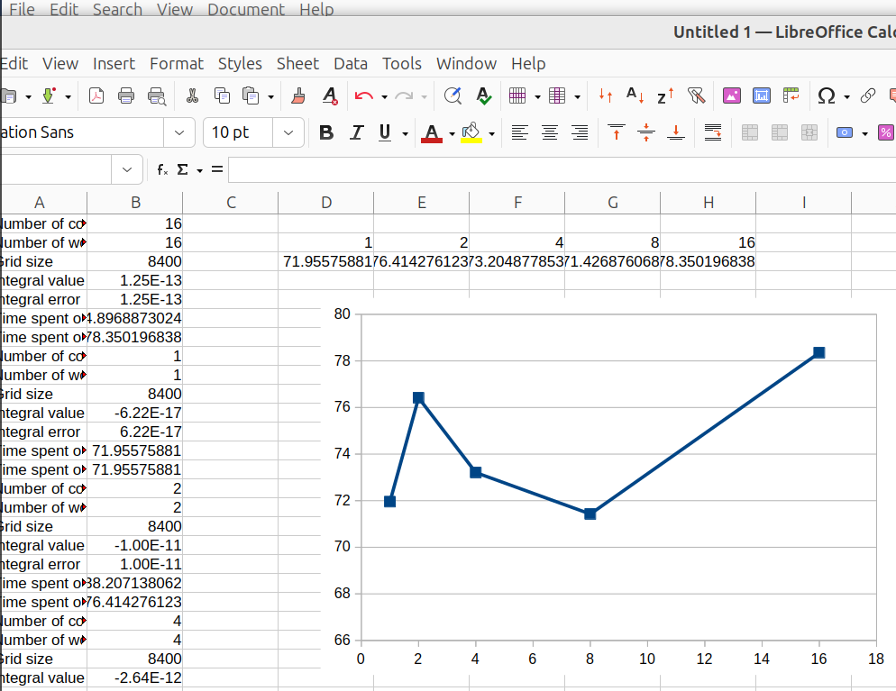
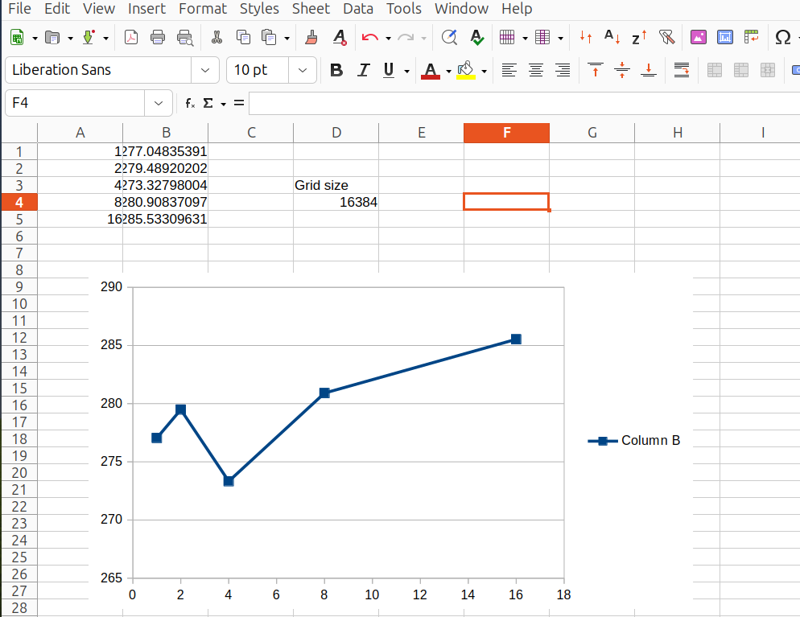

# Lesson plan Advanced by Richel

- Date: Tuesday 2025-10-06
- Course: Advanced

## 2025-09-04

I need to improve the SCoRe user documentation on using HPC
resources efficiently. This goes perfectly hand-in-hand
with the parallel computing session.

As the parallel session is language agnostic, I do not need to use
R, Julia or MATLAB code at all.
Instead, I can use BEAST2.

From the first 1000 lines of UPPMAX modules, these were labelled
to be the most popular: GROMACS, BWA, Bowtie2, ABySS, GATK, BEDTools.
I also heard of LINPACK and BLAST.

Let's start with GROMACS, as it is popular and available on Pelle.

- [YouTube video](https://www.youtube.com/watch?v=-S1eP-iWE8c)
- [1UN3 RCSB page](https://www.rcsb.org/structure/1UN3)
- Downloaded `1UN3.pdb`

```bash
sudo apt install jmol
jmol 1UN3.pdb
```


- [GROMACS on LUMI course](https://zenodo.org/records/10683366)


To run on Pelle:

```bash
wget https://github.com/UPPMAX/R-matlab-julia-HPC/raw/refs/heads/main/docs-mk/lesson_plans/20251010_richel/lumi_course/run_pelle.sh
sbatch run_pelle.sh 
```

Need to use `srun`

## 2025-09-11

I think this was a bad idea: the course is an R and MATLAB and Julia course.
Let's change the learning outcome to run a script in one of those
languages.

## 2025-09-16

I am going to start with the MPI scripts now.
They work!
And then I find out that OpenMPI is not OpenMP.

I feel:

Technique|Uses                            |Notes
---------|--------------------------------|--------------
Normal   |1 core                          |
OpenMP   |1 to all cores on a node        |A threaded mechanism, uses `OMP_NUM_THREADS`
OpenMPI  |1 to all cores on multiple nodes|`Rmpi` package

Works:

```bash
$ sbatch integration2d-rackham_8.sh 
Submitted batch job 56823317

[richel@rackham3 6_integration2d]$ cat slurm-56823317.out
R_packages/4.1.1: The RStudio packages pane is disabled when loading this module, due to performance issues. All packages are still available.
R_packages/4.1.1: For more information and instructions to re-enable it, see 'module help R_packages/4.1.1'

Loading required package: foreach
Loading required package: iterators
[1] "Integral value is 9.07607322631065e-15 Error is 9.07607322631065e-15"
[1] "Time spent: 0.263934373855591 seconds"
```

Using a CLI arg works fine, as long as it is convert to a numeric value:

```
[richel@rackham3 6_integration2d]$ cat *.out
[...]
nworkers: 1
[1] "Integral value is -5.22070689324334e-16 Error is 5.22070689324334e-16"
[1] "Time spent: 0.813078641891479 seconds"
[...]
nworkers: 8
[1] "Integral value is 9.07607322631065e-15 Error is 9.07607322631065e-15"
[1] "Time spent: 0.228480815887451 seconds"
```

Using a 10x bigger grid:

```bash
[richel@rackham3 6_integration2d]$ cat slurm-56825681.out
[...]
nworkers: 1
[1] "Integral value is -6.2179313190142e-17 Error is 6.2179313190142e-17"
[1] "Time spent: 64.7400653362274 seconds"
[richel@rackham3 6_integration2d]$ cat slurm-56825683.out
[...]
nworkers: 8
[1] "Integral value is -4.35873559467836e-13 Error is 4.35873559467836e-13"
[1] "Time spent: 8.92967510223389 seconds"
```

Interesting, that if the grid increases 10x,
1 worker takes 80x longer and 8 workers take 40x longer.
Also, the accuracy decreases with multiple works.
Also, the overhead changes

Grid size|Time 1 worker|Time 8 workers|Corehours 8 workers|Overhead
---------|-------------|--------------|-------------------|-----------------------
Original |0.81         |0.22          |8*0.22=1.76        |1.76/0.81=2.172839506
10x      |64.74        |8.93          |8*8.93=71.44       |71.44/64.74=1.103490887
Increase |80x          |40x           |40x                |NA

OK, now it is time to cleanup the script a bit.
I want these to display the corehours too, and less fluff.

Output is cleaner:

```bash
[richel@rackham3 6_integration2d]$ ls
integration2d-cosmos.sh      integration2d-rackham_1.sh  schedule_rackham_runs.sh
integration2d-dardel.sh      integration2d-rackham_8.sh  slurm-56827590.out
integration2d-kebnekaise.sh  integration2d_rackham_x.sh  slurm-56827597.out
integration2d.R              integration2d-tetralith.sh
[richel@rackham3 6_integration2d]$ cat *.out
Number of cores booked in Slurm: 1
Number of workers: 1
Grid size: 8400
Integral value: -6.2179313190142e-17
Integral error: 6.2179313190142e-17
Time spent on 1 core: 67.9925961494446 seconds
Time spent on all cores: 67.9925961494446 seconds
Number of cores booked in Slurm: 8
Number of workers: 8
Grid size: 8400
Integral value: -4.35873559467836e-13
Integral error: 4.35873559467836e-13
Time spent on 1 core: 9.48788905143738 seconds
Time spent on all cores: 75.903112411499 seconds
```


A replication experiment:

```
[richel@rackham3 6_integration2d]$ cat *.out
Number of cores booked in Slurm: 1
Number of workers: 1
Grid size: 8400
Integral value: -6.2179313190142e-17
Integral error: 6.2179313190142e-17
Time spent on 1 core: 71.8729729652405 seconds
Time spent on all cores: 71.8729729652405 seconds
Number of cores booked in Slurm: 1
Number of workers: 1
Grid size: 8400
Integral value: -6.2179313190142e-17
Integral error: 6.2179313190142e-17
Time spent on 1 core: 72.9636025428772 seconds
Time spent on all cores: 72.9636025428772 seconds
Number of cores booked in Slurm: 1
Number of workers: 1
Grid size: 8400
Integral value: -6.2179313190142e-17
Integral error: 6.2179313190142e-17
Time spent on 1 core: 75.2127022743225 seconds
Time spent on all cores: 75.2127022743225 seconds
Number of cores booked in Slurm: 1
Number of workers: 1
Grid size: 8400
Integral value: -6.2179313190142e-17
Integral error: 6.2179313190142e-17
Time spent on 1 core: 74.9676728248596 seconds
Time spent on all cores: 74.9676728248596 seconds
Number of cores booked in Slurm: 1
Number of workers: 1
Grid size: 8400
Integral value: -6.2179313190142e-17
Integral error: 6.2179313190142e-17
Time spent on 1 core: 73.961464881897 seconds
Time spent on all cores: 73.961464881897 seconds
Number of cores booked in Slurm: 1
Number of workers: 1
Grid size: 8400
Integral value: -6.2179313190142e-17
Integral error: 6.2179313190142e-17
Time spent on 1 core: 73.2491600513458 seconds
Time spent on all cores: 73.2491600513458 seconds
[richel@rackham3 6_integration2d]$ 
```

I give up calling a Slurm script with the `-A` or `-n` parameter:
it does not work (that is how I got a replicate run)

```
Number of cores booked in Slurm: 16
Number of workers: 16
Grid size: 8400
Integral value: 1.25011112572793e-13
Integral error: 1.25011112572793e-13
Time spent on 1 core (seconds): 4.89688730239868
Time spent on all cores (seconds): 78.3501968383789
Number of cores booked in Slurm: 1
Number of workers: 1
Grid size: 8400
Integral value: -6.2179313190142e-17
Integral error: 6.2179313190142e-17
Time spent on 1 core (seconds): 71.9557588100433
Time spent on all cores (seconds): 71.9557588100433
Number of cores booked in Slurm: 2
Number of workers: 2
Grid size: 8400
Integral value: -1.00190966634273e-11
Integral error: 1.00190966634273e-11
Time spent on 1 core (seconds): 38.2071380615234
Time spent on all cores (seconds): 76.4142761230469
Number of cores booked in Slurm: 4
Number of workers: 4
Grid size: 8400
Integral value: -2.64421817774974e-12
Integral error: 2.64421817774974e-12
Time spent on 1 core (seconds): 18.3012194633484
Time spent on all cores (seconds): 73.2048778533936
Number of cores booked in Slurm: 8
Number of workers: 8
Grid size: 8400
Integral value: -4.35873559467836e-13
Integral error: 4.35873559467836e-13
Time spent on 1 core (seconds): 8.9283595085144
Time spent on all cores (seconds): 71.4268760681152
```




Bigger job:

```
Number of cores booked in Slurm: 1
Number of workers: 1
Grid size: 16384
Integral value: 1.76582323875401e-16
Integral error: 1.76582323875401e-16
Time spent on 1 core (seconds): 277.048353910446
Time spent on all cores (seconds): 277.048353910446
Number of cores booked in Slurm: 2
Number of workers: 2
Grid size: 16384
Integral value: -1.81823445188911e-11
Integral error: 1.81823445188911e-11
Time spent on 1 core (seconds): 139.744601011276
Time spent on all cores (seconds): 279.489202022552
Number of cores booked in Slurm: 4
Number of workers: 4
Grid size: 16384
Integral value: -3.75399711316504e-12
Integral error: 3.75399711316504e-12
Time spent on 1 core (seconds): 68.331995010376
Time spent on all cores (seconds): 273.327980041504
Number of cores booked in Slurm: 8
Number of workers: 8
Grid size: 16384
Integral value: -3.48418516260551e-12
Integral error: 3.48418516260551e-12
Time spent on 1 core (seconds): 35.11354637146
Time spent on all cores (seconds): 280.90837097168
Number of cores booked in Slurm: 16
Number of workers: 16
Grid size: 16384
Integral value: 2.79685996584789e-13
Integral error: 2.79685996584789e-13
Time spent on 1 core (seconds): 17.8458185195923
Time spent on all cores (seconds): 285.533096313477
```




