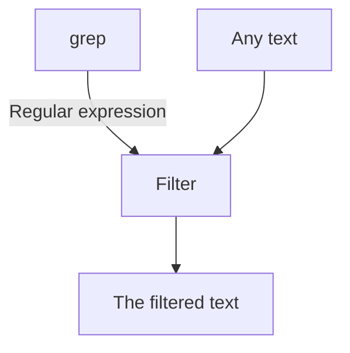

# Syntax of MkDocs with ReadTheDocs style

## Admonitions

## Code

```bash
ls > mylsoutput.txt
```

## Tabs

=== "Dardel"

    Content

=== "Tetralith"

    Content

## Mermaid

(Have not made mmd files to work yet. So far only code directly within)


>```
>mermaid code
>```


### Gantt chart

```mermaid
gantt
  title Lesson plan
  dateFormat X
  axisFormat %s
  Prior : prior, 0, 10s
  Present: present, after prior, 5s
  Challenge: crit, challenge, after present, 20s
  Feedback: feedback, after challenge, 10s
```



### Flow chart

Use ``graph`` instead of ``flowchart`` for diagram type definition


