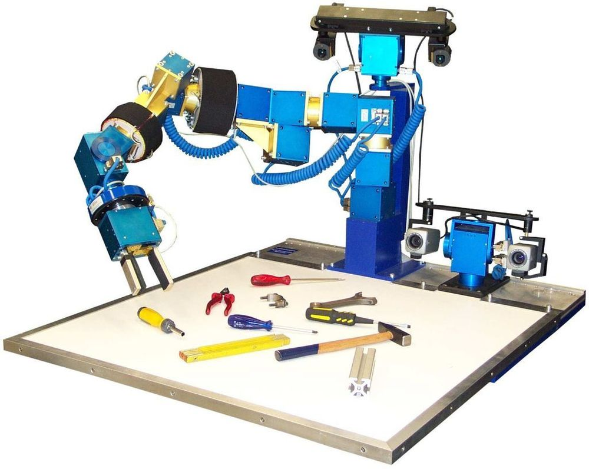

# Distributed parallelism

!!! info "Learning outcomes"

    - I can schedule jobs with distributed parallelism
	- I know the basic difference between threads and distributed memory in terms of memory share
    - I can explain how jobs with distributed parallelism are scheduled
    - I can explain how Julia/MATLAB/R code makes use of distributed parallelism

???- info "For teachers"

    Teaching goals are:

    - .

    Prior:

    - Parallelism.

    Feedback:

    - .




## Why distributed parallelism is important

<!-- markdownlint-disable MD013 --><!-- Tables cannot be split up over lines, hence will break 80 characters per line -->

Type of parallelism   |Number of cores|Number of nodes|Memory                      |Library
----------------------|---------------|---------------|----------------------------|-------
Single-threaded       |1              |1              |As given by operating system|None
Threaded/shared memory|Multiple       |1              |Shared by all cores         |OpenMP
Distributed           |Multiple       |1 or Multiple  |Distributed                 |MPI (Example OpenMPI/MPICH)

<!-- markdownlint-enable MD013 -->

## Notes

- Distributed programming.
  Uses a Message Passing Interface.
  For a job that use many different nodes,
  for example, a weather prediction.

## Test the R script

```bash
mpirun Rscript do_2d_integration.R 1 1
```

## Output

=== "Using 1 MPI processes"

    ```text
    Using 2 OpenMP threads 

                   Core t (s)   Wall t (s)        (%)
           Time:       86.902       43.452      200.0
                     (ns/day)    (hour/ns)
    Performance:        1.740       13.794
    ```

=== "Using 2 MPI processes"

    ```text
                   Core t (s)   Wall t (s)        (%)
           Time:      100.447       50.224      200.0
                     (ns/day)    (hour/ns)
    Performance:        1.591       15.082
    ```

=== "Using 4 MPI processes"

    ```text
                   Core t (s)   Wall t (s)        (%)
           Time:      150.753       37.689      400.0
                     (ns/day)    (hour/ns)
    Performance:        3.783        6.345
    ```


=== "Using 8 MPI processes"

    ```text
                   Core t (s)   Wall t (s)        (%)
           Time:      292.200       36.526      800.0
                     (ns/day)    (hour/ns)
    Performance:        6.446        3.723
    ```

## Remember

- Use `--ntasks=N`
- Use `srun`
- Use an MPI version of your software:
  a 'regular' non-MPI version will never work!

## Links

- [MPI parallelism: multi-task programs](https://scicomp.aalto.fi/triton/tut/parallel-mpi/)
- [Older explanation](https://youtu.be/GHbrpg75qbQ)
- [Newer explanation](https://youtu.be/c7pVEBhPohk)

=== "Julia"

    Julia stuff here

=== "MATLAB"

    MATLAB stuff here

=== "R"

    R stuff here


!!! warning

    - Check if the resources that you allocated are being used properly.
    - Monitor the usage of hardware resources with tools offered at your HPC center, for instance
     [job-usage at HPC2N](https://hpc2n.github.io/intro-course/software/#best__practices).
    - Here there are some examples (of many) of what you will need to pay attention when porting
     a parallel code from your laptop (or another HPC center) to our clusters:

    === "HPC2N"

        We have a tool to monitor the usage of resources called:
         [job-usage at HPC2N](https://hpc2n.github.io/intro-course/software/#best__practices).

    === "Other"

         If you are in a interactive node session the ``top`` command will give you information
         of the resources usage.


## Distributed programming

Although threaded programming is convenient because one can achieve considerable initial speedups
with little code modifications, this approach does not scale for more than hundreds of
cores. Scalability can be achieved with distributed programming. Here, there is not
a common shared memory but the individual `processes` (notice the different terminology
with `threads` in shared memory) have their own memory space. Then, if a process requires
data from or should transfer data to another process, it can do that by using `send` and
`receive` to transfer messages. A standard API for distributed computing is the Message
Passing Interface (MPI). In general, MPI requires refactoring of your code.

.. admonition:: Language-specific nuances for distributed programming
   :class: dropdown

   .. tabs::

      .. tab:: Julia

         The mechanism here is called `Julia processes` which  can be activated by executing a script as follows
         ``julia -p X script.jl``, where *X* is the number of processes. Code modifications are required to support the
         workers. Julia also supports MPI through the package ``MPI.jl``.

      .. tab:: R

         R doesn't have a multiprocessing mechanism as the other languages discussed in this course. Some
         functions provided by certain packages (parallel, doParallel, etc.), for instance, *foreach*,
         offer parallel features. The processes generated by these functions have their own workspace which
         could lead to `data replication <https://hpc2n.github.io/intro-course/software/#recommendations>`_.
         MPI is supported in R through the ``Rmpi`` package.

      .. tab:: Matlab

         In Matlab one can use the ``parpool('my-cluster',X)`` where *X* is the number of workers.  The total number of processes spawned will always be *X+1* where the extra process handles the overhead for the rest. See the
         `documentation for parpool <https://se.mathworks.com/help/parallel-computing/parpool.html>`_ from MatWorks.
         Matlab doesn't support MPI function calls in Matlab code, it could be used indirectly through
         `mex <https://se.mathworks.com/help/matlab/ref/mex.html>`_ functions though.

## Big data


Sometimes the workflow you are targeting doesn't require extensive computations but mainly dealing with
big pieces of data. An example can be, reading a column-structured file and doing some transformation per-column.
Fortunately, all languages covered in this course have already several tools to deal with big data.
We list some of these tools in what follows but notice that other tools doing similar jobs can be
available for each language.

.. admonition:: Language-specific tools for big data
   :class: dropdown

   .. tabs::

      .. tab:: Julia

         **Dagger**

         According to the developers of this framework, `Dagger <https://juliaparallel.org/Dagger.jl/dev/>`_
         is heavily inspired on Dask. It support distributed arrays so that they could fit the memory and
         also the possibility of parallelizing the computations on these arrays.

      .. tab:: R

         `Arrow <https://arrow.apache.org/docs/r/index.html>`_ (previously *disk.frame*) can deal with
         big arrays. Other tools include `data.table <https://cran.r-project.org/web/packages/data.table/vignettes/datatable-intro.html>`_
         and `bigmemory <https://cran.r-project.org/web/packages/bigmemory/index.html>`_.

      .. tab:: Matlab

         In Matlab `Tall Arrays <https://se.mathworks.com/help/matlab/tall-arrays.html>`_ and
         `Distributed Arrays <https://se.mathworks.com/help/parallel-computing/distributed-arrays.html>`_
         will assist you when dealing with large arrays.

-------------------

Exercises
---------

.. challenge:: Running a parallel code efficiently
   :class: dropdown

   In this exercise we will run a parallelized code that performs a 2D integration:

      .. math::
          \int^{\pi}_{0}\int^{\pi}_{0}\sin(x+y)dxdy = 0

   One way to perform the integration is by creating a grid in the ``x`` and ``y`` directions.
   More specifically, one divides the integration range in both directions into ``n`` bins.

   .. tabs::

      .. tab:: Julia

            Here is a parallel code using the ``Distributed`` package in Julia (call it
            ``integration2d_distributed.jl``):

            .. admonition:: integration2d_distributed.jl
               :class: dropdown

               .. code-block:: julia

                   using Distributed
                   using SharedArrays
                   using LinearAlgebra
                   using Printf
                   using Dates

                   # Add worker processes (replace with actual number of cores you want to use)
                   nworkers = *FIXME*
                   addprocs(nworkers)

                   # Grid size
                   n = 20000
                   # Number of processes
                   numprocesses = nworkers
                   # Shared array to store partial sums for each process
                   partial_integrals = SharedVector{Float64}(numprocesses)

                   # Function for 2D integration using multiprocessing
                   # the decorator @everywher instruct Julia to transfer this function to all workers
                   @everywhere function integration2d_multiprocessing(n, numprocesses, processindex, partial_integrals)
                       # Interval size (same for X and Y)
                       h = π / n
                       # Cumulative variable
                       mysum = 0.0
                       # Workload for each process
                       workload = div(n, numprocesses)

                       # Define the range of work for each process according to index
                       begin_index = workload * (processindex - 1) + 1
                       end_index = workload * processindex

                       # Regular integration in the X axis
                       for i in begin_index:end_index
                           x = h * (i - 0.5)
                           # Regular integration in the Y axis
                           for j in 1:n
                               y = h * (j - 0.5)
                               mysum += sin(x + y)
                           end
                       end

                       # Store the result in the shared array
                       partial_integrals[processindex] = h^2 * mysum
                   end

                   # function for main
                   function main()
                       # Start the timer
                       starttime = now()

                       # Distribute tasks to processes
                       @sync for i in 1:numprocesses
                           @spawnat i integration2d_multiprocessing(n, numprocesses, i, partial_integrals)
                       end

                       # Calculate the total integral by summing over partial integrals
                       integral = sum(partial_integrals)

                       # end timing
                       endtime = now()

                       # Output results
                       println("Integral value is $(integral), Error is $(abs(integral - 0.0))")
                       println("Time spent: $(Dates.value(endtime - starttime) / 1000) sec")
                   end

                   # Run the main function
                   main()

            Run the code with the following batch script.

            .. admonition:: job.sh
               :class: dropdown

               .. tabs::

                  .. tab:: UPPMAX

                     .. code-block:: bash

                             #!/bin/bash -l
                             #SBATCH -A naiss202X-XY-XYZ  # your project_ID
                             #SBATCH -J job-serial        # name of the job
                             #SBATCH -n *FIXME*           # nr. tasks/coresw
                             #SBATCH --time=00:20:00      # requested time
                             #SBATCH --error=job.%J.err   # error file
                             #SBATCH --output=job.%J.out  # output file

                             ml julia/1.8.5

                             julia integration2d_distributed.jl

                  .. tab:: HPC2N

                     .. code-block:: bash

                             #!/bin/bash
                             #SBATCH -A hpc2n202x-xyz     # your project_ID
                             #SBATCH -J job-serial        # name of the job
                             #SBATCH -n *FIXME*           # nr. tasks
                             #SBATCH --time=00:20:00      # requested time
                             #SBATCH --error=job.%J.err   # error file
                             #SBATCH --output=job.%J.out  # output file

                             ml purge  > /dev/null 2>&1
                             ml Julia/1.9.3-linux-x86_64

                             julia integration2d_distributed.jl

                  .. tab:: LUNARC

                       .. code-block:: sh

                           #!/bin/bash
                           #SBATCH -A lu202X-XX-XX      # your project_ID
                           #SBATCH -J job-serial        # name of the job
                           #SBATCH -n *FIXME*           # nr. tasks
                           #SBATCH --time=00:20:00      # requested time
                           #SBATCH --error=job.%J.err   # error file
                           #SBATCH --output=job.%J.out  # output file
                           # reservation (optional)
                           #SBATCH --reservation=RPJM-course*FIXME*

                           ml purge  > /dev/null 2>&1
                           ml Julia/1.9.3-linux-x86_64

                           julia integration2d_distributed.jl

                  .. tab:: PDC

                     .. code-block:: bash

                           #!/bin/bash
                           #SBATCH -A naiss202t-uv-wxyz # your project_ID
                           #SBATCH -J job               # name of the job
                           #SBATCH  -p shared           # name of the queue
                           #SBATCH --ntasks=*FIXME*     # nr. of tasks
                           #SBATCH --cpus-per-task=1    # nr. of cores per-task
                           #SBATCH --time=00:03:00      # requested time
                           #SBATCH --error=job.%J.err   # error file
                           #SBATCH --output=job.%J.out  # output file

                           # Load dependencies and Julia version
                           ml PDC/23.12 julia/1.10.2-cpeGNU-23.12

                           julia integration2d_distributed.jl

                  .. tab:: NSC

                     .. code-block:: bash

                           #!/bin/bash
                           #SBATCH -A naiss202t-uv-xyz  # your project_ID
                           #SBATCH -J job-serial        # name of the job
                           #SBATCH -n *FIXME*           # nr. tasks
                           #SBATCH --time=00:20:00      # requested time
                           #SBATCH --error=job.%J.err   # error file
                           #SBATCH --output=job.%J.out  # output file

                           # Load any modules you need, here for Julia
                           ml julia/1.9.4-bdist

                           julia integration2d_distributed.jl

            Try different number of cores for this batch script (*FIXME* string) using the sequence:
            1,2,4,8,12, and 14. Note: this number should match the number of processes
            (also a *FIXME* string) in the Julia script. Collect the timings that are
            printed out in the **job.*.out**. According to these execution times what would be
            the number of cores that gives the optimal (fastest) simulation?

            Challenge: Increase the grid size (``n``) to 100000 and submit the batch job with 4 workers (in the
            Julia script) and request 5 cores in the batch script. Monitor the usage of resources
            with tools available at your center, for instance ``top`` (UPPMAX) or
            ``job-usage`` (HPC2N).

      .. tab:: R

            Here is a parallel code using the ``parallel`` and ``doParallel`` packages in R (call it
            ``integration2d.R``). Note: check if those packages are already installed for the required
            R version, otherwise install them with ``install.packages()``. The recommended R version
            for this exercise is ``ml GCC/12.2.0 OpenMPI/4.1.4 R/4.2.2`` (HPC2N).

            .. admonition:: integration2d.R
               :class: dropdown

               .. code-block:: R

                   library(parallel)
                   library(doParallel)

                   # nr. of workers/cores that will solve the tasks
                   nworkers <- *FIXME*

                   # grid size
                   n <- 840

                   # Function for 2D integration (non-optimal implementation)
                   integration2d <- function(n, numprocesses, processindex) {
                     # Interval size (same for X and Y)
                     h <- pi / n
                     # Cumulative variable
                     mysum <- 0.0
                     # Workload for each process
                     workload <- floor(n / numprocesses)

                     # Define the range of work for each process according to index
                     begin_index <- workload * (processindex - 1) + 1
                     end_index <- workload * processindex

                     # Regular integration in the X axis
                     for (i in begin_index:end_index) {
                       x <- h * (i - 0.5)
                       # Regular integration in the Y axis
                       for (j in 1:n) {
                         y <- h * (j - 0.5)
                         mysum <- mysum + sin(x + y)
                       }
                     }
                     # Return the result
                     return(h^2 * mysum)
                   }

                   # Set up the cluster for doParallel
                   cl <- makeCluster(nworkers)
                   registerDoParallel(cl)

                       # Start the timer
                       starttime <- Sys.time()

                       # Distribute tasks to processes and combine the outputs into the results list
                       results <- foreach(i = 1:nworkers, .combine = c) %dopar% { integration2d(n, nworkers, i) }

                       # Calculate the total integral by summing over partial integrals
                       integral <- sum(results)

                       # End the timing
                       endtime <- Sys.time()

                       # Print out the result
                       print(paste("Integral value is", integral, "Error is", abs(integral - 0.0)))
                       print(paste("Time spent:", difftime(endtime, starttime, units = "secs"), "seconds"))

                   # Stop the cluster after computation
                   stopCluster(cl)

            Run the code with the following batch script.

            .. admonition:: job.sh
               :class: dropdown

               .. tabs::

                  .. tab:: UPPMAX

                     .. code-block:: bash

                             #!/bin/bash -l
                             #SBATCH -A naiss202u-wv-xyz  # your project_ID
                             #SBATCH -J job-serial        # name of the job
                             #SBATCH -n *FIXME*           # nr. tasks/coresw
                             #SBATCH --time=00:20:00      # requested time
                             #SBATCH --error=job.%J.err   # error file
                             #SBATCH --output=job.%J.out  # output file

                             ml R_packages/4.1.1

                             Rscript --no-save --no-restore integration2d.R

                  .. tab:: HPC2N

                     .. code-block:: bash

                             #!/bin/bash
                             #SBATCH -A hpc2n202w-xyz     # your project_ID
                             #SBATCH -J job-serial        # name of the job
                             #SBATCH -n *FIXME*           # nr. tasks
                             #SBATCH --time=00:20:00      # requested time
                             #SBATCH --error=job.%J.err   # error file
                             #SBATCH --output=job.%J.out  # output file

                             ml purge > /dev/null 2>&1
                             ml GCC/12.2.0  OpenMPI/4.1.4 R/4.2.2
                             Rscript --no-save --no-restore integration2d.R

                  .. tab:: LUNARC

                       .. code-block:: sh

                            #!/bin/bash
                            #SBATCH -A lu202u-wy-yz      # your project_ID
                            #SBATCH -J job-serial        # name of the job
                            #SBATCH -n *FIXME*           # nr. tasks
                            #SBATCH --time=00:20:00      # requested time
                            #SBATCH --error=job.%J.err   # error file
                            #SBATCH --output=job.%J.out  # output file
			                   #SBATCH --reservation=RPJM-course*FIXME* # reservation (optional)

                            ml purge > /dev/null 2>&1
                            ml GCC/11.3.0  OpenMPI/4.1.4  R/4.2.1
                            Rscript --no-save --no-restore integration2d.R

                  .. tab:: PDC

                     .. code-block:: bash

                           #!/bin/bash
                           #SBATCH -A naiss202t-uv-wxyz # your project_ID
                           #SBATCH -J job               # name of the job
                           #SBATCH  -p shared           # name of the queue
                           #SBATCH --ntasks=*FIXME*     # nr. of tasks
                           #SBATCH --cpus-per-task=1    # nr. of cores per-task
                           #SBATCH --time=00:03:00      # requested time
                           #SBATCH --error=job.%J.err   # error file
                           #SBATCH --output=job.%J.out  # output file

                           # Load dependencies and R version
                           ml ...

                           Rscript --no-save --no-restore integration2d.R

                  .. tab:: NSC

                     .. code-block:: bash

                           #!/bin/bash
                           #SBATCH -A naiss202t-uv-xyz  # your project_ID
                           #SBATCH -J job-serial        # name of the job
                           #SBATCH -n *FIXME*           # nr. tasks
                           #SBATCH --time=00:20:00      # requested time
                           #SBATCH --error=job.%J.err   # error file
                           #SBATCH --output=job.%J.out  # output file

                           # Load any modules you need, here for R
                           ml R/4.4.0-hpc1-gcc-11.3.0-bare

                           Rscript --no-save --no-restore integration2d.R

            Try different number of cores for this batch script (*FIXME* string) using the sequence:
            1,2,4,8,12, and 14. Note: this number should match the number of processes
            (also a *FIXME* string) in the R script. Collect the timings that are
            printed out in the **job.*.out**. According to these execution times what would be
            the number of cores that gives the optimal (fastest) simulation?

            Challenge: Increase the grid size (``n``) to 10000 and submit the batch job with 4 workers (in the
            R script) and request 5 cores in the batch script. Monitor the usage of resources
            with tools available at your center, for instance ``top`` (UPPMAX) or
            ``job-usage`` (HPC2N).

      .. tab:: Matlab

            Here is a parallel code using the ``parfor`` tool from Matlab (call it
            ``integration2d.m``).

            .. admonition:: integration2d.m
               :class: dropdown

               .. code-block:: matlab

                   % Number of workers/processes
                   num_workers = *FIXME*;

                   % Use parallel pool with 'parfor'
                   parpool('profile-name',num_workers);  % Start parallel pool with num_workers workers

                   % Grid size
                   n = 6720;

                   % bin size
                   h = pi / n;

                   tic;  % Start timer
                   % Shared variable to collect partial sums
                   partial_integrals = 0.0;

                   % In Matlab one can use parfor to parallelize loops
                   parfor i = 1:n
                       partial_integrals = partial_integrals + integration2d_partial(n,i);
                   end

                   % Compute the integrals by multilpying by the bin size
                   integral = partial_integrals * h^2;
                   elapsedTime = toc;  % Stop timer

                   fprintf("Integral value is %e\n", integral);
                   fprintf("Error is %e\n", abs(integral - 0.0));
                   fprintf("Time spent: %.2f sec\n", elapsedTime);

                   % Clean up the parallel pool
                   delete(gcp('nocreate'));

                   % Function for the 2D integration only computes a single bin
                   function mysum = integration2d_partial(n,i)
                       % bin size
                       h = pi / n;
                       % Partial summation
                       mysum = 0.0;
                           % A single bin is computed
                           x = h * (i - 0.5);
                           % Regular integration in the Y axis
                           for j = 1:n
                               y = h * (j - 0.5);
                               mysum = mysum + sin(x + y);
                           end
                   end

            You can run directly this script from the Matlab GUI.
            Try different number of cores for this batch script (*FIXME* string) using the sequence:
            1,2,4,8,12, and 14. Collect the timings that are printed out in the Matlab command window.
            According to these execution times what would be
            the number of cores that gives the optimal (fastest) simulation?

            Challenge: Increase the grid size (``n``) to 100000 and submit the batch job with 4 workers.
            Monitor the usage of resources with tools available at your center, for instance ``top`` (UPPMAX),
            ``job-usage`` (HPC2N), or if you're working in the GUI (e.g. on LUNARC), you can click ``Parallel``
            and then ``Monitor Jobs``. For ``job-usage``, you can see the job ID if you type ``squeue --me`` on a terminal on Kebnekaise.

.. challenge:: Parallelizing a *for loop* workflow (Advanced)
   :class: dropdown

   Create a Data Frame containing two features, one called **ID** which has integer values
   from 1 to 10000, and the other called **Value** that contains 10000 integers starting from 3
   and goes in steps of 2 (3, 5, 7, ...). The following codes contain parallelized workflows
   whose goal is to compute the average of the whole feature **Value** using some number of
   workers. Substitute the **FIXME** strings in the following codes to perform the tasks given
   in the comments.

   *The main idea for all languages is to divide the workload across all workers*.
   You can run the codes as suggested for each language.

   .. tabs::

      .. tab:: Julia

         - First, be sure you have ``DataFrames`` installed as JuliaPackage.
         - If not, follow the steps below. You can install it in your ordinaty user space (not an environment)

         - Open a Julia session

         .. code-block::

            julia> using DataFrames

         - Let it be installed when asking
         - When done and working, exit().

         - Here is an exercise to fix some code snippets. Call the script ``script-df.jl``.
         - Watch out for ``*FIXME*`` and replace with suitable functions
         - The functions ``nthreads()`` (number of available threads), and ``threadid()``
           (the thread identification number) will be useful in this task.

         .. code-block:: julia

                using DataFrames
                using Base.Threads

                # Create a data frame with two sets of values ID and Value
                data_df = DataFrame(ID = 1:10000, Value = range(3, step=2, length=10000))

                # Define a function to compute the sum in parallel
                function parallel_sum(data)
                    # Initialize an array to store thread-local sums
                    local_sums = zeros(eltype(data), *FIXME*)
                    # Iterate through each value in the 'Value' column in parallel
                    @threads for i =1:length(data)
                        # Add the value to the thread-local sum
                        local_sums[*FIXME*] += data[i]
                    end
                    # Combine the local sums to obtain the total sum
                    total_sum_parallel = sum(local_sums)
                    return total_sum_parallel
                end

                # Compute the sum in parallel
                total_sum_parallel = parallel_sum(data_df.Value)

                # Compute the mean
                mean_value_parallel = *FIXME* / length(data_df.Value)

                # Print the mean value
                println(mean_value_parallel)

         Run this job with the following batch script, defining that we want to use 4 threads:

         .. tabs::

            .. tab:: UPPMAX

               .. code-block:: bash

                       #!/bin/bash -l
                       #SBATCH -A naiss202t-uw-xyz  # your project_ID
                       #SBATCH -J job-parallel      # name of the job
                       #SBATCH -n 4                 # nr. tasks/coresw
                       #SBATCH --time=00:20:00      # requested time
                       #SBATCH --error=job.%J.err   # error file
                       #SBATCH --output=job.%J.out  # output file

                       ml julia/1.8.5

                       julia --threads 4 script-df.jl  # X number of threads

            .. tab:: HPC2N

               .. code-block:: bash

                        #!/bin/bash
                        #SBATCH -A hpc2n202w-xyz     # your project_ID
                        #SBATCH -J job-parallel      # name of the job
                        #SBATCH -n 4                 # nr. tasks
                        #SBATCH --time=00:20:00      # requested time
                        #SBATCH --error=job.%J.err   # error file
                        #SBATCH --output=job.%J.out  # output file

                        ml purge  > /dev/null 2>&1
                        ml Julia/1.8.5-linux-x86_64

                        julia --threads 4 script-df.jl  # X number of threads

            .. tab:: LUNARC

                 .. code-block:: sh

                       #!/bin/bash
                       #SBATCH -A lu202u-w-yz      # your project_ID
                       #SBATCH -J job-parallel      # name of the job
                       #SBATCH -n 4	            # nr. tasks
                       #SBATCH --time=00:20:00      # requested time
                       #SBATCH --error=job.%J.err   # error file
                       #SBATCH --output=job.%J.out  # output file
		                 #SBATCH --reservation=RPJM-course*FIXME* # reservation (optional)

                       ml purge
                       ml Julia/1.9.3-linux-x86_64

                       julia --threads 4 script-df.jl  # X number of threads

            .. tab:: PDC

               .. code-block:: bash

                     #!/bin/bash
                     #SBATCH -A naiss202t-uw-xyz  # your project_ID
                     #SBATCH -J job-parallel      # name of the job
                     #SBATCH  -p shared           # name of the queue
                     #SBATCH  --ntasks=4          # nr. of tasks
                     #SBATCH --cpus-per-task=1    # nr. of cores per-task
                     #SBATCH --time=00:03:00      # requested time
                     #SBATCH --error=job.%J.err   # error file
                     #SBATCH --output=job.%J.out  # output file

                     # Load dependencies and Julia version
                     ml PDC/23.12 julia/1.10.2-cpeGNU-23.12

                     julia --threads 4 script-df.jl  # X number of threads

            .. tab:: NSC

               .. code-block:: bash

                     #!/bin/bash
                     #SBATCH -A naiss202t-uv-xyz  # your project_ID
                     #SBATCH -J job-serial        # name of the job
                     #SBATCH -n *FIXME*           # nr. tasks
                     #SBATCH --time=00:20:00      # requested time
                     #SBATCH --error=job.%J.err   # error file
                     #SBATCH --output=job.%J.out  # output file

                     # Load any modules you need, here for Julia
                     ml julia/1.9.4-bdist

                     julia --threads 4 script-df.jl  # X number of threads

      .. tab:: R

         - Call the script ``script-df.R``.

         .. code-block:: r

                library(doParallel)
                library(foreach)

                # Create a data frame with two sets called ID and Value
                data_df <- data.frame(
                ID <- seq(1,10000), Value <- seq(from=3,by=2,length.out=10000)
                )

                # Create 4 subsets
                num_subsets <- *FIXME*

                # Create a cluster with 4 workers
                cl <- makeCluster(*FIXME*)

                # Register the cluster for parallel processing
                registerDoParallel(cl)

                # Function to process a subset of the whole data
                process_subset <- function(subset) {
                # Perform some computation on the subset
                subset_sum <- sum(*FIXME*)
                return(data.frame(SubsetSum = subset_sum))
                }

                # Use foreach with dopar to process subsets in parallel
                result <- foreach(i = 1:*FIXME*, .combine = rbind) %dopar% {
                # Determine the indices for the subset
                subset_indices <- seq(from = *FIXME*,
                                        to = *FIXME*)

                # Create the subset
                subset_data <- data_df[*FIXME*, , drop = FALSE]

                # Process the subset
                subset_result <- process_subset(*FIXME*)

                return(subset_result)
                }

                # Stop the cluster when done
                stopCluster(cl)

                # Print the results
                print(sum(*FIXME*)/*FIXME*)

         Run the code with the following batch script:

         .. tabs::

            .. tab:: UPPMAX

               .. code-block:: bash

                       #!/bin/bash -l
                       #SBATCH -A naiss202t-uw-xyz  # your project_ID
                       #SBATCH -J job-parallel      # name of the job
                       #SBATCH -n 4                 # nr. tasks/coresw
                       #SBATCH --time=00:20:00      # requested time
                       #SBATCH --error=job.%J.err   # error file
                       #SBATCH --output=job.%J.out  # output file

                       ml R_packages/4.1.1

                       Rscript --no-save --no-restore script-df.R

            .. tab:: HPC2N

               .. code-block:: bash

                        #!/bin/bash
                        #SBATCH -A hpc2n202w-xyz     # your project_ID
                        #SBATCH -J job-parallel      # name of the job
                        #SBATCH -n 4                 # nr. tasks
                        #SBATCH --time=00:20:00      # requested time
                        #SBATCH --error=job.%J.err   # error file
                        #SBATCH --output=job.%J.out  # output file

                        ml purge > /dev/null 2>&1
                        ml GCC/12.2.0  OpenMPI/4.1.4 R/4.2.2
                        Rscript --no-save --no-restore script-df.R

            .. tab:: LUNARC

                 .. code-block:: sh

                       #!/bin/bash
                       #SBATCH -A lu202u-wx-yz      # your project_ID
                       #SBATCH -J job-parallel      # name of the job
                       #SBATCH -n 4                 # nr. tasks
                       #SBATCH --time=00:20:00      # requested time
                       #SBATCH --error=job.%J.err   # error file
                       #SBATCH --output=job.%J.out  # output file
		                 #SBATCH --reservation=RPJM-course*FIXME* # reservation (optional)

                       ml purge > /dev/null 2>&1
                       ml GCC/11.3.0  OpenMPI/4.1.4  R/4.2.1
                       Rscript --no-save --no-restore script-df.R

            .. tab:: PDC

               .. code-block:: bash

                     #!/bin/bash
                     #SBATCH -A naiss202t-uv-wxyz # your project_ID
                     #SBATCH -J job               # name of the job
                     #SBATCH  -p shared           # name of the queue
                     #SBATCH  --ntasks=1          # nr. of tasks
                     #SBATCH --cpus-per-task=1    # nr. of cores per-task
                     #SBATCH --time=00:03:00      # requested time
                     #SBATCH --error=job.%J.err   # error file
                     #SBATCH --output=job.%J.out  # output file

                     # Load dependencies and Julia version
                     ml PDC/23.12 julia/1.10.2-cpeGNU-23.12

                     # Load dependencies and R version
                     ml ...

                     Rscript --no-save --no-restore script-df.R

            .. tab:: NSC

               .. code-block:: bash

                     #!/bin/bash
                     #SBATCH -A naiss202t-uv-xyz  # your project_ID
                     #SBATCH -J job-serial        # name of the job
                     #SBATCH -n *FIXME*           # nr. tasks
                     #SBATCH --time=00:20:00      # requested time
                     #SBATCH --error=job.%J.err   # error file
                     #SBATCH --output=job.%J.out  # output file

                     # Load any modules you need, here for R
                     ml R/4.4.0-hpc1-gcc-11.3.0-bare

                     Rscript --no-save --no-restore script-df.R

      .. tab:: Matlab

            .. code-block:: matlab
	
                % Create a table with two columns: ID and Value
                ID = (1:10000)';  % Column for IDs
                Value = (3:2:20001)'; % Column for values
                data_tbl = table(*FIXME*, *FIXME*); % Create a table with the previous two features

                % Matlab uses the so called parpool to create some workers
                parpool('profile-name', *FIXME*);
                p = gcp;

                % Measure time
                tic;
                % Compute the sum in parallel for the Value feature
                total_sum_parallel = parallel_sum(data_tbl.*FIXME*);

                % Compute the mean
                mean_value_parallel = total_sum_parallel / length(data_tbl.*FIXME*);

                % Stop measuring time
                t_parallel = toc;
                fprintf('Time taken for parallel version: %.2f seconds\n', t_parallel);

                % Display the mean value
                disp(mean_value_parallel);

                % Delete the pool
                delete(gcp);

                % Function to compute the sum in parallel
                function total_sum_parallel = parallel_sum(values)
                n = length(*FIXME*);

                local_sums = 0.0;
                parfor i = 1:*FIXME*        % run the loop over the number of elements
                   local_sums = local_sums + *FIXME*(i);    % add the values to the partial sum
                end

                % Set the total sum
                total_sum_parallel = local_sums;
                end

         You can run this code directly from the Matlab GUI.

.. solution:: Solution

   .. tabs::

      .. tab:: Julia

            .. code-block:: julia

                using DataFrames
                using Base.Threads

                # Create a data frame with two sets of values ID and Value
                data_df = DataFrame(ID = 1:10000, Value = range(3, step=2, length=10000))

                # Define a function to compute the sum in parallel
                function parallel_sum(data)
                    # Initialize an array to store thread-local sums
                    local_sums = zeros(eltype(data), nthreads())
                    # Iterate through each value in the 'Value' column in parallel
                    @threads for i =1:length(data)
                        # Add the value to the thread-local sum
                        local_sums[threadid()] += data[i]
                    end
                    # Combine the local sums to obtain the total sum
                    total_sum_parallel = sum(local_sums)
                    return total_sum_parallel
                end

                # Compute the sum in parallel
                total_sum_parallel = parallel_sum(data_df.Value)

                # Compute the mean
                mean_value_parallel = total_sum_parallel / length(data_df.Value)

                # Print the mean value
                println(mean_value_parallel)
	
      .. tab:: R

            .. code-block:: r

                library(doParallel)
                library(foreach)

                # Create a data frame with two sets called ID and Value
                data_df <- data.frame(
                ID <- seq(1,10000), Value <- seq(from=3,by=2,length.out=10000)
                )

                # Create 4 subsets
                num_subsets <- 4

                # Create a cluster with 4 workers
                cl <- makeCluster(4)

                # Register the cluster for parallel processing
                registerDoParallel(cl)

                # Function to process a subset of the whole data
                process_subset <- function(subset) {
                # Perform some computation on the subset
                subset_sum <- sum(subset$Value)
                return(data.frame(SubsetSum = subset_sum))
                }

                # Use foreach with dopar to process subsets in parallel
                result <- foreach(i = 1:num_subsets, .combine = rbind) %dopar% {
                # Determine the indices for the subset
                subset_indices <- seq(from = 1 + (i - 1) * nrow(data_df) / num_subsets,
                                        to = i * nrow(data_df) / num_subsets)

                # Create the subset
                subset_data <- data_df[subset_indices, , drop = FALSE]

                # Process the subset
                subset_result <- process_subset(subset_data)

                return(subset_result)
                }

                # Stop the cluster when done
                stopCluster(cl)

                # Print the results
                print(sum(result)/10000)	

      .. tab:: Matlab

            .. code-block:: matlab
	
                % Create a table with two columns: ID and Value
                ID = (1:10000)';  % Column for IDs
                Value = (3:2:20001)'; % Column for values
                data_tbl = table(ID, Value);

                % Matlab uses the so called parpool to create some workers
                parpool('kebnekaise', 4);
                p = gcp;

                % Measure time
                tic;
                % Compute the sum in parallel
                total_sum_parallel = parallel_sum(data_tbl.Value);

                % Compute the mean
                mean_value_parallel = total_sum_parallel / length(data_tbl.Value);

                % Stop measuring time
                t_parallel = toc;
                fprintf('Time taken for parallel version: %.2f seconds\n', t_parallel);

                % Display the mean value
                disp(mean_value_parallel);

                % Delete the pool
                delete(gcp);

                % Function to compute the sum in parallel
                function total_sum_parallel = parallel_sum(values)
                n = length(values);

                local_sums = 0.0;
                parfor i = 1:n
                   local_sums = local_sums + values(i);
                end

                % Set the total sum
                total_sum_parallel = local_sums;
                end

.. admonition:: More info

   - `HPC2N Julia documentation <https://www.hpc2n.umu.se/resources/software/julia>`_.
   - `White paper on Julia parallel computing <https://juliahub.com/assets/pdf/Parallel-Computing-Guide-for-Julia-byJuliaHub.pdf>`_.
   - `HPC2N R documentation <https://www.hpc2n.umu.se/resources/software/r>`_.
   - `Wikipedias' article on Parallel Computing <https://en.wikipedia.org/wiki/Parallel_computing>`_.

-->
