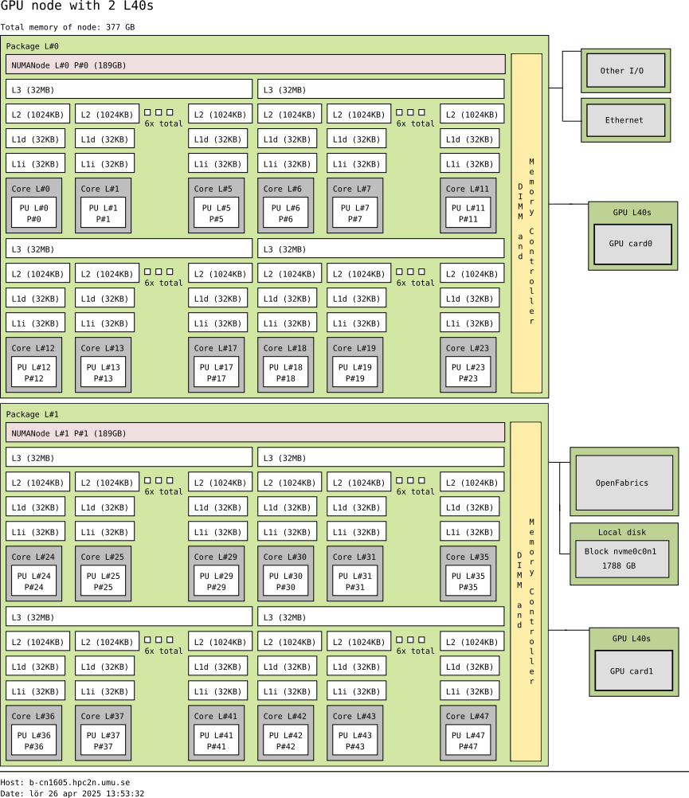

# Using GPUs

!!! note "Questions"

    - What is GPU acceleration?
    - How to enable GPUs? 
    - How to deploy GPUs at HPC2N, UPPMAX, LUNARC, NSC, PDC and C3SE?
   
!!! note "Objectives"

    - Get an intro to common schemes for GPU code acceleration
    - Learn about the GPU nodes at HPC2N, UPPMAX, LUNARC, NSC, PDC, and C3SE 
    - Learn how to make a batch script asking for GPU nodes at HPC2N, UPPMAX, LUNARC, NSC, PDC, and C3SE  

## Introduction

In order to understand the capabilities of a GPU, it is instructive to compare a pure CPU architecture with a GPU based architecture. Here, there is a schemematics of the former:
 
!!! note " "
 
    

    Pure CPU architecture (single node). In the present case there are 256 cores, each with its own cache memory (LX). There is a shared memory (~378 GB/NUMA node) for all these cores. This is an AMD Zen4 node. 
 
    The base frequency is 2.25 GHz, but it can boost up to 3.1 GHz. 

As for the GPU architecture, a GPU card of type Ada Lovelace (like the L40s) looks like this:

!!! note " "

    {:align: center}

    Note: The AD102 GPU also includes 288 FP64 Cores (2 per SM) which are not depicted in the above diagram. The FP64 TFLOP rate is 1/64th the TFLOP rate of FP32 operations. The small number of FP64 Cores are included to ensure any programs with FP64 code operate correctly, including FP64 Tensor Core code. 
 
    This is a single GPU engine of a L40s card. There are 12 Graphics Processing Clusters (GPCs), 72 Texture Processing Clusters (TPCs), 144 Streaming Multiprocessors (SMs), and a 384-bit memory interface with 12 32-bit memory controllers).

    On the diagram, each green dot represents a CUDA core (single precision), while the yellow are RT cores and blue Tensor cores. The cores are arranged in the slots called SMs in the figure. Cores in the same SM share some local and fast cache memory.

GPCs

!!! note " "

    

    The GPC is the dominant high-level hardware block. Each GPC includes a dedicated Raster Engine, two Raster Operations (ROPs) partitions, with each partition containing eight individual ROP units, and six TPCs. Each TPC includes one PolyMorph Engine and two SMs. 
 
    Each SM contain 128 CUDA Cores, one Ada Third-Generation RT Core, four Ada Fourth-Generation Tensor Cores, four Texture Units, a 256 KB Register File, and 128 KB of L1/Shared Memory, which can be configured for different memory sizes depending on the needs of the graphics or compute workload.

In a typical cluster, some GPUs are attached to a single node resulting in a CPU-GPU hybrid architecture. The CPU component is called the host and the GPU part the device.

!!! note "One possible layout"

    Kebnekaise, AMD Zen4 node with L40s GPU

    

    Schematics of a hybrid CPU-GPU architecture. A GPU L40s card is attached to a NUMA island which in turn contains 24 cores (AMD Zen4 CPU node with 48 cores total). The NUMA island and the GPUs are connected through a PCI-E interconnect which makes the data transfer between both components rather slow.

We can characterize the CPU and GPU performance with two quantities: the **latency** and the **throughput**.

- **Latency** refers to the time spent in a sole computation.
- **Throughput** denotes the number of computations that can be performed in parallel. Then, we can say that a CPU has low latency (able to do fast computations) but low throughput (only a few computations simultaneously).

In the case of GPUs, the latency is high and the throughput is also high. We can visualize the behavior of the CPUs and GPUs with cars as in the figure below. A CPU would be compact road where only a few racing cars can drive whereas a GPU would be a broader road where plenty of slow cars can drive.


Cars and roads analogy for the CPU and GPU behavior. The compact road is analogous to the CPU (low latency, low throughput) and the broader road is analogous to the GPU (high latency, high throughput).

Not every program is suitable for GPU acceleration. GPUs process simple functions rapidly, and are best suited for repetitive and highly-parallel computing tasks. GPUs were originally designed to render high-resolution images and video concurrently and fast, but since they can perform parallel operations on multiple sets of data, they are also often used for other, non-graphical tasks. Common uses are machine learning and scientific computation were the GPUs can take advantage of massive parallelism.

- Many R packages are not CUDA aware, but some have been written specifically with GPUs in mind.
- Many Julia packages are not CUDA aware. The CUDA.jl package is the main programming interface for working with Nvidia GPUs. 
- Matlab does have support for computing on GPUs, but you need to write functions that support GPU execution. Many functions in Matlab run automatically on a GPU if you supply a gpuArray data argument. GPU computing in MATLAB requires Parallel Computing Toolbox. Information here: <a href="https://www.mathworks.com/help/parallel-computing/run-matlab-functions-on-a-gpu.html" target="_blank">Run MATLAB Functions on a GPU</a>. 

One of the most common use of GPUs with and Julia is for machine learning or deep learning. 

## GPUs on C3SE, UPPMAX, HPC2N, LUNARC, NSC, and PDC systems

There are generally either not GPUs on the login nodes or they cannot be accessed for computations.
To use them you need to either launch an interactive job or submit a batch job.

=== "C3SE"

    Alvis is meant for GPU jobs. There is no node-sharing on multi-node jobs (`--exclusive` is automatic). 

    NOTE: Requesting -N 1 does not mean 1 full node

    You would need to add this to your batch script: 

    ```bash
    #SBATCH -p alvis
    #SBATCH -N <nodes>
    #SBATCH --gpus-per-node=<type>:x
    ```
 
    where ``<type>`` is one of

    - V100
    - T4
    - A100

    and ``x`` is number of GPU cards

    - 1-4 for V100
    - 1-8 for T4
    - 1-4 for A100

=== "NSC" 

    Tetralith has Nvidia T4 GPUs. In order to access them, add this to your batch script or interactive job:
     
    ```bash
    #SBATCH -n 1
    #SBATCH -c 32
    #SBATCH --gpus-per-task=1
    ```
   
=== "PDC" 

    Dardel has AMD Instinct™ MI250X GPU chips. In order to access them, add this to your batch script or interactive job:

    You need to add this to your batch script (or interactive job) in order to use them: 

    ```bash
    #SBATCH -N 1
    #SBATCH --ntasks-per-node=1
    #SBATCH -p gpu  
    ```

    NOTE: the fact that Dardel has AMD GPUs means that CUDA-enabled packages will not run! You need something like hip. 

=== "UPPMAX" 

    Rackham’s compute nodes do not have GPUs. You need to use Snowy for that.
    The new cluster Pelle has GPUs.

    On Pelle, you need to use this batch command: 

    - for L40s GPUs (up to 10 GPU cards)

    ```bash
    #SBATCH -p gpu
    #SBATCH --gpus:l40s:<number of GPUs>
    ```

    or for H100 GPUs (up to 2 GPU cards)

    ```bash
    #SBATCH -p gpu
    #SBATCH --gpus=h100:<number of GPUs>
    ```

=== "HPC2N"

    Kebnekaise's GPU nodes are considered a separate resource, and the regular compute nodes do not have GPUs.

    Kebnekaise has a great many different types of GPUs:

    - V100 (2 cards/node)
    - A40 (8 cards/node)
    - A6000 (2 cards/node)
    - L40s (2 or 6 cards/node)
    - A100 (2 cards/node)
    - H100 (4 cards/node)
    - MI100 (2 cards/node)

    To access them, you need to use this to the batch system:

    ```bash
    #SBATCH --gpus=x
    ```

    where x is the number of GPU cards you want. Above are given how many are on each type, so you can ask for up to that number.

    In addition, you need to add this to the batch system:

    ```bash
    #SBATCH -C <type>
    ```

    where type is

    - v100 
    - a40
    - a6000
    - l40s
    - a100
    - h100
    - mi100
    
    For more information, see HPC2N's guide to the different parts of the batch system: <a href="https://docs.hpc2n.umu.se/documentation/batchsystem/resources/" target="_blank">https://docs.hpc2n.umu.se/documentation/batchsystem/resources/</a>

=== "LUNARC"


    LUNARC has Nvidia A100 GPUs and Nvidia A40 GPUs, but the latter ones are reserved for interactive graphics work on the on-demand system, and Slurm jobs should not be submitted to them.

    Thus in order to use the A100 GPUs on Cosmos, add this to your batch script:

    A100 GPUs on AMD nodes:

    ```bash  
    #SBATCH -p gpua100
    #SBATCH --gres=gpu:1
    ``` 

    These nodes are configured as exclusive access and will not be shared between users. User projects will be charged for the entire node (48 cores). A job on a node will also have access to all memory on the node.

    A100 GPUs on Intel nodes:

    ```bash
    #SBATCH -p gpua100i
    #SBATCH --gres=gpu:<number>
    ``` 

    where ``<number>`` is 1 or 2 (Two of the nodes have 1 GPU and two have 2 GPUs).


