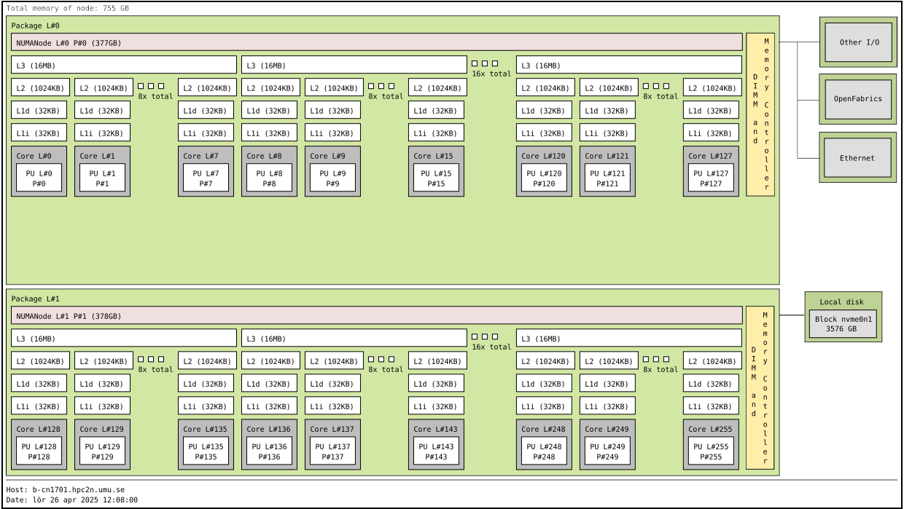

# Using GPUs

!!! note "Questions"

    - What is GPU acceleration?
    - How to enable GPUs? 
    - How to deploy GPUs at HPC2N, UPPMAX, LUNARC, NSC, PDC and C3SE?
   
!!! note "Objectives"

    - Get an intro to common schemes for GPU code acceleration
    - Learn about the GPU nodes at HPC2N, UPPMAX, LUNARC, NSC, PDC, and C3SE 
    - Learn how to make a batch script asking for GPU nodes at HPC2N, UPPMAX, LUNARC, NSC, PDC, and C3SE  

## Introduction

In order to understand the capabilities of a GPU, it is instructive to compare a pure CPU architecture with a GPU based architecture. Here, there is a schemematics of the former:
 
   

   *Pure CPU architecture (single node). In the present case there are 256 cores, each with its own cache memory (LX). There is a shared memory (~378 GB/NUMA node) for all these cores. This is an AMD Zen4 node. 
   The base frequency is 2.25 GHz, but it can boost up to 3.1 GHz. *

As for the GPU architecture, a GPU card of type Ada Lovelace (like the L40s) looks like this:

   
   :align: center

   Note: The AD102 GPU also includes 288 FP64 Cores (2 per SM) which are not depicted in the above diagram. The FP64 TFLOP rate is 1/64th the TFLOP rate of FP32 operations. The small number of FP64 Cores are included to ensure any programs with FP64 code operate correctly, including FP64 Tensor Core code. 
   This is a single GPU engine of a L40s card. There are 12 Graphics Processing Clusters (GPCs), 72 Texture Processing Clusters (TPCs), 144 Streaming Multiprocessors (SMs), and a 384-bit memory interface with 12 32-bit memory controllers).
   On the diagram, each green dot represents a CUDA core (single precision), while the yellow are RT cores and blue Tensor cores. The cores are arranged in the slots called SMs in the figure. Cores in the same SM share some local and fast cache memory.

.. figure:: ../img/GPC-with-raster-engine.png
   :align: center
   :width: 450 

