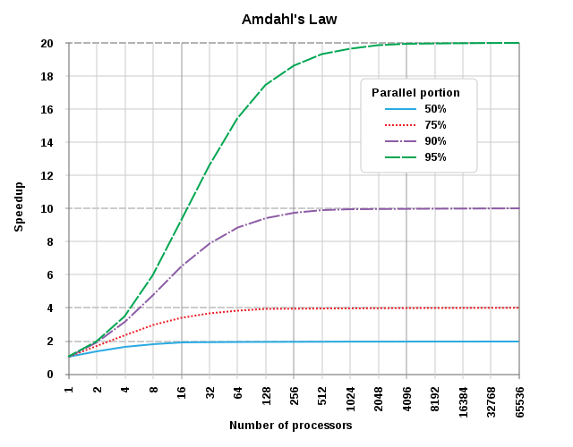

# Parallel computation

!!! info "Learning outcomes"

    - Understand some types of parallel computation
    - Understand that the maximum effectiveness of parallelism depends
      on the portion that can be parallelised
    - Understand when to use threaded parallelism

???- info "For teachers"

    Teaching goals are:

    - Learners have scheduled and run a job that needs more cores,
      with a calculation in their favorite language
    - Learners understand when it is possible/impossible
      and/or useful/useless to run a job with multiple cores

    Lesson plan:

    - 10 mins: Prior
    - 5 mins: Present
    - 15 mins: Challenge
    - 15 mins: Feedback

    Prior:

    - What is parallel computing?
    - When to use parallel computing

    Feedback:

    - When to use parallel computing?
    - When not to use parallel computing?
    - The main section is called 'The ideal effectiveness of parallelism'.
      What does 'ideal' mean in this context?
      What could make parallelism less ideal?

## Why parallel computing is important

Most HPC clusters use 10 days as a maximum duration for a job.
Your calculation may take longer than that.
One technique that may work is to use parallel computing,
where one uses multiple CPU cores to work together on a same calculation

## HPC cluster architecture

Here is a simplified picture of HPC cluster architecture:


<!-- markdownlint-disable MD013 --><!-- Tables cannot be split up over lines, hence will break 80 characters per line -->

Term        |What it loosely is                              |Amount
------------|------------------------------------------------|---------------
Core        |Something that does a calculation               |One or more per CPU
CPU         |A collection of cores that share the same memory|One or more per node
Node        |A collection of CPUs that share the same memory |One or more per HPC cluster
HPC cluster |A collection of nodes                           |One or more per universe
The universe|A collection of HPC clusters                    |One <!-- yes, I think this is funny :-) -->

<!-- markdownlint-enable MD013 -->


## Types of 'doing more things at the same time'

There are many types of 'doing more things at the same time'.
One way to distinguish these, is to separate these on
the extent of the parallelism:

Extent       |Parallelism
-------------|-------------------------------------
Core         |Single-threaded (you already do this)
Node         |Thread parallelism (today's session)
HPC cluster  |Distributed parallelism
The universe |Distributed parallelism

Today, we will extend your toolkit from a single-threaded
calculation (you already do this) to thread parallelism.

## The ideal effectiveness of parallelism

Before going into details, we will look at the
effectiveness of parallelism in the most optimal case,
with the goal that you can determine if it is worth it.

By now, you can probably guess that parallel computing spreads
a calculation over multiple things that can calculate.

Imagine a calculation that takes 16 time units, represented as this:


> A calculation of 16 time units run on 1 core,
> where square is a time unit of calculation.
>
> Red square: a unit of calculation that cannot be run in parallel.
> Green square: a unit of calculation that can be run in parallel

Using 2 calculation units, this results in:


> A calculation of 16 time units run on 2 cores,
> where square is a time unit of calculation.
>
> Red square: a unit of calculation that cannot be run in parallel.
> Green square: a unit of calculation that can be run in parallel.
> White square: a unit of calculation that is spent doing nothing

This takes the calculation down from 16 to 10 time units.
The so-called 'speedup' of using two workers is 16 / 10 = 1.6.

??? hint "How did you calculate the speedup exactly?"

    The speedup, `S`, equals:

    ```text
    S = t_enhanced / t_regular`
    ```

    where:

    - `t_enhanced` is the time the enhanced process takes
    - `t_regular` is the time the regular/unenhanced process takes

    In this context, the
    'enhanced process' is the calculation performed by multiple cores.

??? hint "Isn't that Gustafson's Law?"

    Not directly. 

    We do use the same term 'speedup' as is calculated in Gustafson's Law,
    yet we apply it to compare between a single-core and a multi-core
    process.

    Gustafson's Law predict the maximum speedup, which is

    ```text
    S = s + (p * N) = N - ((N - 1) * s) = 1 + ((N - 1) * p)
    ```

    - `S` is the speedup
    - `s` is fraction of the calculation that cannot be parallelized. The
      's' stands 'serial'
    - `p` is fraction of the calculation that can be parallelized
    - `N` is the number of workers, in our case: cores

However, 4 (out of 20) calculations units are spent waiting.
This means that 16 / 20 = 80% of the calculation time
is spent efficiently.

??? hint "How did you calculate the efficiency exactly?"

    The efficiency, `f`, equals:

    ```text
    f = t_used_effectively / t_total`
    ```

    where:

    - `t_used_effectively` is the time spend on a calculation,
      summed up over all cores
    - `t_total` is the total time all spent by all cores

    These two can be calculated as such:

    ```text
    t_used_effectively = (p + s) + (p * (N - 1))
    t_total = time * N
    ```

    where:

    - `s` is fraction of the calculation that cannot be parallelized. The
      's' stands 'serial'
    - `p` is fraction of the calculation that can be parallelized
    - `N` is the number of workers, in our case: cores


Here one can see this calculation for more cores:

<!-- markdownlint-disable MD013 --><!-- Tables cannot be split up over lines, hence will break 80 characters per line -->

Program runtime                      |Number of cores|Time|Speedup       |Efficiency
-------------------------------------|---------------|----|--------------|-----------------------------------------------
 |1              |16  |16 / 16 = 100%|16 / 16 = 100%
|2              |10  |16 / 10 = 160%|(10 + 6) / (10 * 2) = 16 / 20 = 80%
|3              |8   |16 / 8 = 200% |(10 + 6 + 6) / (10 * 3) = 22 / 30 = 73%
|4              |7   |16 / 7 = 229% |(10 + 6 + 6 + 6) / (10 * 4) = 28 / 40 = 70%
|6              |6   |16 / 6 = 267% |(10 + 6 + 6 + 6 + 6) / (10 * 5) = 34 / 50 = 68%

<!-- markdownlint-enable MD013 -->

The best possible speed gain (as shown here) is called Amdahl's Law
and, in a general form, is plotted like this:



## Question

- Which of the lines in the graph of Amdahl's Law corresponds
  with the worked-out example of 16 time units?

??? tip "Answer"

    The red dotted line.

    Using a different unit (i.e. 'relative speed', instead of 'speedup')
    was done on purpose. It is easy to convert between the two: just
    take the inverse (i.e. divide 1 by the value you have)

- In the example of 16 time units, what is the shortest amount of time that
  can be spent on the calculation, given infinite resources?

??? tip "Answer"

    The length of the calculation that cannot be run in parallel,
    which is 4 time units.

- In this example, what is the fastest relative speed?

??? tip "Answer"

    25%, as the calculation needs 4 time units to do 16 units of work.

- For your research project, you need to run a lot of calculations.
  Each calculation takes 10 hours. How do you make optimal use
  of your computational resources?

??? tip "Answer"

    Run the calculation on a single core for 100% efficiency

- For your research project, you also have a calculation that takes 11 days.
  Your HPC cluster allows a calculation of at most 10 days.
  Assume your HPC center will not extend your job (they will when asked!).
  How do you make optimal use of your time?

??? tip "Answer"

    If your calculation already has parallelism built-in,
    then run the calculation on two cores: this only involves changing your
    Slurm script, with a low loss of computational resources.

    If you are a really tight on computational resources, you can
    implement a 'save state' in your calculation, so that you can schedule
    two runs of nine days in succession, each with 100% efficiency.

    Alternatively, you can added thread parallelism to allow running
    with multiple cores.

- Your colleague runs many jobs with a lot of cores. 'It is way faster!',
  he/she states. That same colleague, however, also complains about long
  waiting times before his/her jobs start. How would you explain this
  situation?

??? tip "Answer"

    The colleague used up (or: 'wasted') all his/her computational resources
    (commonly 10,000 core hours per month).

    Due to this, his/her jobs are only run when the HPC cluster has
    a low workload and activates the so-called 'bonus queue'.

- Your colleague has done a benchmark and concluded the plot below.
  What seemed to percentage of his/her code that could be run
  in parallel?


??? tip "Answer"

    TODO
