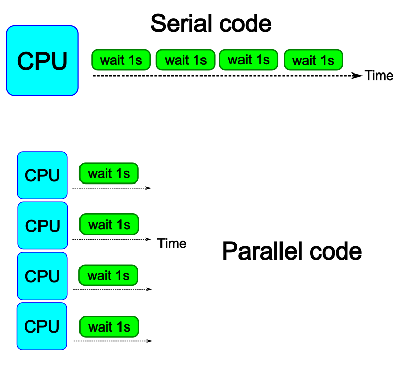

# Extra reading about parallelism

## Threaded programming

To take advantage of the shared memory of the cores, **threaded** mechanisms can be used.
Low-level programming languages, such as Fortran/C/C++, use OpenMP as the standard
application programming interface (API) to parallelize programs by using a threaded mechanism.
Here, all threads have access to the same data and can do computations simultaneously.
From this  we infer that without doing any modification to our code
we can get the benefits from parallel computing by turning-on/off external libraries,
by setting environment variables such as `OMP_NUM_THREADS`.

Higher-level languages have their own mechanisms to generate threads and this can be
confusing especially if the code is using external libraries, linear algebra for instance
(LAPACK, BLAS, ...). These libraries have their own threads (OpenMP for example) and
the code you are writing (R, Julia, Python, or Matlab) can also have some internal threded mechanism.

    - Here there are some examples (of many) of what you will need to pay attention when porting
     a parallel code from your laptop (or another HPC center) to our clusters:

A common issue with shared memory programming is *data racing* which happens when
different threads write on the same memory address.

??? Language-specific nuances for threaded programming

    === Julia

        The mechanism here is called `Julia threads` which is performant and can be activated by
        executing a script as follows ``julia --threads X script.jl``, where *X* is the number of
        threads. Code modifications are required to support the threads.

    === R

        R doesn't have a threaded mechanism as the other languages discussed in this course. Some
        functions provided by certain packages (parallel, doParallel, etc.), for instance, *foreach*,
        offer parallel features but memory is not shared across the workers. This could lead to
        [data replication](https://hpc2n.github.io/intro-course/software/#recommendations).

    === Matlab

        Starting from version 2020a, Matlab offers the [ThreadPool](https://se.mathworks.com/help/parallel-computing/parallel.threadpool.html)
        functionality that can leverage the power of threads sharing a common memory. This could
        potentially lead to a faster code compared to other schemes (Distributed discussed below)
        but notice that the code is not expected to support multi-node simulations.

??? example "Demonstrations"

    The idea is to parallelize a simple *for loop* (language-agnostic):

    ```bash
    for i start at 1 end at 4
     wait 1 second
    end the for loop
    ```

    The waiting step is used to simulate a task without writing too much code. In this way,
    one can realize how faster the loop can be executed when threads are added:

    {width=200}

    === Julia

        In the following example ``sleep-threads.jl`` the `sleep()` function is called `n` times
        first in serial mode and then by using `n` threads. The *BenchmarkTools* package
        help us to time the code (as this package is not in the base Julia installation you will need
        to install it).

        ```julia

        using BenchmarkTools
        using .Threads

        n = 4   # number of iterations

        function sleep_serial(n)   #Serial version
            for i in 1:n
                sleep(1)
            end
        end

        @btime sleep_serial(n) evals=1 samples=1

        function sleep_threaded(n) #Parallel version
            @threads for i = 1:n
                sleep(1)
            end
        end

        @btime sleep_threaded(n) evals=1 samples=1
        ```
        
        First load the Julia module ``ml Julia/1.8.5-linux-x86_64`` and then run the script
        with the command  ``srun -A "your-project" -n 1 -c 4 -t 00:05:00 julia --threads 4 sleep-threads.jl``
        to use 4 Julia threads.

        We can also use the *Distributed* package that allows the scaling of simulations beyond
        a single node (call the script ``sleep-distributed.jl``):

        ```julia

        using BenchmarkTools
        using Distributed

        n = 4   # number of iterations

        function sleep_parallel(n)
           @sync @distributed for i in 1:n
                sleep(1)
            end
        end

        @btime sleep_parallel(n) evals=1 samples=1
        ```

        Run the script with the command  ``srun -A "your-project" -n 1 -c 4 -t 00:05:00 julia -p 4 sleep-distributed.jl``
        to use 4 Julia processes.

    === R
        
        In the following example ``sleep.R`` the `Sys.sleep()` function is called `n` times
        first in serial mode and then by using `n` processes. Start by loading the
        modules ``ml GCC/12.2.0  OpenMPI/4.1.4 R/4.2.2``

        ```r
        library(doParallel)
        
        # number of iterations = number of processes
        n <- 4
        
        sleep_serial <- function(n) {
          for (i in 1:n) {
              Sys.sleep(1)
          }
        }
        
        serial_time <- system.time(   sleep_serial(n)   )[3]
        serial_time
        
        sleep_parallel <- function(n) {
          r <- foreach(i=1:n) %dopar% Sys.sleep(1)
        }
        
        cl <- makeCluster(n)
        registerDoParallel(cl)
        parallel_time <- system.time(    sleep_parallel(n)   )[3]
        stopCluster(cl)
        parallel_time
        ```

        Run the script with the command  ``srun -A "your-project" -n 1 -c 4 -t 00:05:00 Rscript --no-save --no-restore sleep.R``.

    === Matlab

        In Matlab one can use the function `pause()` to wait for some number of secods.
        The Matlab module we tested can be loaded as ``ml MATLAB/2023a.Update4``.

        ```matlab
        % Get a handler for the cluster
        c=parcluster('kebnekaise');

        n = 4;  % Number of iterations

        % Run the job with 1 worker and submit the job to the batch queue
        j = c.batch(@sleep_serial, 1, {4}, 'pool', 1);
        % Wait till the job has finished
        j.wait;
        % Fetch the result after the job has finished
        t = j.fetchOutputs{:};
        fprintf('Time taken for serial version: %.2f seconds\n', t);

        % Run the job with 4 worker and submit the job to the batch queue
        j = c.batch(@sleep_parallel, 1, {4}, 'pool', 4);
        % Wait till the job has finished
        j.wait;
        % Fetch the result after the job has finished
        t = j.fetchOutputs{:};
        fprintf('Time taken for parallel version: %.2f seconds\n', t);

        % Serial version
        function t_serial = sleep_serial(n)
        % Start timming
        tic;
           for i = 1:n
              pause(1);
           end
        t_serial = toc;  % stop timing
        end

        % Parallel version
        function t_parallel = sleep_parallel(n)
        % Start timing
        tic;
           parfor i = 1:n
              pause(1);
           end
        t_parallel = toc; % stop timing
        end
        ```

        You can run this code directly in the Matlab GUI.

## Distributed programming

Although threaded programming is convenient because one can achieve considerable initial speedups
with little code modifications, this approach does not scale for more than hundreds of
cores. Scalability can be achieved with distributed programming. Here, there is not
a common shared memory but the individual `processes` (notice the different terminology
with `threads` in shared memory) have their own memory space. Then, if a process requires
data from or should transfer data to another process, it can do that by using `send` and
`receive` to transfer messages. A standard API for distributed computing is the Message
Passing Interface (MPI). In general, MPI requires refactoring of your code.
