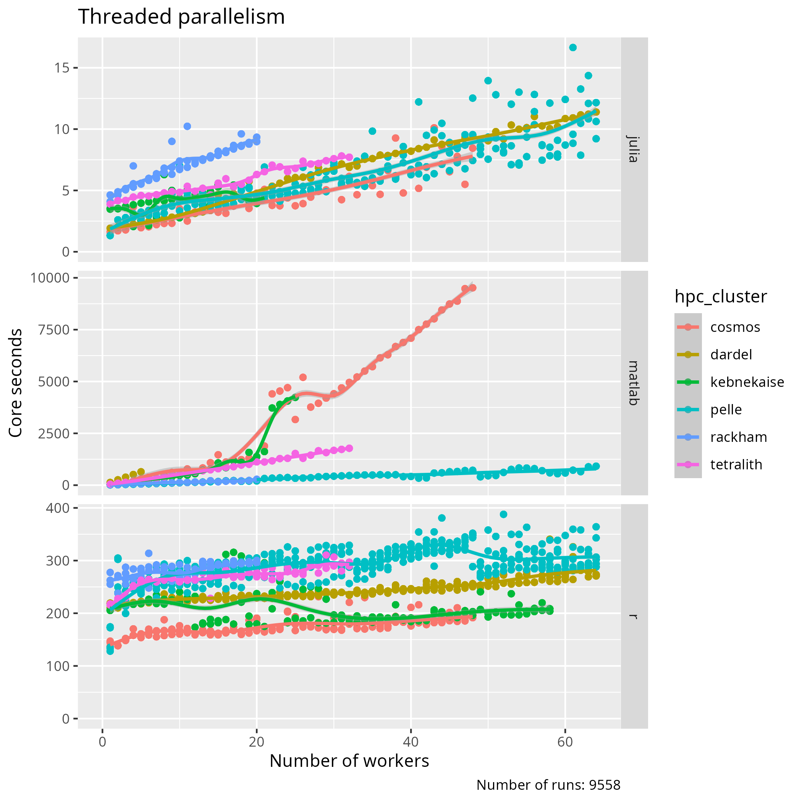
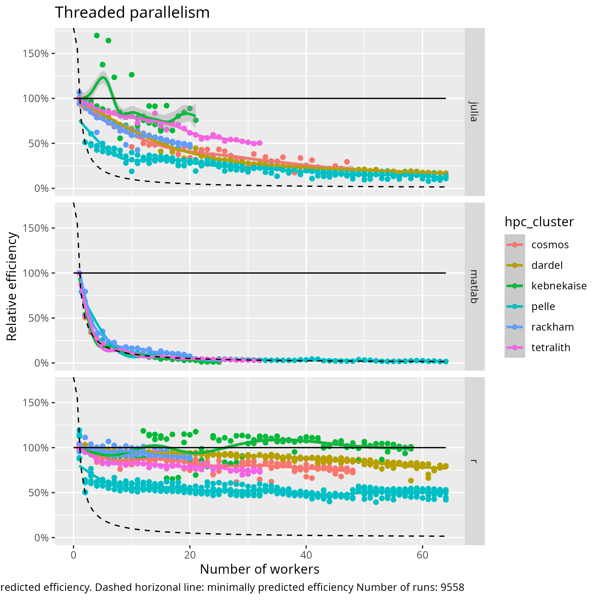

# Summary advanced day

## Parallel computing

> Simplified HPC cluster architecture

Extent       |Parallelism
-------------|--------------------------------------
Core         |Single-threaded
Node         |Thread parallelism
HPC cluster  |Distributed parallelism

> Types of parallelism, relevant to this courses

> Amdahl's law: the maximum speedup of code by parallelization is constrained
> by the code that cannot be run in parallel.

## Thread parallelism

Language|Keyword to indicate a parallel calculation
--------|------------------------------------------
Julia   |`Threads.@threads`
MATLAB  |`parfor`
R       |`%dopar%`

=== "Total core seconds"

    

    > Benchmark: the total core seconds per number of workers

=== "Efficiency"

    

    > Benchmark: Efficiency per number of workers

=== "Speedup"

    

    > Benchmark: Speedup per number of workers

- Singlethreaded code makes the best use of your computational resources
- HPC clusters differ
- Languages differ

- No need to learn a different 'faster' programming language,
  as the variance within a programming
  language is bigger than variance between
  languages (adapted fig 2, from `[Prechelt, 2000]`).
  Instead, get good in the one you already know

## Distributed parallelism

!!! important "Learning outcomes"

    - I can schedule jobs with distributed parallelism
    - I know the basic difference between threads and distributed memory in terms of memory share
    - I can explain how Julia/MATLAB/R code makes use of distributed parallelism

!!! info "Summary"

    - Memory and processes are distributed among tasks
    - Information sent between tasks only on demand
    - Native packages
        - own syntax and run with ``-p`` 
        - MATLAB
    - MPI external library
        - MPI-like syntax and run with ``mpirun -np`` command or similar.

## Big data

!!! important "Learning outcomes"

    - I understand how I can work with big data
    - I know where to find more information about big data

!!! info "Summary"

    - There are packages for all languages
        - Distributing parts of arrays
        - "Lazy computing"
    - Effective storage
        - Different file formats suits diffeent types of data
        - HDF5/NetCDF lets you load parts of the file into memory
    - Allocating memory
        - Allocate more cores
        - Use Slurm commands ``--mem=<size>GB`` or ``--mem-per-gpu=<size>GB``    

## Introduction to GPUs

!!! important "Learning outcomes"

    - I can explain the difference between a CPU and a GPU
    - I can use GPUs with my language

!!! info "Summary"

    - GPUs process simple functions rapidly, and are best suited for repetitive and highly-parallel computing tasks
    - There are GPUs on NSC/Tetralith, PDC/Dardel, C3SE/Alvis, HPC2N/Kebnekaise, LUNARC/Cosmos, UPPMAX/Pelle, but they are different
    - It varies between centres how you allocate a GPU
    - You need to use either batch or interactive/OpenOnDemand to use GPUs

## Machine Learning

!!! important "Learning outcomes"

    - I can check if an ML package is installed with a module
    - I can run ML code with my language

!!! info "Summary"

    - ML approaches
        - Supervised learning (with training examples)
            - classification
            - regression
        - Unsupervised learning (find structures in data))
            - clustering
            - dimensionality reduction
        - Reinforcement learning (take actions in different environment)
            - real-time decisions
            - game AIs
            - Robot navigation
    - When to use
        - When tasks are too complex or dynamic for a traditional algorithm
        - When you cannot define a set of rules to solve a problem, like image recognition and spam detection   
        - When you have tasks involving large amounts of unstructured data (images, audio, etc.)
        - When you need to be able to easily adapt to new information over time 
