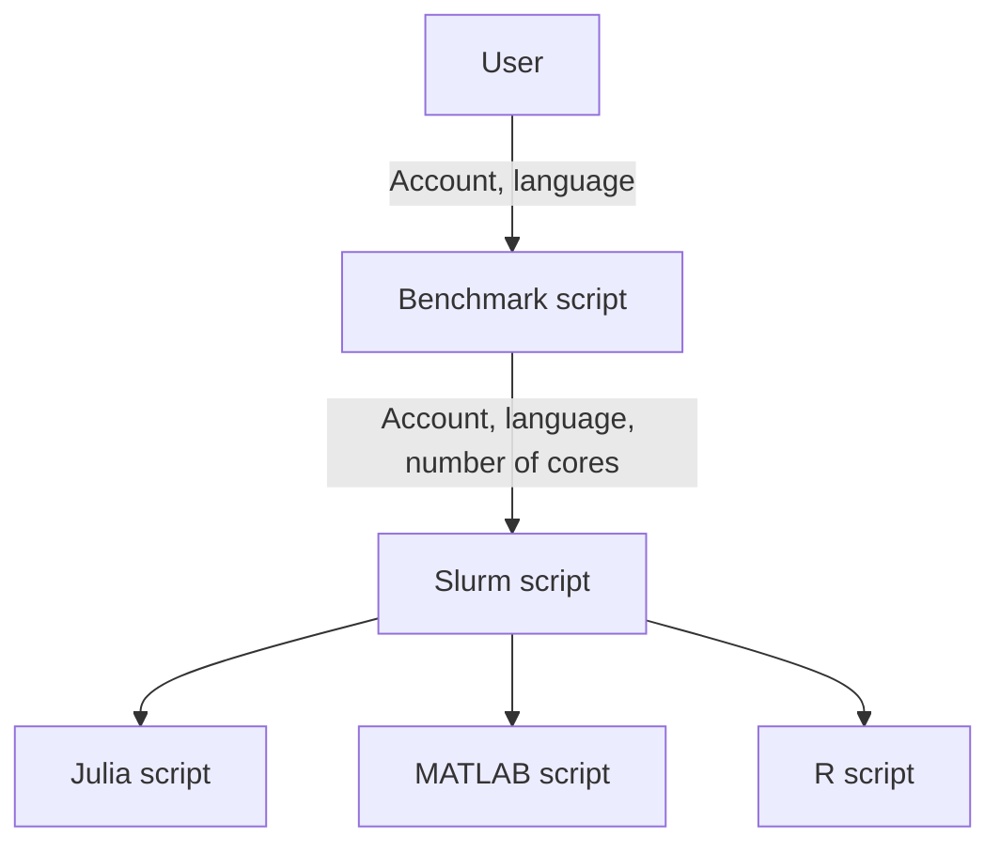
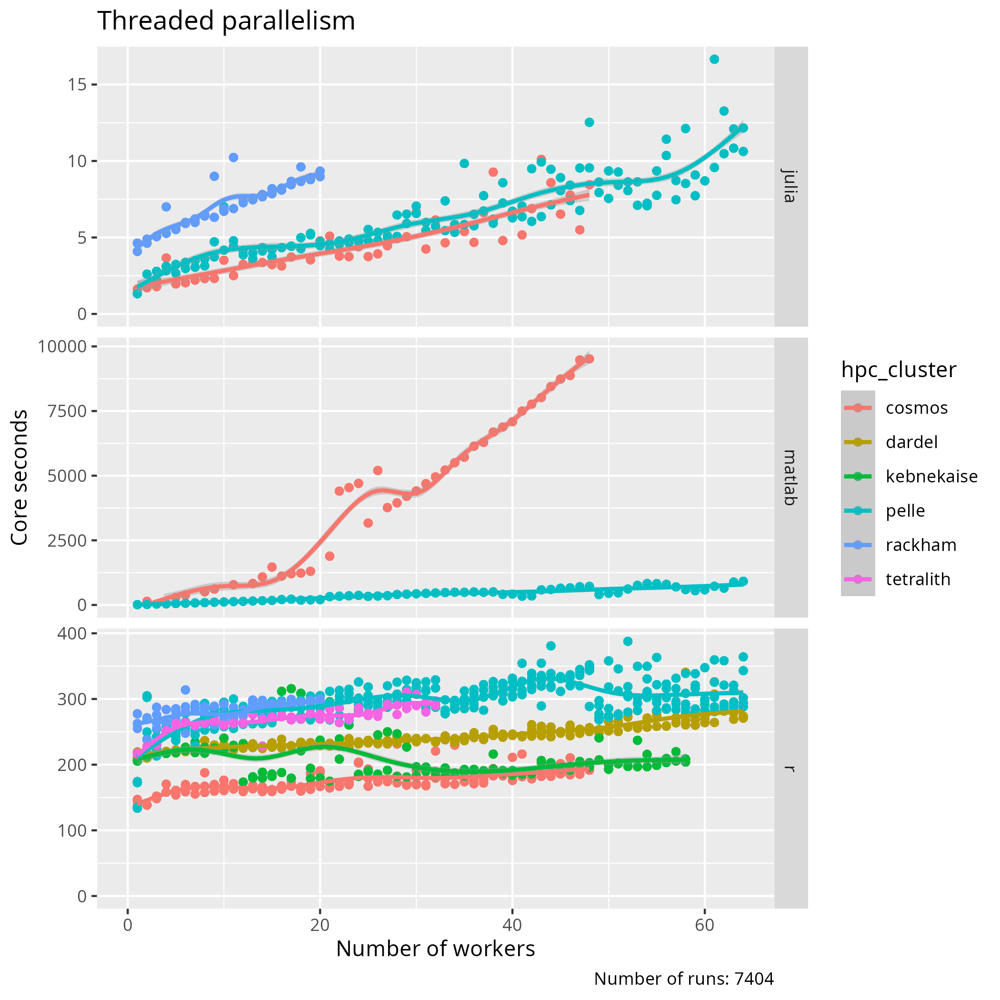
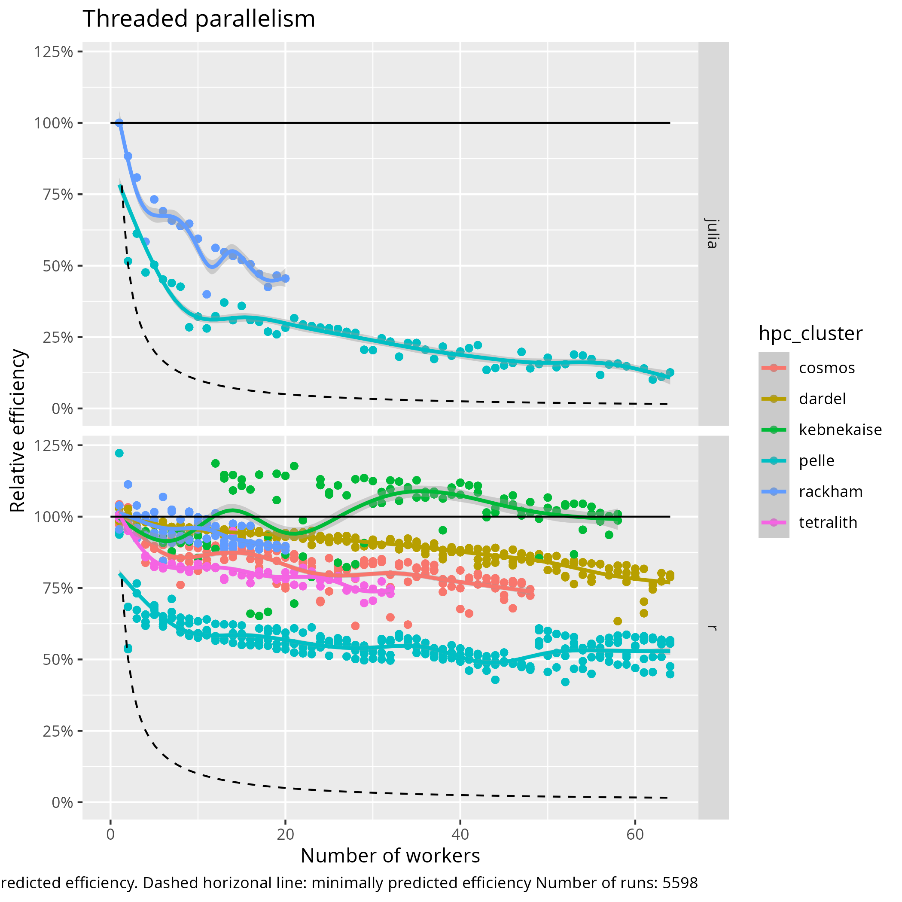
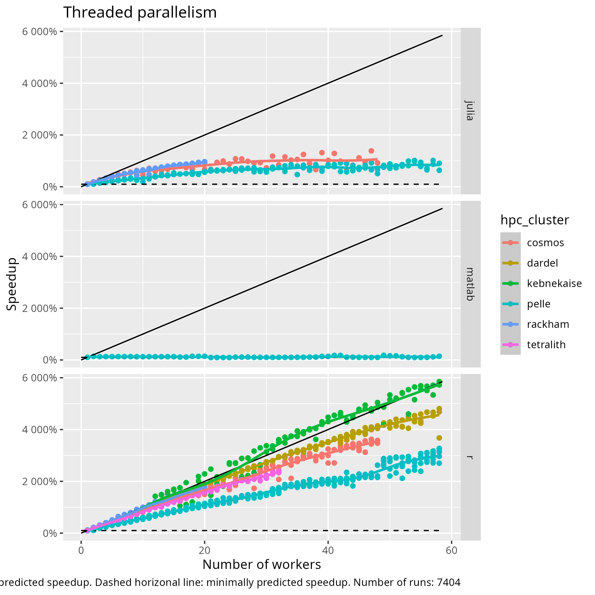

# Thread parallelism

!!! info "Learning outcomes"

    - Understand how to schedule jobs with thread parallelism
    - Understand how code achieves thread parallelism
    - Observe/conclude the costs/benefits of thread parallelism

???- note "For teachers"

    Teaching goals are:

    - Schedule and run a job that needs more cores,
      with a calculation in their favorite language
    - Learners have scheduled and run a job that needs more cores,
      with a calculation in their favorite language
    - Learners understand when it is possible/impossible
      and/or useful/useless to run a job with multiple cores

    Prior:

    - What is parallel computing?

    Feedback:

    - When to use parallel computing?
    - When not to use parallel computing?

    HPC cluster|Tested
    -----------|--------
    Alvis      |Not, maybe never
    Bianca     |Need certicate
    COSMOS     |Yes
    Dardel     |Yes
    Kebnekaise |Running
    LUMI       |Not, maybe never
    Rackham    |Yes
    Pelle      |Yes
    Tetralith  |Yes

## Why thread parallelism is important

Because it is one way to speedup (pun intended) the calculation.

## Goal

In this session, we are going to benchmark thread parallelism.




## Benchmark script

[`benchmark_2d_integration.sh`](benchmark_2d_integration.sh)
is the script that starts a benchmark,
by submitting multiple jobs to the Slurm queue,
using the Slurm script below.

The goal of the benchmark script is to
do a fixed unit of work
with increasingly more cores.

As the script itself only does light calculations,
you can run it directly. Here is how to call the script:

```bash
bash benchmark_2d_integration.sh [account] [language]
```

???- hint "Why not call the script with `./benchmark_2d_integration.sh`?"

    Because that would require one extra step:
    to make the script executable.


For example:

```bash
bash benchmark_2d_integration.sh staff r
```

If you use the incorrect spelling, the script will help you.

## Slurm script

This is the script that schedules a job with thread parallelism.

The goal of the script is to
submit a calculation that uses thread parallelism,
with a custom amount of cores.

This Slurm script is called by the benchmark script,
i.e. not directly by a user.

???- hint "How do I run it anyways?"

    You do not, instead you will run the benchmark script below.

    However, you can run it as such:

    ```bash
    sbatch -A [account] -n [number_of_cores] do_[language]_2d_integration.sh
    ```

    For example:

    ```bash
    sbatch -A staff -n 1 do_r_2d_integration.sh

    # On Dardel
    sbatch -A staff -n 1 -p main do_r_2d_integration.sh
    ```

There are 3 Slurm scripts, 1 per language:

Language|Script with calculation
--------|------------------------------------------
Julia   |[do_julia_2d_integration.sh](do_julia_2d_integration.sh)
MATLAB  |[do_matlab_2d_integration.sh](do_matlab_2d_integration.sh)
R       |[do_r_2d_integration.sh](do_r_2d_integration.sh)

Each of these Slurm scripts are called by the benchmark script,
where the benchmark script supplies the desired number of cores.

## Calculation script

This is the code that performs a job with thread parallelism.

The goal of the code is to have a fixed unit of work that
can be done by a custom amount of cores.

This calculation script is called by the Slurm script,
i.e. not directly by a user.

???- hint "R: How do I run it anyways?"
    
    You can run it as such:
    
    ```bash
    [interpreter] [script_name] [number_of_cores] [grid_size]
    ```
    
    On a login node, use 1 core and a grid size of 1 to start
    the lightest calculation possible:
    
    ```bash
    Rscript integration2d.R 1 1
    ```

<!-- markdownlint-disable MD013 --><!-- Tables cannot be split up over lines, hence will break 80 characters per line -->

Language|Script with calculation                      |Documentation used
--------|---------------------------------------------|-------------------
Julia   |[do_2d_integration.jl](do_2d_integration.jl) |[Julia documentation](https://docs.julialang.org/en/v1/manual/multi-threading)
MATLAB  |[do_2d_integration.m](do_2d_integration.m)   |.
R       |[do_2d_integration.R](do_2d_integration.R)   |.

<!-- markdownlint-enable MD013 -->

## Script to collect the results

The goal of the script to collect the benchmark results,
[`collect_benchmark_results.sh`](collect_benchmark_results.sh),
is to collect the output of the runs from the Slurm log files.

Run [`collect_benchmark_results.sh`](collect_benchmark_results.sh) as such:

```bash
./collect_benchmark_results.sh
```

You will see the collected results.

## Exercises


## Exercise 1: start the benchmark on your HPC cluster

The goal of this exercise is to start the benchmark script
on your HPC cluster, as well as some troubleshooting.

On your HPC cluster:

- Download the benchmark script

???- hint "How to do that?"

    There are many ways to do so.

    One way is to download it directly from
    [this course's repository](https://raw.githubusercontent.com/UPPMAX/R-matlab-julia-HPC/refs/heads/main/docs/advanced/thread_parallelism/benchmark_2d_integration.sh):

    ```bash
    wget https://raw.githubusercontent.com/UPPMAX/R-matlab-julia-HPC/refs/heads/main/docs/advanced/thread_parallelism/benchmark_2d_integration.sh
    ```

- Run the benchmark script

???- hint "How to do that?"

    [The 'Benchmark script' section](#benchmark-script) shows how:

    ```bash
    bash benchmark_2d_integration.sh staff r
    ```

- Check the Slurm output files for problems.
  If there are problems: fix these, then run the benchmark script again

???- hint "How to do that?"

    There are many ways to do so.

    One way is to show all files with the `.out` extension:

    ```bash
    cat *.out
    ```

## Exercise 2: read the benchmark script

Now that the benchmark script is running,
we have the time to figure out what it is doing.

- What is the most important single line in this script,
  i.e. the line it is all about?

???- hint "Answer"

    For all HPC clusters except Dardel:

    ```bash
    sbatch -A "${slurm_job_account}" -N "${n_nodes}" -n "${n_cores}" "${script_name}"
    ```

    For the Dardel HPC cluster:

    ```bash
    sbatch -A "${slurm_job_account}" -N "${n_nodes}" -n "${n_cores}" -p main "${script_name}"
    ```

- In English, describe what the line does in general terms

???- hint "Answer"

    Schedule to run ...

    - on some account
    - with some amount of nodes
    - with some amount of cores
    - (on Dardel) on the `main` partition
    - a script with some name

- This line of code is part of a `for` loop.
  In English, what does the `for` loop achieve?

???- hint "Answer"

    HIERO


## Exercise 3: read the Slurm script

## Exercise 4: read the calculation script

## Exercise 5: analyse the results

## Exercise 6: compare to others







## Exercise X1:

What went wrong here? Why is this a problem?

<!-- markdownlint-disable MD013 --><!-- Tables cannot be split up over lines, hence will break 80 characters per line -->

```console
[richel@pelle1 thread_parallelism]$ squeue --me
             JOBID PARTITION     NAME     USER ST       TIME  NODES NODELIST(REASON)
             54197     pelle do_r_2d_   richel  R       0:14      1 p66
             54200     pelle do_r_2d_   richel  R       0:14      4 p[64-67]
             54216     pelle do_r_2d_   richel  R       0:14      3 p[104-106]
             54217     pelle do_r_2d_   richel  R       0:14      6 p[106-111]
             54169     pelle do_r_2d_   richel  R       0:15      1 p70
```

<!-- markdownlint-enable MD013 -->

## Exercise X2:

What went wrong here? Why is this a problem?

```console
Julia single-thread tuns
```

## Exercise X3: always program in Assembly?

```
Figure from paper
```

## Where to go next?

Distributed parallelism

## Troubleshooting

### T1. Invalid account or account/partition combination specified

<!-- markdownlint-disable MD013 --><!-- Verbatim error message cannot be split up over lines, hence will break 80 characters per line -->

```bash
sbatch: error: Batch job submission failed: Invalid account or account/partition combination specified
```

<!-- markdownlint-enable MD013 -->

You've specified the wrong account.

Run `projinfo`.

## T2. There is no package called ‘doParallel’

This is an R error.

You can find it by checking the log files:

```bash
cat *.out
```

When you see, for example, the text below,
it is clearly stated that there is no package called `doParallel`.

```text
HPC cluster: tetralith
Slurm job account used: naiss2025-22-934
Number of cores booked in Slurm: 32
Error in library(doParallel, quietly = TRUE) : 
  there is no package called ‘doParallel’
Execution halted
```

To fix this:

- load the correct module
- install that package from the terminal.

To load the correct module, load the R module(s) as loaded by the
[`do_r_2d_integration.sh`](do_r_2d_integration.sh) script,
for example:

```bash
module load R/4.4.0-hpc1-gcc-11.3.0-bare
```

???- hint "Could you expand on that?"

    Open the [`do_r_2d_integration.sh`](do_r_2d_integration.sh) script.

    Search for the part where modules are loaded, which is at the
    bottom.

    Find the lines where the modules are loaded for your favorite HPC cluster,
    e.g.

    ```bash
    if [ ${hpc_cluster} == "rackham" ]
    then
      module load R_packages/4.1.1 >/dev/null 2>&1
    fi
    ```

    Copy the part that loads the modules, excluding the `>` and after,
    and run these in a terminal on your favorite
    HPC cluster:

    ```bash
    module load R_packages/4.1.1
    ```

    You have now loaded the packages needed for the calculation.


To install that package from the terminal,
[check this course's material on how to do so](../../r/packages.md).
  

## T3. 'namespace ‘rlang’ 0.4.12 is already loaded, but >= 1.1.0 is required'

```bash
Error in loadNamespace(i, c(lib.loc, .libPaths()), versionCheck = vI[[i]]) : 
  namespace ‘rlang’ 0.4.12 is already loaded, but >= 1.1.0 is required
Calls: <Anonymous> ... waldo_compare -> loadNamespace -> namespaceImport -> loadNamespace
Execution halted
```

This is the same procedure as T2.

<!-- markdownlint-disable -->

<!-- old stuff below 

Threaded programming
''''''''''''''''''''

To take advantage of the shared memory of the cores, **threaded** mechanisms can be used.
Low-level programming languages, such as Fortran/C/C++, use OpenMP as the standard
application programming interface (API) to parallelize programs by using a threaded mechanism.
Here, all threads have access to the same data and can do computations simultaneously.
From this  we infer that without doing any modification to our code
we can get the benefits from parallel computing by turning-on/off external libraries,
by setting environment variables such as ``OMP_NUM_THREADS``.

Higher-level languages have their own mechanisms to generate threads and this can be
confusing especially if the code is using external libraries, linear algebra for instance
(LAPACK, BLAS, ...). These libraries have their own threads (OpenMP for example) and
the code you are writing (R, Julia, Python, or Matlab) can also have some internal threded mechanism.

.. warning::

   - Check if the libraries/packages that you are using have a threaded mechanism.
   - Monitor the usage of hardware resources with tools offered at your HPC center, for instance
     `job-usage at HPC2N <https://hpc2n.github.io/intro-course/software/#best__practices>`_.
   - Here there are some examples (of many) of what you will need to pay attention when porting
     a parallel code from your laptop (or another HPC center) to our clusters:

   .. tabs::

      .. tab:: Julia

         For some linear algebra operations Julia supports threads (set with the ``OMP_NUM_THREADS`` variable).
         If your code contains calls to these operations in a loop that is already parallelized by *n* processes,
         and you allocate *n* cores for this job, this job will exceed the allocated resources unless the
         number of threads is explicitly set to 1. Notice that Julia also has its own threaded mechanism.

      .. tab:: R

         Creating a cluster with *n* cores (makeCluster) and start traing a ML model with flags such as
         ``allowParallel`` set to ``TRUE`` or ``num.threads`` set to a value such as the total number of requested
         cores is exceeded.

      .. tab:: Matlab

         Using a **CPLEX** solver inside a ``parfor`` loop: These solvers work in a *opportunistic* manner meaning that
         they will try to use all the resources available in the machine. If you request *n* cores for ``parfor`` in
         your batch job, these cores will be used by the solver. Theoretically, you will be using *nxn* cores although
         only *n* were requested. One way to solve this issue is by setting the number of threads
         ``cplex.Param.threads.Cur`` to 1.

A common issue with shared memory programming is *data racing* which happens when
different threads write on the same memory address.

.. admonition:: Language-specific nuances for threaded programming
   :class: dropdown

   .. tabs::

      .. tab:: Julia

         The mechanism here is called `Julia threads` which is performant and can be activated by
         executing a script as follows ``julia --threads X script.jl``, where *X* is the number of
         threads. Code modifications are required to support the threads.

      .. tab:: R

         R doesn't have a threaded mechanism as the other languages discussed in this course. Some
         functions provided by certain packages (parallel, doParallel, etc.), for instance, *foreach*,
         offer parallel features but memory is not shared across the workers. This could lead to
         `data replication <https://hpc2n.github.io/intro-course/software/#recommendations>`_.

      .. tab:: Matlab

         Starting from version 2020a, Matlab offers the `ThreadPool <https://se.mathworks.com/help/parallel-computing/parallel.threadpool.html>`_
         functionality that can leverage the power of threads sharing a common memory. This could
         potentially lead to a faster code compared to other schemes (Distributed discussed below)
         but notice that the code is not expected to support multi-node simulations.


Big data
''''''''

Sometimes the workflow you are targeting doesn't require extensive computations but mainly dealing with
big pieces of data. An example can be, reading a column-structured file and doing some transformation per-column.
Fortunately, all languages covered in this course have already several tools to deal with big data.
We list some of these tools in what follows but notice that other tools doing similar jobs can be
available for each language.

.. admonition:: Language-specific tools for big data
   :class: dropdown

   .. tabs::

      .. tab:: Julia

         **Dagger**

         According to the developers of this framework, `Dagger <https://juliaparallel.org/Dagger.jl/dev/>`_
         is heavily inspired on Dask. It support distributed arrays so that they could fit the memory and
         also the possibility of parallelizing the computations on these arrays.

      .. tab:: R

         `Arrow <https://arrow.apache.org/docs/r/index.html>`_ (previously *disk.frame*) can deal with
         big arrays. Other tools include `data.table <https://cran.r-project.org/web/packages/data.table/vignettes/datatable-intro.html>`_
         and `bigmemory <https://cran.r-project.org/web/packages/bigmemory/index.html>`_.

      .. tab:: Matlab

         In Matlab `Tall Arrays <https://se.mathworks.com/help/matlab/tall-arrays.html>`_ and
         `Distributed Arrays <https://se.mathworks.com/help/parallel-computing/distributed-arrays.html>`_
         will assist you when dealing with large arrays.

-------------------

.. demo::
   :class: dropdown

   The idea is to parallelize a simple *for loop* (language-agnostic):

   .. code-block:: sh

      for i start at 1 end at 4
         wait 1 second
      end the for loop

   The waiting step is used to simulate a task without writing too much code. In this way,
   one can realize how faster the loop can be executed when threads are added:

   .. figure:: ../../img/parallel-loop.png
      :width: 200
      :align: center

   .. tabs::

      .. tab:: Julia

         In the following example ``sleep-threads.jl`` the `sleep()` function is called `n` times
         first in serial mode and then by using `n` threads. The *BenchmarkTools* package
         help us to time the code (as this package is not in the base Julia installation you will need
         to install it).

         .. code-block:: julia

            using BenchmarkTools
            using .Threads

            n = 4   # number of iterations

            function sleep_serial(n)   #Serial version
                for i in 1:n
                    sleep(1)
                end
            end

            @btime sleep_serial(n) evals=1 samples=1

            function sleep_threaded(n) #Parallel version
                @threads for i = 1:n
                    sleep(1)
                end
            end

            @btime sleep_threaded(n) evals=1 samples=1

         First load the Julia module ``ml Julia/1.8.5-linux-x86_64`` and then run the script
         with the command  ``srun -A "your-project" -n 1 -c 4 -t 00:05:00 julia --threads 4 sleep-threads.jl``
         to use 4 Julia threads.

         We can also use the *Distributed* package that allows the scaling of simulations beyond
         a single node (call the script ``sleep-distributed.jl``):

         .. code-block:: julia

            using BenchmarkTools
            using Distributed

            n = 4   # number of iterations

            function sleep_parallel(n)
               @sync @distributed for i in 1:n
                    sleep(1)
                end
            end

            @btime sleep_parallel(n) evals=1 samples=1

         Run the script with the command  ``srun -A "your-project" -n 1 -c 4 -t 00:05:00 julia -p 4 sleep-distributed.jl``
         to use 4 Julia processes.

      .. tab:: R

         In the following example ``sleep.R`` the `Sys.sleep()` function is called `n` times
         first in serial mode and then by using `n` processes. Start by loading the
         modules ``ml GCC/12.2.0  OpenMPI/4.1.4 R/4.2.2``

         .. code-block:: r

            library(doParallel)

            # number of iterations = number of processes
            n <- 4

            sleep_serial <- function(n) {
              for (i in 1:n) {
                  Sys.sleep(1)
              }
            }

            serial_time <- system.time(   sleep_serial(n)   )[3]
            serial_time

            sleep_parallel <- function(n) {
              r <- foreach(i=1:n) %dopar% Sys.sleep(1)
            }

            cl <- makeCluster(n)
            registerDoParallel(cl)
            parallel_time <- system.time(    sleep_parallel(n)   )[3]
            stopCluster(cl)
            parallel_time

         Run the script with the command  ``srun -A "your-project" -n 1 -c 4 -t 00:05:00 Rscript --no-save --no-restore sleep.R``.

      .. tab:: Matlab

         In Matlab one can use the function `pause()` to wait for some number of secods.
         The Matlab module we tested can be loaded as ``ml MATLAB/2023a.Update4``.

         .. code-block:: matlab

            % Get a handler for the cluster
            c=parcluster('kebnekaise');

            n = 4;  % Number of iterations

            % Run the job with 1 worker and submit the job to the batch queue
            j = c.batch(@sleep_serial, 1, {4}, 'pool', 1);
            % Wait till the job has finished
            j.wait;
            % Fetch the result after the job has finished
            t = j.fetchOutputs{:};
            fprintf('Time taken for serial version: %.2f seconds\n', t);

            % Run the job with 4 worker and submit the job to the batch queue
            j = c.batch(@sleep_parallel, 1, {4}, 'pool', 4);
            % Wait till the job has finished
            j.wait;
            % Fetch the result after the job has finished
            t = j.fetchOutputs{:};
            fprintf('Time taken for parallel version: %.2f seconds\n', t);

            % Serial version
            function t_serial = sleep_serial(n)
            % Start timming
            tic;
               for i = 1:n
                  pause(1);
               end
            t_serial = toc;  % stop timing
            end

            % Parallel version
            function t_parallel = sleep_parallel(n)
            % Start timing
            tic;
               parfor i = 1:n
                  pause(1);
               end
            t_parallel = toc; % stop timing
            end

         You can run this code directly in the Matlab GUI.

-------------------

Exercises
---------

.. challenge:: Running a parallel code efficiently
   :class: dropdown

   In this exercise we will run a parallelized code that performs a 2D integration:

      .. math::
          \int^{\pi}_{0}\int^{\pi}_{0}\sin(x+y)dxdy = 0

   One way to perform the integration is by creating a grid in the ``x`` and ``y`` directions.
   More specifically, one divides the integration range in both directions into ``n`` bins.

   .. tabs::

      .. tab:: Julia

            Here is a parallel code using the ``Distributed`` package in Julia (call it
            ``integration2d_distributed.jl``):

            .. admonition:: integration2d_distributed.jl
               :class: dropdown

               .. code-block:: julia

                   using Distributed
                   using SharedArrays
                   using LinearAlgebra
                   using Printf
                   using Dates

                   # Add worker processes (replace with actual number of cores you want to use)
                   nworkers = *FIXME*
                   addprocs(nworkers)

                   # Grid size
                   n = 20000
                   # Number of processes
                   numprocesses = nworkers
                   # Shared array to store partial sums for each process
                   partial_integrals = SharedVector{Float64}(numprocesses)

                   # Function for 2D integration using multiprocessing
                   # the decorator @everywher instruct Julia to transfer this function to all workers
                   @everywhere function integration2d_multiprocessing(n, numprocesses, processindex, partial_integrals)
                       # Interval size (same for X and Y)
                       h = π / n
                       # Cumulative variable
                       mysum = 0.0
                       # Workload for each process
                       workload = div(n, numprocesses)

                       # Define the range of work for each process according to index
                       begin_index = workload * (processindex - 1) + 1
                       end_index = workload * processindex

                       # Regular integration in the X axis
                       for i in begin_index:end_index
                           x = h * (i - 0.5)
                           # Regular integration in the Y axis
                           for j in 1:n
                               y = h * (j - 0.5)
                               mysum += sin(x + y)
                           end
                       end

                       # Store the result in the shared array
                       partial_integrals[processindex] = h^2 * mysum
                   end

                   # function for main
                   function main()
                       # Start the timer
                       starttime = now()

                       # Distribute tasks to processes
                       @sync for i in 1:numprocesses
                           @spawnat i integration2d_multiprocessing(n, numprocesses, i, partial_integrals)
                       end

                       # Calculate the total integral by summing over partial integrals
                       integral = sum(partial_integrals)

                       # end timing
                       endtime = now()

                       # Output results
                       println("Integral value is $(integral), Error is $(abs(integral - 0.0))")
                       println("Time spent: $(Dates.value(endtime - starttime) / 1000) sec")
                   end

                   # Run the main function
                   main()

            Run the code with the following batch script.

            .. admonition:: job.sh
               :class: dropdown

               .. tabs::

                  .. tab:: UPPMAX

                     .. code-block:: bash

                             #!/bin/bash -l
                             #SBATCH -A naiss202X-XY-XYZ  # your project_ID
                             #SBATCH -J job-serial        # name of the job
                             #SBATCH -n *FIXME*           # nr. tasks/coresw
                             #SBATCH --time=00:20:00      # requested time
                             #SBATCH --error=job.%J.err   # error file
                             #SBATCH --output=job.%J.out  # output file

                             ml julia/1.8.5

                             julia integration2d_distributed.jl

                  .. tab:: HPC2N

                     .. code-block:: bash

                             #!/bin/bash
                             #SBATCH -A hpc2n202x-xyz     # your project_ID
                             #SBATCH -J job-serial        # name of the job
                             #SBATCH -n *FIXME*           # nr. tasks
                             #SBATCH --time=00:20:00      # requested time
                             #SBATCH --error=job.%J.err   # error file
                             #SBATCH --output=job.%J.out  # output file

                             ml purge  > /dev/null 2>&1
                             ml Julia/1.9.3-linux-x86_64

                             julia integration2d_distributed.jl

                  .. tab:: LUNARC

                       .. code-block:: sh

                           #!/bin/bash
                           #SBATCH -A lu202X-XX-XX      # your project_ID
                           #SBATCH -J job-serial        # name of the job
                           #SBATCH -n *FIXME*           # nr. tasks
                           #SBATCH --time=00:20:00      # requested time
                           #SBATCH --error=job.%J.err   # error file
                           #SBATCH --output=job.%J.out  # output file
                           # reservation (optional)
                           #SBATCH --reservation=RPJM-course*FIXME*

                           ml purge  > /dev/null 2>&1
                           ml Julia/1.9.3-linux-x86_64

                           julia integration2d_distributed.jl

                  .. tab:: PDC

                     .. code-block:: bash

                           #!/bin/bash
                           #SBATCH -A naiss202t-uv-wxyz # your project_ID
                           #SBATCH -J job               # name of the job
                           #SBATCH  -p shared           # name of the queue
                           #SBATCH --ntasks=*FIXME*     # nr. of tasks
                           #SBATCH --cpus-per-task=1    # nr. of cores per-task
                           #SBATCH --time=00:03:00      # requested time
                           #SBATCH --error=job.%J.err   # error file
                           #SBATCH --output=job.%J.out  # output file

                           # Load dependencies and Julia version
                           ml PDC/23.12 julia/1.10.2-cpeGNU-23.12

                           julia integration2d_distributed.jl

                  .. tab:: NSC

                     .. code-block:: bash

                           #!/bin/bash
                           #SBATCH -A naiss202t-uv-xyz  # your project_ID
                           #SBATCH -J job-serial        # name of the job
                           #SBATCH -n *FIXME*           # nr. tasks
                           #SBATCH --time=00:20:00      # requested time
                           #SBATCH --error=job.%J.err   # error file
                           #SBATCH --output=job.%J.out  # output file

                           # Load any modules you need, here for Julia
                           ml julia/1.9.4-bdist

                           julia integration2d_distributed.jl

            Try different number of cores for this batch script (*FIXME* string) using the sequence:
            1,2,4,8,12, and 14. Note: this number should match the number of processes
            (also a *FIXME* string) in the Julia script. Collect the timings that are
            printed out in the **job.*.out**. According to these execution times what would be
            the number of cores that gives the optimal (fastest) simulation?

            Challenge: Increase the grid size (``n``) to 100000 and submit the batch job with 4 workers (in the
            Julia script) and request 5 cores in the batch script. Monitor the usage of resources
            with tools available at your center, for instance ``top`` (UPPMAX) or
            ``job-usage`` (HPC2N).

      .. tab:: R

            Here is a parallel code using the ``parallel`` and ``doParallel`` packages in R (call it
            ``integration2d.R``). Note: check if those packages are already installed for the required
            R version, otherwise install them with ``install.packages()``. The recommended R version
            for this exercise is ``ml GCC/12.2.0 OpenMPI/4.1.4 R/4.2.2`` (HPC2N).

            .. admonition:: integration2d.R
               :class: dropdown

               .. code-block:: R

                   library(parallel)
                   library(doParallel)

                   # nr. of workers/cores that will solve the tasks
                   nworkers <- *FIXME*

                   # grid size
                   n <- 840

                   # Function for 2D integration (non-optimal implementation)
                   integration2d <- function(n, numprocesses, processindex) {
                     # Interval size (same for X and Y)
                     h <- pi / n
                     # Cumulative variable
                     mysum <- 0.0
                     # Workload for each process
                     workload <- floor(n / numprocesses)

                     # Define the range of work for each process according to index
                     begin_index <- workload * (processindex - 1) + 1
                     end_index <- workload * processindex

                     # Regular integration in the X axis
                     for (i in begin_index:end_index) {
                       x <- h * (i - 0.5)
                       # Regular integration in the Y axis
                       for (j in 1:n) {
                         y <- h * (j - 0.5)
                         mysum <- mysum + sin(x + y)
                       }
                     }
                     # Return the result
                     return(h^2 * mysum)
                   }

                   # Set up the cluster for doParallel
                   cl <- makeCluster(nworkers)
                   registerDoParallel(cl)

                       # Start the timer
                       starttime <- Sys.time()

                       # Distribute tasks to processes and combine the outputs into the results list
                       results <- foreach(i = 1:nworkers, .combine = c) %dopar% { integration2d(n, nworkers, i) }

                       # Calculate the total integral by summing over partial integrals
                       integral <- sum(results)

                       # End the timing
                       endtime <- Sys.time()

                       # Print out the result
                       print(paste("Integral value is", integral, "Error is", abs(integral - 0.0)))
                       print(paste("Time spent:", difftime(endtime, starttime, units = "secs"), "seconds"))

                   # Stop the cluster after computation
                   stopCluster(cl)

            Run the code with the following batch script.

            .. admonition:: job.sh
               :class: dropdown

               .. tabs::

                  .. tab:: UPPMAX

                     .. code-block:: bash

                             #!/bin/bash -l
                             #SBATCH -A naiss202u-wv-xyz  # your project_ID
                             #SBATCH -J job-serial        # name of the job
                             #SBATCH -n *FIXME*           # nr. tasks/coresw
                             #SBATCH --time=00:20:00      # requested time
                             #SBATCH --error=job.%J.err   # error file
                             #SBATCH --output=job.%J.out  # output file

                             ml R_packages/4.1.1

                             Rscript --no-save --no-restore integration2d.R

                  .. tab:: HPC2N

                     .. code-block:: bash

                             #!/bin/bash
                             #SBATCH -A hpc2n202w-xyz     # your project_ID
                             #SBATCH -J job-serial        # name of the job
                             #SBATCH -n *FIXME*           # nr. tasks
                             #SBATCH --time=00:20:00      # requested time
                             #SBATCH --error=job.%J.err   # error file
                             #SBATCH --output=job.%J.out  # output file

                             ml purge > /dev/null 2>&1
                             ml GCC/12.2.0  OpenMPI/4.1.4 R/4.2.2
                             Rscript --no-save --no-restore integration2d.R

                  .. tab:: LUNARC

                       .. code-block:: sh

                            #!/bin/bash
                            #SBATCH -A lu202u-wy-yz      # your project_ID
                            #SBATCH -J job-serial        # name of the job
                            #SBATCH -n *FIXME*           # nr. tasks
                            #SBATCH --time=00:20:00      # requested time
                            #SBATCH --error=job.%J.err   # error file
                            #SBATCH --output=job.%J.out  # output file
                               #SBATCH --reservation=RPJM-course*FIXME* # reservation (optional)

                            ml purge > /dev/null 2>&1
                            ml GCC/11.3.0  OpenMPI/4.1.4  R/4.2.1
                            Rscript --no-save --no-restore integration2d.R

                  .. tab:: PDC

                     .. code-block:: bash

                           #!/bin/bash
                           #SBATCH -A naiss202t-uv-wxyz # your project_ID
                           #SBATCH -J job               # name of the job
                           #SBATCH  -p shared           # name of the queue
                           #SBATCH --ntasks=*FIXME*     # nr. of tasks
                           #SBATCH --cpus-per-task=1    # nr. of cores per-task
                           #SBATCH --time=00:03:00      # requested time
                           #SBATCH --error=job.%J.err   # error file
                           #SBATCH --output=job.%J.out  # output file

                           # Load dependencies and R version
                           ml ...

                           Rscript --no-save --no-restore integration2d.R

                  .. tab:: NSC

                     .. code-block:: bash

                           #!/bin/bash
                           #SBATCH -A naiss202t-uv-xyz  # your project_ID
                           #SBATCH -J job-serial        # name of the job
                           #SBATCH -n *FIXME*           # nr. tasks
                           #SBATCH --time=00:20:00      # requested time
                           #SBATCH --error=job.%J.err   # error file
                           #SBATCH --output=job.%J.out  # output file

                           # Load any modules you need, here for R
                           ml R/4.4.0-hpc1-gcc-11.3.0-bare

                           Rscript --no-save --no-restore integration2d.R

            Try different number of cores for this batch script (*FIXME* string) using the sequence:
            1,2,4,8,12, and 14. Note: this number should match the number of processes
            (also a *FIXME* string) in the R script. Collect the timings that are
            printed out in the **job.*.out**. According to these execution times what would be
            the number of cores that gives the optimal (fastest) simulation?

            Challenge: Increase the grid size (``n``) to 10000 and submit the batch job with 4 workers (in the
            R script) and request 5 cores in the batch script. Monitor the usage of resources
            with tools available at your center, for instance ``top`` (UPPMAX) or
            ``job-usage`` (HPC2N).

      .. tab:: Matlab

            Here is a parallel code using the ``parfor`` tool from Matlab (call it
            ``integration2d.m``).

            .. admonition:: integration2d.m
               :class: dropdown

               .. code-block:: matlab

                   % Number of workers/processes
                   num_workers = *FIXME*;

                   % Use parallel pool with 'parfor'
                   parpool('profile-name',num_workers);  % Start parallel pool with num_workers workers

                   % Grid size
                   n = 6720;

                   % bin size
                   h = pi / n;

                   tic;  % Start timer
                   % Shared variable to collect partial sums
                   partial_integrals = 0.0;

                   % In Matlab one can use parfor to parallelize loops
                   parfor i = 1:n
                       partial_integrals = partial_integrals + integration2d_partial(n,i);
                   end

                   % Compute the integrals by multilpying by the bin size
                   integral = partial_integrals * h^2;
                   elapsedTime = toc;  % Stop timer

                   fprintf("Integral value is %e\n", integral);
                   fprintf("Error is %e\n", abs(integral - 0.0));
                   fprintf("Time spent: %.2f sec\n", elapsedTime);

                   % Clean up the parallel pool
                   delete(gcp('nocreate'));

                   % Function for the 2D integration only computes a single bin
                   function mysum = integration2d_partial(n,i)
                       % bin size
                       h = pi / n;
                       % Partial summation
                       mysum = 0.0;
                           % A single bin is computed
                           x = h * (i - 0.5);
                           % Regular integration in the Y axis
                           for j = 1:n
                               y = h * (j - 0.5);
                               mysum = mysum + sin(x + y);
                           end
                   end

            You can run directly this script from the Matlab GUI.
            Try different number of cores for this batch script (*FIXME* string) using the sequence:
            1,2,4,8,12, and 14. Collect the timings that are printed out in the Matlab command window.
            According to these execution times what would be
            the number of cores that gives the optimal (fastest) simulation?

            Challenge: Increase the grid size (``n``) to 100000 and submit the batch job with 4 workers.
            Monitor the usage of resources with tools available at your center, for instance ``top`` (UPPMAX),
            ``job-usage`` (HPC2N), or if you're working in the GUI (e.g. on LUNARC), you can click ``Parallel``
            and then ``Monitor Jobs``. For ``job-usage``, you can see the job ID if you type ``squeue --me`` on a terminal on Kebnekaise.

.. challenge:: Parallelizing a *for loop* workflow (Advanced)
   :class: dropdown

   Create a Data Frame containing two features, one called **ID** which has integer values
   from 1 to 10000, and the other called **Value** that contains 10000 integers starting from 3
   and goes in steps of 2 (3, 5, 7, ...). The following codes contain parallelized workflows
   whose goal is to compute the average of the whole feature **Value** using some number of
   workers. Substitute the **FIXME** strings in the following codes to perform the tasks given
   in the comments.

   *The main idea for all languages is to divide the workload across all workers*.
   You can run the codes as suggested for each language.

   .. tabs::

      .. tab:: Julia

         - First, be sure you have ``DataFrames`` installed as JuliaPackage.
         - If not, follow the steps below. You can install it in your ordinaty user space (not an environment)

         - Open a Julia session

         .. code-block::

            julia> using DataFrames

         - Let it be installed when asking
         - When done and working, exit().

         - Here is an exercise to fix some code snippets. Call the script ``script-df.jl``.
         - Watch out for ``*FIXME*`` and replace with suitable functions
         - The functions ``nthreads()`` (number of available threads), and ``threadid()``
           (the thread identification number) will be useful in this task.

         .. code-block:: julia

                using DataFrames
                using Base.Threads

                # Create a data frame with two sets of values ID and Value
                data_df = DataFrame(ID = 1:10000, Value = range(3, step=2, length=10000))

                # Define a function to compute the sum in parallel
                function parallel_sum(data)
                    # Initialize an array to store thread-local sums
                    local_sums = zeros(eltype(data), *FIXME*)
                    # Iterate through each value in the 'Value' column in parallel
                    @threads for i =1:length(data)
                        # Add the value to the thread-local sum
                        local_sums[*FIXME*] += data[i]
                    end
                    # Combine the local sums to obtain the total sum
                    total_sum_parallel = sum(local_sums)
                    return total_sum_parallel
                end

                # Compute the sum in parallel
                total_sum_parallel = parallel_sum(data_df.Value)

                # Compute the mean
                mean_value_parallel = *FIXME* / length(data_df.Value)

                # Print the mean value
                println(mean_value_parallel)

         Run this job with the following batch script, defining that we want to use 4 threads:

         .. tabs::

            .. tab:: UPPMAX

               .. code-block:: bash

                       #!/bin/bash -l
                       #SBATCH -A naiss202t-uw-xyz  # your project_ID
                       #SBATCH -J job-parallel      # name of the job
                       #SBATCH -n 4                 # nr. tasks/coresw
                       #SBATCH --time=00:20:00      # requested time
                       #SBATCH --error=job.%J.err   # error file
                       #SBATCH --output=job.%J.out  # output file

                       ml julia/1.8.5

                       julia --threads 4 script-df.jl  # X number of threads

            .. tab:: HPC2N

               .. code-block:: bash

                        #!/bin/bash
                        #SBATCH -A hpc2n202w-xyz     # your project_ID
                        #SBATCH -J job-parallel      # name of the job
                        #SBATCH -n 4                 # nr. tasks
                        #SBATCH --time=00:20:00      # requested time
                        #SBATCH --error=job.%J.err   # error file
                        #SBATCH --output=job.%J.out  # output file

                        ml purge  > /dev/null 2>&1
                        ml Julia/1.8.5-linux-x86_64

                        julia --threads 4 script-df.jl  # X number of threads

            .. tab:: LUNARC

                 .. code-block:: sh

                       #!/bin/bash
                       #SBATCH -A lu202u-w-yz      # your project_ID
                       #SBATCH -J job-parallel      # name of the job
                       #SBATCH -n 4                # nr. tasks
                       #SBATCH --time=00:20:00      # requested time
                       #SBATCH --error=job.%J.err   # error file
                       #SBATCH --output=job.%J.out  # output file
                         #SBATCH --reservation=RPJM-course*FIXME* # reservation (optional)

                       ml purge
                       ml Julia/1.9.3-linux-x86_64

                       julia --threads 4 script-df.jl  # X number of threads

            .. tab:: PDC

               .. code-block:: bash

                     #!/bin/bash
                     #SBATCH -A naiss202t-uw-xyz  # your project_ID
                     #SBATCH -J job-parallel      # name of the job
                     #SBATCH  -p shared           # name of the queue
                     #SBATCH  --ntasks=4          # nr. of tasks
                     #SBATCH --cpus-per-task=1    # nr. of cores per-task
                     #SBATCH --time=00:03:00      # requested time
                     #SBATCH --error=job.%J.err   # error file
                     #SBATCH --output=job.%J.out  # output file

                     # Load dependencies and Julia version
                     ml PDC/23.12 julia/1.10.2-cpeGNU-23.12

                     julia --threads 4 script-df.jl  # X number of threads

            .. tab:: NSC

               .. code-block:: bash

                     #!/bin/bash
                     #SBATCH -A naiss202t-uv-xyz  # your project_ID
                     #SBATCH -J job-serial        # name of the job
                     #SBATCH -n *FIXME*           # nr. tasks
                     #SBATCH --time=00:20:00      # requested time
                     #SBATCH --error=job.%J.err   # error file
                     #SBATCH --output=job.%J.out  # output file

                     # Load any modules you need, here for Julia
                     ml julia/1.9.4-bdist

                     julia --threads 4 script-df.jl  # X number of threads

      .. tab:: R

         - Call the script ``script-df.R``.

         .. code-block:: r

                library(doParallel)
                library(foreach)

                # Create a data frame with two sets called ID and Value
                data_df <- data.frame(
                ID <- seq(1,10000), Value <- seq(from=3,by=2,length.out=10000)
                )

                # Create 4 subsets
                num_subsets <- *FIXME*

                # Create a cluster with 4 workers
                cl <- makeCluster(*FIXME*)

                # Register the cluster for parallel processing
                registerDoParallel(cl)

                # Function to process a subset of the whole data
                process_subset <- function(subset) {
                # Perform some computation on the subset
                subset_sum <- sum(*FIXME*)
                return(data.frame(SubsetSum = subset_sum))
                }

                # Use foreach with dopar to process subsets in parallel
                result <- foreach(i = 1:*FIXME*, .combine = rbind) %dopar% {
                # Determine the indices for the subset
                subset_indices <- seq(from = *FIXME*,
                                        to = *FIXME*)

                # Create the subset
                subset_data <- data_df[*FIXME*, , drop = FALSE]

                # Process the subset
                subset_result <- process_subset(*FIXME*)

                return(subset_result)
                }

                # Stop the cluster when done
                stopCluster(cl)

                # Print the results
                print(sum(*FIXME*)/*FIXME*)

         Run the code with the following batch script:

         .. tabs::

            .. tab:: UPPMAX

               .. code-block:: bash

                       #!/bin/bash -l
                       #SBATCH -A naiss202t-uw-xyz  # your project_ID
                       #SBATCH -J job-parallel      # name of the job
                       #SBATCH -n 4                 # nr. tasks/coresw
                       #SBATCH --time=00:20:00      # requested time
                       #SBATCH --error=job.%J.err   # error file
                       #SBATCH --output=job.%J.out  # output file

                       ml R_packages/4.1.1

                       Rscript --no-save --no-restore script-df.R

            .. tab:: HPC2N

               .. code-block:: bash

                        #!/bin/bash
                        #SBATCH -A hpc2n202w-xyz     # your project_ID
                        #SBATCH -J job-parallel      # name of the job
                        #SBATCH -n 4                 # nr. tasks
                        #SBATCH --time=00:20:00      # requested time
                        #SBATCH --error=job.%J.err   # error file
                        #SBATCH --output=job.%J.out  # output file

                        ml purge > /dev/null 2>&1
                        ml GCC/12.2.0  OpenMPI/4.1.4 R/4.2.2
                        Rscript --no-save --no-restore script-df.R

            .. tab:: LUNARC

                 .. code-block:: sh

                       #!/bin/bash
                       #SBATCH -A lu202u-wx-yz      # your project_ID
                       #SBATCH -J job-parallel      # name of the job
                       #SBATCH -n 4                 # nr. tasks
                       #SBATCH --time=00:20:00      # requested time
                       #SBATCH --error=job.%J.err   # error file
                       #SBATCH --output=job.%J.out  # output file
                         #SBATCH --reservation=RPJM-course*FIXME* # reservation (optional)

                       ml purge > /dev/null 2>&1
                       ml GCC/11.3.0  OpenMPI/4.1.4  R/4.2.1
                       Rscript --no-save --no-restore script-df.R

            .. tab:: PDC

               .. code-block:: bash

                     #!/bin/bash
                     #SBATCH -A naiss202t-uv-wxyz # your project_ID
                     #SBATCH -J job               # name of the job
                     #SBATCH  -p shared           # name of the queue
                     #SBATCH  --ntasks=1          # nr. of tasks
                     #SBATCH --cpus-per-task=1    # nr. of cores per-task
                     #SBATCH --time=00:03:00      # requested time
                     #SBATCH --error=job.%J.err   # error file
                     #SBATCH --output=job.%J.out  # output file

                     # Load dependencies and Julia version
                     ml PDC/23.12 julia/1.10.2-cpeGNU-23.12

                     # Load dependencies and R version
                     ml ...

                     Rscript --no-save --no-restore script-df.R

            .. tab:: NSC

               .. code-block:: bash

                     #!/bin/bash
                     #SBATCH -A naiss202t-uv-xyz  # your project_ID
                     #SBATCH -J job-serial        # name of the job
                     #SBATCH -n *FIXME*           # nr. tasks
                     #SBATCH --time=00:20:00      # requested time
                     #SBATCH --error=job.%J.err   # error file
                     #SBATCH --output=job.%J.out  # output file

                     # Load any modules you need, here for R
                     ml R/4.4.0-hpc1-gcc-11.3.0-bare

                     Rscript --no-save --no-restore script-df.R

      .. tab:: Matlab

            .. code-block:: matlab
    
                % Create a table with two columns: ID and Value
                ID = (1:10000)';  % Column for IDs
                Value = (3:2:20001)'; % Column for values
                data_tbl = table(*FIXME*, *FIXME*); % Create a table with the previous two features

                % Matlab uses the so called parpool to create some workers
                parpool('profile-name', *FIXME*);
                p = gcp;

                % Measure time
                tic;
                % Compute the sum in parallel for the Value feature
                total_sum_parallel = parallel_sum(data_tbl.*FIXME*);

                % Compute the mean
                mean_value_parallel = total_sum_parallel / length(data_tbl.*FIXME*);

                % Stop measuring time
                t_parallel = toc;
                fprintf('Time taken for parallel version: %.2f seconds\n', t_parallel);

                % Display the mean value
                disp(mean_value_parallel);

                % Delete the pool
                delete(gcp);

                % Function to compute the sum in parallel
                function total_sum_parallel = parallel_sum(values)
                n = length(*FIXME*);

                local_sums = 0.0;
                parfor i = 1:*FIXME*        % run the loop over the number of elements
                   local_sums = local_sums + *FIXME*(i);    % add the values to the partial sum
                end

                % Set the total sum
                total_sum_parallel = local_sums;
                end

         You can run this code directly from the Matlab GUI.

.. solution:: Solution

   .. tabs::

      .. tab:: Julia

            .. code-block:: julia

                using DataFrames
                using Base.Threads

                # Create a data frame with two sets of values ID and Value
                data_df = DataFrame(ID = 1:10000, Value = range(3, step=2, length=10000))

                # Define a function to compute the sum in parallel
                function parallel_sum(data)
                    # Initialize an array to store thread-local sums
                    local_sums = zeros(eltype(data), nthreads())
                    # Iterate through each value in the 'Value' column in parallel
                    @threads for i =1:length(data)
                        # Add the value to the thread-local sum
                        local_sums[threadid()] += data[i]
                    end
                    # Combine the local sums to obtain the total sum
                    total_sum_parallel = sum(local_sums)
                    return total_sum_parallel
                end

                # Compute the sum in parallel
                total_sum_parallel = parallel_sum(data_df.Value)

                # Compute the mean
                mean_value_parallel = total_sum_parallel / length(data_df.Value)

                # Print the mean value
                println(mean_value_parallel)
    
      .. tab:: R

            .. code-block:: r

                library(doParallel)
                library(foreach)

                # Create a data frame with two sets called ID and Value
                data_df <- data.frame(
                ID <- seq(1,10000), Value <- seq(from=3,by=2,length.out=10000)
                )

                # Create 4 subsets
                num_subsets <- 4

                # Create a cluster with 4 workers
                cl <- makeCluster(4)

                # Register the cluster for parallel processing
                registerDoParallel(cl)

                # Function to process a subset of the whole data
                process_subset <- function(subset) {
                # Perform some computation on the subset
                subset_sum <- sum(subset$Value)
                return(data.frame(SubsetSum = subset_sum))
                }

                # Use foreach with dopar to process subsets in parallel
                result <- foreach(i = 1:num_subsets, .combine = rbind) %dopar% {
                # Determine the indices for the subset
                subset_indices <- seq(from = 1 + (i - 1) * nrow(data_df) / num_subsets,
                                        to = i * nrow(data_df) / num_subsets)

                # Create the subset
                subset_data <- data_df[subset_indices, , drop = FALSE]

                # Process the subset
                subset_result <- process_subset(subset_data)

                return(subset_result)
                }

                # Stop the cluster when done
                stopCluster(cl)

                # Print the results
                print(sum(result)/10000)    

      .. tab:: Matlab

            .. code-block:: matlab
    
                % Create a table with two columns: ID and Value
                ID = (1:10000)';  % Column for IDs
                Value = (3:2:20001)'; % Column for values
                data_tbl = table(ID, Value);

                % Matlab uses the so called parpool to create some workers
                parpool('kebnekaise', 4);
                p = gcp;

                % Measure time
                tic;
                % Compute the sum in parallel
                total_sum_parallel = parallel_sum(data_tbl.Value);

                % Compute the mean
                mean_value_parallel = total_sum_parallel / length(data_tbl.Value);

                % Stop measuring time
                t_parallel = toc;
                fprintf('Time taken for parallel version: %.2f seconds\n', t_parallel);

                % Display the mean value
                disp(mean_value_parallel);

                % Delete the pool
                delete(gcp);

                % Function to compute the sum in parallel
                function total_sum_parallel = parallel_sum(values)
                n = length(values);

                local_sums = 0.0;
                parfor i = 1:n
                   local_sums = local_sums + values(i);
                end

                % Set the total sum
                total_sum_parallel = local_sums;
                end

.. admonition:: More info

   - `HPC2N Julia documentation <https://www.hpc2n.umu.se/resources/software/julia>`_.
   - `White paper on Julia parallel computing <https://juliahub.com/assets/pdf/Parallel-Computing-Guide-for-Julia-byJuliaHub.pdf>`_.
   - `HPC2N R documentation <https://www.hpc2n.umu.se/resources/software/r>`_.
   - `Wikipedias' article on Parallel Computing <https://en.wikipedia.org/wiki/Parallel_computing>`_.

-->
