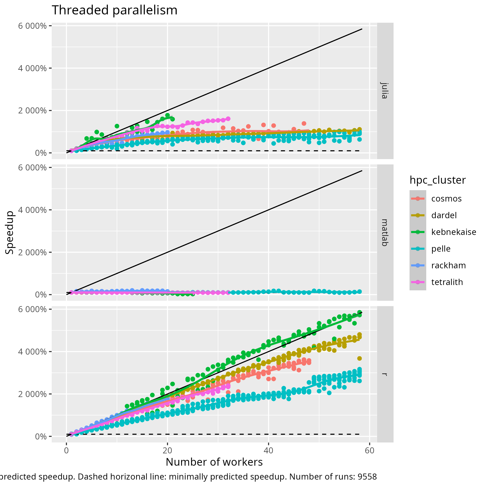

# Thread parallelism

!!! info "Learning outcomes"

    - I can schedule jobs with thread parallelism
    - I can explain how jobs with thread parallelism are scheduled
    - I can explain how Julia/MATLAB/R code makes use of thread parallelism
    - I can explain the results of a correct benchmark
    - I can explain the results of an incorrect benchmark
    - I can argue why I should stick to my programming language,
      even if it is not the fastest

???- note "For teachers"

    Teaching goals are:

    - Schedule and run a job that needs more cores,
      with a calculation in their favorite language
    - Learners have scheduled and run a job that needs more cores,
      with a calculation in their favorite language
    - Learners understand when it is possible/impossible
      and/or useful/useless to run a job with multiple cores
    - Learners can argue why they should stick to their programming languages,
      even if it is not the fastest

    Prior:

    - What is parallel computing?

    Feedback:

    - When to use parallel computing?
    - When not to use parallel computing?

    HPC cluster|Tested
    -----------|--------
    Alvis      |Not, maybe never
    Bianca     |Need certicate
    COSMOS     |Yes
    Dardel     |Yes
    Kebnekaise |Running
    LUMI       |Not, maybe never
    Rackham    |Yes
    Pelle      |Yes
    Tetralith  |Yes

???- hint "Prefer this session as a video?"

    The watch the YouTube video
    [R-Julia-MATLAB course, advanced day: Thread parallelism](https://youtu.be/zSu-MWvM0Us)

## Why thread parallelism is important

Because it is one way to speedup (pun intended) the calculation.

## Goal

In this session, we are going to benchmark thread parallelism,
as we should not make claims about performance without measurements `[CppCore Per.6]`.


## Benchmark script

[`benchmark_2d_integration.sh`](benchmark_2d_integration.sh)
is the script that starts a benchmark,
by submitting multiple jobs to the Slurm queue,
using the Slurm script below.

The goal of the benchmark script is to
do a fixed unit of work
with increasingly more cores.

As the script itself only does light calculations,
you can run it directly. Here is how to call the script:

```bash
bash benchmark_2d_integration.sh [account] [language]
```

???- hint "Why not call the script with `./benchmark_2d_integration.sh`?"

    Because that would require one extra step:
    to make the script executable.


For example:

```bash
bash benchmark_2d_integration.sh staff r
```

If you use the incorrect spelling, the script will help you.

## Slurm script

This is the script that schedules a job with thread parallelism.

The goal of the script is to
submit a calculation that uses thread parallelism,
with a custom amount of cores.

This Slurm script is called by the benchmark script,
i.e. not directly by a user. If the Slurm script is absent,
the benchmark script will (try to) download it for you.

???- hint "How do I run it anyways?"

    You do not, instead you will run the benchmark script below.

    However, you can run it as such:

    ```bash
    sbatch -A [account] -n [number_of_cores] do_[language]_2d_integration.sh
    ```

    For example:

    ```bash
    sbatch -A staff -n 1 do_r_2d_integration.sh

    # On Dardel
    sbatch -A staff -n 1 -p main do_r_2d_integration.sh
    ```

There are 3 Slurm scripts, 1 per language:

Language|Script with calculation
--------|------------------------------------------
Julia   |[do_julia_2d_integration.sh](do_julia_2d_integration.sh)
MATLAB  |[do_matlab_2d_integration.sh](do_matlab_2d_integration.sh)
R       |[do_r_2d_integration.sh](do_r_2d_integration.sh)

Each of these Slurm scripts are called by the benchmark script,
where the benchmark script supplies the desired number of cores.

## Language script

This is the code (in your favorite language)
that performs a job with thread parallelism.

The goal of the language script is to have a fixed unit of work that
can be done by a custom amount of cores.

This language script is called by the Slurm script,
i.e. not directly by a user. If the language script is absent,
the benchmark script will (try to) download it for you.

???- hint "How do I run it anyways?"

    Check the Slurm script for your favorite language.

    In general, you can run it as such:
    
    ```bash
    [interpreter] [script_name] [number_of_cores] [grid_size]
    ```
    
    On a login node, use 1 core and a grid size of 1 to start
    the lightest calculation possible:
    
    ```bash
    julia integration2d.jl 1 1
    Rscript integration2d.R 1 1
    ```

<!-- markdownlint-disable MD013 --><!-- Tables cannot be split up over lines, hence will break 80 characters per line -->

Language|Script with calculation
--------|---------------------------------------------
Julia   |[do_2d_integration.jl](do_2d_integration.jl)
MATLAB  |[do_2d_integration.m](do_2d_integration.m)
R       |[do_2d_integration.R](do_2d_integration.R)

<!-- markdownlint-enable MD013 -->

## Exercises

## Exercise 1: start the benchmark on your HPC cluster

The goal of this exercise is to start the benchmark script
on your HPC cluster, as well as some troubleshooting.

On your HPC cluster:

- Download the benchmark script

???- hint "How to do that?"

    There are many ways to do so.

    One way is to download it directly from
    [this course's repository](https://raw.githubusercontent.com/UPPMAX/R-matlab-julia-HPC/refs/heads/main/docs/advanced/thread_parallelism/benchmark_2d_integration.sh):

    ```bash
    wget https://raw.githubusercontent.com/UPPMAX/R-matlab-julia-HPC/refs/heads/main/docs/advanced/thread_parallelism/benchmark_2d_integration.sh
    ```

- Run the benchmark script. 
  Tip: see [the 'Benchmark script' section](#benchmark-script).

???- hint "How to do that?"

    [The 'Benchmark script' section](#benchmark-script) shows how:

    ```bash
    bash benchmark_2d_integration.sh staff r
    ```

    You can use [our account preparations page](../..HPC/preparations_account.md#ask-for-access-to-a-naiss-course-project)
    to find the course NAISS project for your HPC cluster.

- Check the Slurm output files for problems.
  If there are problems: fix these, then run the benchmark script again

???- hint "How to do that?"

    There are many ways to do so.

    One way is to show all files with the `.out` extension:

    ```bash
    cat *.out
    ```

## Exercise 2: read the benchmark script

Now that [the benchmark script](benchmark_2d_integration.sh) is running,
we have the time to figure out what it is doing.

- What is the most important single line in this script,
  i.e. the line it is all about?
  Tip: start looking from the bottom of the script

???- hint "Answer"

    For all HPC clusters except Dardel:

    ```bash
    sbatch -A "${slurm_job_account}" -N "${n_nodes}" -n "${n_cores}" "${slurm_script_name}"
    ```

    For the Dardel HPC cluster:

    ```bash
    sbatch -A "${slurm_job_account}" -N "${n_nodes}" --ntasks "${n_cores}" -p shared "${slurm_script_name}"
    ```

- In English, describe what the line does in general terms

???- hint "Answer"

    Schedule to run ...

    - on some account
    - with some amount of nodes
    - with some amount of cores
    - (on Dardel) on the `main` partition
    - a script with some name

- This line of code is part of a `for` loop.
  In English, what does the `for` loop achieve?

???- hint "Answer"

    The `for` loop achieves that the same calculation is scheduled
    to be done with 1 core, then with 2 cores, then with 3 cores, etc.,
    to 64 cores.

## Exercise 3: read the Slurm script

The benchmark script submits
[a Slurm script of your favorite language](#slurm-script)
multiple times to the queue: once with 1 cores, once with 2 cores, etc.

- What is the most important single line in this script,
  i.e. the line it is all about?
  Tip: start looking from the bottom of the script

???- hint "Answer"

    The last line.

    Language|Most important line
    --------|---------------------------------------------------------------------------------------
    Julia   |`julia --threads "${SLURM_NPROCS}" do_2d_integration.jl "${SLURM_NPROCS}"`
    MATLAB  |`matlab -nodisplay -nosplash -nojvm -batch "run(\"${matlab_target_filename}\"); exit;"`
    R       |`Rscript --no-save --no-restore do_2d_integration.R "${SLURM_NPROCS}"`


- In English, describe what the line does in general terms.
  Tip: this is the same answer for all programming languages.
  Tip 2: assume 'procedure' is synonym for 'core'. 
  Tip 3: the Julia line is closest to English.

???- hint "Answer"

    Run a Julia/MATLAB/R script for the booked number of cores,
    without doing anything else (e.g. showing a splash screen or restoring a
    computational environment).

## Exercise 4: read the language script

The Slurm script runs 
[a script of your favorite language](#language-script)
for a specified number of cores.

- Locate the lines of code that make the calculation perform in parallel.

???- hint "Answer"

    === "Julia"

        ```julia
        Threads.@threads for worker_index = 1:n_workers
           results[worker_index] = integration2d(grid_size, n_workers, worker_index)
        end
        ```

    === "MATLAB"

        ```matlab
        parfor worker_index = 1:n_workers
            partial_results(worker_index) = integration2d(grid_size, n_workers, worker_index);
        end
        ```

    === "R"

        ```r
        results_of_workers <- foreach(worker_index = 1:n_workers, .combine = c) %dopar% {
          integration2d(grid_size, n_workers, worker_index)
        }
        ```

- In English, describe what these lines does in general terms.

???- hint "Answer"

    For each available worker: per worker, do part of a calculation
    and combine the results

- Optional: what is `grid_size`? What does it do? What would be a better
  variable name?

???- hint "Answer"

    `grid_size` determines the accuracy of the calculation: the bigger
    `grid_size`, the smaller intervals will be integrated.

    A better variable name could be `accuracy`. However, with such a
    variable name, there is no natural understanding that the range
    of its value goes from 1 to infinity. For the name `grid_size`,
    this range is easier to feel right, as sizes are non-zero
    positive values by nature

- Locate the keyword that make the calculation perform in parallel. Or:
  locate the word that, when removed, would 'downgrade' the calculation
  to be single-threaded.

???- hint "Answer"

    The last line.

    Language|Keyword to indicate a parallel calculation
    --------|------------------------------------------
    Julia   |`Threads.@threads`
    MATLAB  |`parfor`
    R       |`%dopar%`

- The function that is run in parallel (i.e. `integration2d`) is
  **made suitable** to be run in parallel. In English, describe
  which changes are made to make it suitable.

???- hint "Answer"

    The function has three (instead of one) arguments:

    Language|Function signature
    --------|---------------------------------------------------------------------------
    Julia   |`function integration2d(grid_size::Int, n_workers::Int, worker_index::Int)`
    MATLAB  |`function integration2d(grid_size, n_workers, worker_index)`
    R       |`integration2d <- function(grid_size, n_workers, worker_index)`

    The extra arguments are `n_workers` and `worker_index`.

    These allow the `worker_index`-th worker to know which share of the
    calculation it must do. 

- What do these changes achieve?

???- hint "Answer"

    These changes allow each thread to know what it needs to know to
    run its part of the calculation.

- Bonus: do you spot the bug in `integrate2d`?
  Is this a problem? Why would someone keep
  it in anyways?

???- hint "Answer"

    The calculation of `begin_index` and `end_index`:

    === "Julia"

        ```julia
        workload = fld(grid_size, n_workers)
        begin_index = workload * (worker_index - 1) + 1
        end_index = workload * worker_index
        ```

    === "MATLAB"

        ```matlab
        grid_cells_per_worker = floor(grid_size / n_workers);
        begin_index = grid_cells_per_worker * (worker_index - 1) + 1;
        end_index = grid_cells_per_worker * worker_index;
        ```

    === "R"

        ```r
        grid_cells_per_worker <- floor(grid_size / n_workers)
        begin_index <- grid_cells_per_worker * (worker_index - 1) + 1
        end_index <- grid_cells_per_worker * worker_index
        ```

    To most clearly demonstrate this, imagine a `grid_size` of 3
    for an `n_workers` of 2:

    Variable name                 |Value
    ------------------------------|----------------------------
    `grid_size`                   |3
    `n_workers`                   |2
    `grid_cells_per_worker`       |`3 / 2 (rounded down) =` 1
    `begin_index` for first worker|`1 * (1 - 1) + 1 =` 1
    `end_index`   for first worker|`1 * 1 =` 1
    `begin_index` for second worker|`1 * (2 - 1) + 1 =` 2
    `end_index`   for second worker|`1 * 2 =` 2

    This means that, although the calculation is split in 3 parts,
    only 2 of these are performed.

    For bigger grid sizes, however, this problem gets less.

    One would keep such a bug in for readability:
    this session is about thread parallelism, not about the extensive
    calculation of these indices.

## Exercise 5: share the results

By now, some of the calculations in exercise 1 will be finished.
If not: no worries, just continue!
 
- In the terminal on your favorite HPC cluster, run the
  following command to collect all results:

```bash
grep -EoRh "^[jmlr].*,.*" --include=*.out | sort | uniq
```

- Copy-paste these results to 
  [our shared HackMD document](https://hackmd.io/@qfRrKmbUR9-jszg-SvdO9A/rk3j1XB6eg/edit).

## Exercise 6: analyse the results

!!! warning "Take it easy"

    Doing this analysis yourself is useful,
    if you are fluent in analysing data.

    If not, you are encouraged to use:

    - [This spreadsheet](analysis.ods)
    - [This R script](plot_benchmark_results.R)

- Copy-paste the results of the previous exercise
  into a comma-separated file called `my_results.csv`.

These are the descriptions of the variables:

Parameter    |Value
-------------|----------------------------
`language`   |Your programming language
`hpc_cluster`|Your HPC cluster
`grid_size`  |Accuracy
`n_workers`  |Number of cores used
`core_secs`  |Core seconds used, i.e. the time used by all cores together

- Load the comma-separated file (`my_results.csv`)
  in a spreadsheet or read it in your favorite programming language
- Add a column called `wall_clock_sec`, which equals
  `core_secs` divided by `n_workers`. `wall_clock_sec` 
  is the time it took the calculation to complete
- Add a column called `speedup`, which equals
  the wall clock time for 1 core divided by the wall clock
  time of that amount of cores
- Plot the speedup (on the y axis) per number of workers (on the x axis).
- Compare your speedup with the Amdahl's Law figure of
  [the previous session, above 'Exercises'](../parallel_computing/README.md#exercises)).
  What do you estimate is the maximum speedup?
- What do you estimate is the percentage of code that can be parallelized
  (i.e. the 'parallel portion' in the figure of Amdahl's Law)?

## Exercise 7: compare to others

Compare your results to others,
that ran the same benchmark,
yet for other HPC clusters
and other programming languages:

=== "Total core seconds"

    

    > Benchmark: the total core seconds per number of workers

=== "Efficiency"

    

    > Benchmark: Efficiency per number of workers

=== "Speedup"

    

    > Benchmark: Speedup per number of workers

- What do you notice?

??? tip "Answer"

    This question is vague on purpose:
    there are many things going on here and many answers are correct:

    - Measurements are messier than you may have thought
    - Julia is 100x faster than R
    - The MATLAB code is single-threaded
    - R works best at being efficient in parallel
    - HPC clusters differ

## Exercise X1: job scheduling problem?

You have just submitted some multithreaded jobs to the queue.
What went wrong here? Why is this a problem?

<!-- markdownlint-disable MD013 --><!-- Tables cannot be split up over lines, hence will break 80 characters per line -->

```console
[richel@pelle1 thread_parallelism]$ squeue --me
             JOBID PARTITION     NAME     USER ST       TIME  NODES NODELIST(REASON)
             54197     pelle do_r_2d_   richel  R       0:14      1 p66
             54200     pelle do_r_2d_   richel  R       0:14      4 p[64-67]
             54216     pelle do_r_2d_   richel  R       0:14      3 p[104-106]
             54217     pelle do_r_2d_   richel  R       0:14      6 p[106-111]
             54169     pelle do_r_2d_   richel  R       0:15      1 p70
```

<!-- markdownlint-enable MD013 -->

???- hint "Answer"

    The multithreaded jobs are split over multiple nodes.
    This means that the cores booked do not have shared memory.
    This will make the calculation slower, as the results have to
    be shared by sending data between nodes.


## Exercise X2: learns a faster programming language?

As can be seen in the benchmark, some programming languages
are faster than others. This warrants the question:
should you learn to program in the programming language
that does calculations fastest?

The theoretically fastest programming languages
allow you to write machine code.
Assembler lets you do so directly.
Some other languages (most notably C, C++ and Rust)
allow you to insert machine code.
Hence, these are the theoretically fastest
languages.

To write fast code, should one learn those languages instead?

Below is a figure from `[Prechelt, 2000]`.
It shows the distribution of runtime speeds of a certain problem
(called `z1000`), for different programming languages.


Take a close look at the figure.
The paper has an advice to yes/no learn a 'faster'
programming language. What do you think the advice is?

???- hint "Answer"

    The variance within a programming
    language is bigger than variance between
    languages (adapted fig 2, from `[Prechelt, 2000]`).

    Instead of learning a faster language, learn how to be fast in
    your language.

- Still, the Julia code is 100x faster than the R code.
  Why would this advice still hold?

???- hint "Answer"

    Because none of the code is optimized for speed.

    Both Julia and R can call C code, where C
    is the fastest higher-level language.
    
    It would be interesting to see how this benchmark
    would look like for optimized code.


- Are there other factors that decide which programming language to use?
  If yes, name some.

???- hint "Answer"

    There are many reasons why to use a 'slower' programming language:

    - you already know the 'slower' programming language
    - you need access to specific libraries/packages
    - you have colleagues that are willing to teach you
    - you need to to work from code that has been written
      someone else

## Where to go next?

If you want to scale up,
distributed parallelism allows you to
do a calculation on many computers.

## Troubleshooting

### T1. Invalid account or account/partition combination specified

<!-- markdownlint-disable MD013 --><!-- Verbatim error message cannot be split up over lines, hence will break 80 characters per line -->

```bash
sbatch: error: Batch job submission failed: Invalid account or account/partition combination specified
```

<!-- markdownlint-enable MD013 -->

You've specified the wrong account.

Run:

```bash
projinfo
```

## T2. There is no package called ‘doParallel’

This is an R error.

You can find it by checking the log files:

```bash
cat *.out
```

When you see, for example, the text below,
it is clearly stated that there is no package called `doParallel`.

```text
HPC cluster: tetralith
Slurm job account used: naiss2025-22-934
Number of cores booked in Slurm: 32
Error in library(doParallel, quietly = TRUE) : 
  there is no package called ‘doParallel’
Execution halted
```

To fix this:

- load the correct module
- install that package from the terminal.

To load the correct module, load the R module(s) as loaded by the
[`do_r_2d_integration.sh`](do_r_2d_integration.sh) script,
for example:

```bash
module load R/4.4.0-hpc1-gcc-11.3.0-bare
```

???- hint "Could you expand on that?"

    Open the [`do_r_2d_integration.sh`](do_r_2d_integration.sh) script.

    Search for the part where modules are loaded, which is at the
    bottom.

    Find the lines where the modules are loaded for your favorite HPC cluster,
    e.g.

    ```bash
    if [ ${hpc_cluster} == "rackham" ]
    then
      module load R_packages/4.1.1 >/dev/null 2>&1
    fi
    ```

    Copy the part that loads the modules, excluding the `>` and after,
    and run these in a terminal on your favorite
    HPC cluster:

    ```bash
    module load R_packages/4.1.1
    ```

    You have now loaded the packages needed for the calculation.


To install that package from the terminal,
[check this course's material on how to do so](../../r/packages.md).
  

## T3. 'namespace ‘rlang’ 0.4.12 is already loaded, but >= 1.1.0 is required'

```bash
Error in loadNamespace(i, c(lib.loc, .libPaths()), versionCheck = vI[[i]]) : 
  namespace ‘rlang’ 0.4.12 is already loaded, but >= 1.1.0 is required
Calls: <Anonymous> ... waldo_compare -> loadNamespace -> namespaceImport -> loadNamespace
Execution halted
```

This only happens on Rackham, since 2025-09-25.

## MATLAB error

```matlab
Warning: Executing startup failed in matlabrc.
This indicates a potentially serious problem in your MATLAB setup, which should
be resolved as soon as possible.  Error detected was:
MATLAB:undefinedVarOrClass
Unable to resolve the name 'java.net.InetAddress.getLocalHost.getHostAddress'. 
Error using run
RUN cannot execute the file 'do_2d_integration.m 48'. RUN requires a valid
MATLAB script
```

## References

- `[CppCore Per.6]`
  [C++ Core Guidelines: Per.6: Don't make claims about performance without measurements](https://isocpp.github.io/CppCoreGuidelines/CppCoreGuidelines#per6-dont-make-claims-about-performance-without-measurements)
- `[Prechelt, 2000]` Prechelt, Lutz. "An empirical comparison of C, C++, Java, Perl, Python, REXX and TCL." IEEE Computer 33.10 (2000): 23-29.
