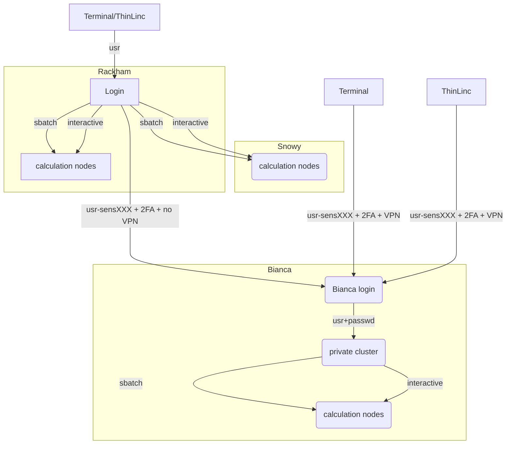
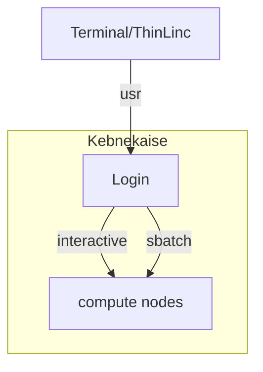

# HPC clusters

## The HPC centers UPPMAX, HPC2N, LUNARC, NSC and PDC

!!! info "Five HPC centers"

    There are many similarities:

    - Login vs. calculation/compute nodes
    - Environmental module system with
      software hidden until loaded with `module load`
    - Slurm batch job and scheduling system

    ... many small differences:

    - commands to load R, Matlab and Julia and packages/libraries
    - sometimes different versions of R, Matlab and Julia, etc.
    - slightly different flags to Slurm

    ... and some bigger differences:

    - UPPMAX has three different clusters

        - Rackham for general purpose computing on CPUs only
        - Snowy available for local projects and suits long
        jobs (< 1 month) and has GPUs
        - Bianca for sensitive data and has GPUs

    - HPC2N has Kebnekaise with GPUs
    - LUNARC has Cosmos with GPUs (and Cosmos-SENS)
    - NSC has several clusters
        - BerzeLiUs (AI/ML, NAISS)
        - Tetralith (NAISS)
        - Sigma (LiU local)
        - Freja (R&D, located at SMHI)
        - Nebula (MET Norway R&D)
        - Stratus (weather forecasts, located at NSC)
        - Cirrus (weather forecasts, located at SMHI)
        - We will be using Tetralith, which also has GPUs
    - PDC has Dardel with AMD GPUs

!!! warning "Terminology: modules"

    We call the applications available via the *module system* **modules**.

    - [HPC2N](https://docs.hpc2n.umu.se/software/modules/)
    - [LUNARC](https://lunarc-documentation.readthedocs.io/en/latest/manual/manual_modules/)
    - [NSC](https://www.nsc.liu.se/software/modules/)
    - [PDC](https://support.pdc.kth.se/doc/software/module/)
    - [UPPMAX](https://docs.uppmax.uu.se/cluster_guides/modules/)

<!-- markdownlint-disable MD013 --><!-- Headers cannot be split up over lines, hence will break 80 characters per line -->

## Briefly about the cluster hardware and system at UPPMAX, HPC2N, LUNARC, NSC and PDC

<!-- markdownlint-enable MD013 -->

What is a cluster?

- Login nodes and calculations/computation nodes

- A network of computers, each computer working as a **node**.

- Each node contains several processor cores and RAM
  and a local disk called scratch.

- The user logs in to **login nodes**  via Internet through ssh or Thinlinc.
    - Here the file management and lighter data analysis can be performed.

- The **calculation nodes** have to be used for intense computing.

### Common features

- Linux kernel
- Bash shell
- x86-64 CPUs, some clusters with Intel processors and some with AMD.
- NVidia GPUs (HPC2N/LUNARC, also AMD) except for Dardel with AMD.

<!-- markdownlint-disable MD013 --><!-- Tables cannot be split up over lines, hence will break 80 characters per line -->

HPC Cluster        |Kebnekaise                                          |Rackham|Snowy|Bianca|COSMOS|Tetralith|Dardel
-------------------|----------------------------------------------------|-------|-----|------|------|---------|------
Cores/compute node |28 (72 for largemem, 128/256 for AMD Zen3/Zen4)     |20|16|16|48|32|128
Memory/compute node|128-3072 GB                                         |128-1024 GB|128-4096 GB|128-512 GB|256-512 GB|96-384 GB|256-2048 GB
GPU                |NVidia V100, A100, A6000, L40s, H100, A40, AMD MI100|None       |NVidia T4  |NVidia A100|NVidia A100|NVidia T4|four AMD Instinct™ MI250X á 2 GCDs

<!-- markdownlint-enable MD013 -->

## Overview of the UPPMAX systems

## Overview of the HPC2N system

## Overview of the LUNARC system

## Overview of the NSC systems

