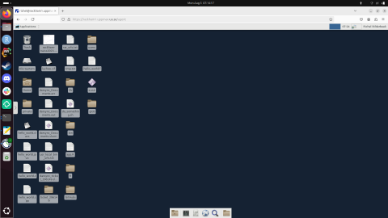
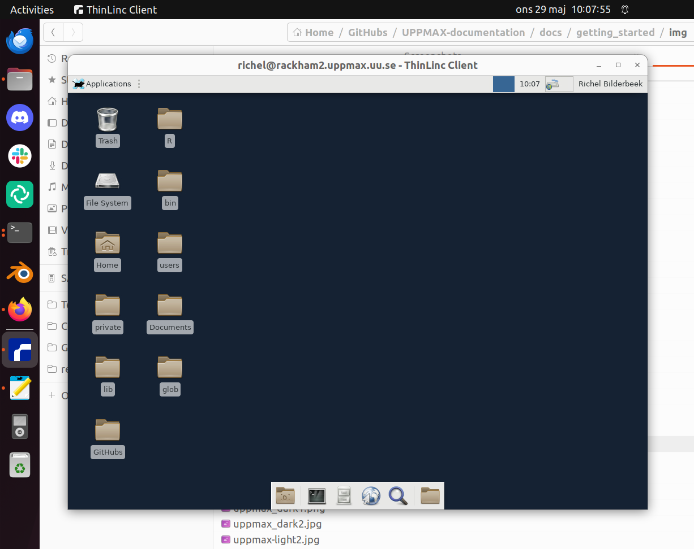

# Log in session

!!! info "Goal"

    The goal of this optional sessions is to make sure that:

    - [You have fulfilled the prerequisites](../prereqs.md)
    - [You have prepared your environment](../preparations.md):
        - you can log in
        - you can start a text editor

    We will also download exercise snippets and solutions
    that you can work with:

    - [Use the tarball with exercises](use_tarball.md)

    If/when you have done all this, see you at 10:00 sharp!
    Else, see you in this session.

!!! info "Cluster-specific approaches"

    The course is a cooperation between **UPPMAX** (Rackham, Snowy, Bianca),
    **HPC2N** (Kebnekaise), and **LUNARC** (COSMOS) and will focus on the
    compute systems at all these centres, as well as select resources at
    NSC (Tetralith) and PDC (Dardel).

    Although there are differences we will only have **few separate sessions**.

    Most participants will use NSC's or Dardel's systems for the course,
    as Rackham, Kebnekaise and Cosmos are only for local
    (UU, UmU, IRF, MIUN, SLU, LTU, LU) users.

    The general information given in the course will be true
    for all/most HPC centres in Sweden.

    - The examples will often have specific information,
      like module names and versions, which may vary.
      What you learn here should help you to make any changes needed
      for the other centres.
    - When present, links to the Julia/R/Matlab documentation
      at other NAISS centres are given in the corresponding session.

!!! note

    - You were invited to be part of the course project.
    - If you already have research projects in any of the clusters
      you can use them. The CPU-hours required during the course will be low!

!!! info "Learning outcomes"

    Be able to login, where you are

!!! tip

    - If you have user account and *research* project on Kebnekaise,
      follow the **HPC2N** track below.
    - If you have user account and *research* project on COSMOS,
      follow the **LUNARC** track below.
    - If you have user account and course/research project on Rackham,
      follow the **UPPMAX** track below.
    - If you have user account and course/research project on Tetralith,
      follow the **NSC** track below.
    - If you have user account and course/research project on Dardel,
      follow the **PDC** track below.

!!! question "Use ThinLinc or terminal?"

    It is up to you!
    
    Graphics come easier with ThinLinc

    For this course, when having many windows open,
    it may sometimes be better to run in terminal, for screen space issues.

## Step 1: Log in

For beginners: use the **bold** login method.

<!-- markdownlint-disable MD013 --><!-- Tables cannot be split up over lines, hence will break 80 characters per line -->

HPC cluster|Login method             |Documentation                                                                                                |YouTube video
-----------|-------------------------|-------------------------------------------------------------------------------------------------------------|--------------------------------------------------
Alvis      |SSH                      |[Documentation](https://www.c3se.chalmers.se/documentation/connecting/ssh/)                                  |[YouTube video](https://youtu.be/PJZ3W907qCU)
Alvis      |**Website**              |[Documentation](https://www.c3se.chalmers.se/documentation/connecting/remote_graphics/)                      |[YouTube video](https://youtu.be/KO98JvEB2oc)
Bianca     |SSH                      |[Documentation](https://docs.uppmax.uu.se/getting_started/login_bianca_console_password/)                    |[YouTube video](https://youtu.be/7mKDxnXqi_M)
Bianca     |Website                  |[Documentation](https://docs.uppmax.uu.se/getting_started/login_bianca_remote_desktop_website/)              |[YouTube video](https://youtu.be/Ni9nyCf7me8)
COSMOS     |**Local ThinLinc client**|[Documentation](https://lunarc-documentation.readthedocs.io/en/latest/getting_started/using_hpc_desktop/)    |[YouTube video](https://youtu.be/wn7TgElj_Ng)
COSMOS     |SSH                      |[Documentation](https://lunarc-documentation.readthedocs.io/en/latest/getting_started/login_howto/)          |[YouTube video](https://youtu.be/sMsenzWERTg)
Dardel     |Local ThinLinc client    |[Documentation](https://support.pdc.kth.se/doc/contact/contact_support/?sub=login/interactive_hpc/)          |[YouTube video](https://youtu.be/qgI2SigIuCk)
Dardel     |**SSH**                  |[Documentation](https://support.pdc.kth.se/doc/contact/contact_support/?sub=login/ssh_login/)                |[YouTube video](https://youtu.be/I8cNqiYuA-4)
Kebnekaise |Local ThinLinc client    |[Documentation](https://docs.hpc2n.umu.se/documentation/access/)                                             |[YouTube video](https://youtu.be/_jpj0GW9ASc)
Kebnekaise |SSH                      |[Documentation](https://docs.hpc2n.umu.se/documentation/access/)                                             |[YouTube video](https://youtu.be/pIiKOKBHIeY)
Kebnekaise |**Website**              |[Documentation](https://docs.hpc2n.umu.se/documentation/access/)                                             |[YouTube video](https://youtu.be/_O4dQn8zPaw)
LUMI       |SSH                      |[Documentation](https://docs.lumi-supercomputer.eu/firststeps/loggingin/)                                    |[YouTube video](https://youtu.be/bPdvn2gajgU)
Pelle      |SSH                      |[Documentation](https://docs.uppmax.uu.se/getting_started/login_pelle_console_password/)                     |[YouTube video](https://youtu.be/zsw3QD_NinU)
Pelle      |Local ThinLinc client    |[Documentation](https://docs.uppmax.uu.se/getting_started/login_pelle_remote_desktop_local_thinlinc_client/) |[YouTube video](https://youtu.be/0rVy83X89Go)
Rackham    |Local ThinLinc client    |[Documentation](https://docs.uppmax.uu.se/getting_started/login_rackham_console_password/)                   |[YouTube video](https://youtu.be/PqEpsn74l0g)
Rackham    |SSH                      |[Documentation](https://docs.uppmax.uu.se/getting_started/login_rackham_remote_desktop_local_thinlinc_client)|[YouTube video](https://youtu.be/TSVGSKyt2bQ)
Rackham    |**Website**              |[Documentation](https://docs.uppmax.uu.se/getting_started/login_rackham_remote_desktop_website/)             |[YouTube video](https://youtu.be/HQ2iuKRPabc)
Tetralith  |**Local ThinLinc client**|[Documentation](https://www.nsc.liu.se/support/graphics/)                                                    |[YouTube video](https://youtu.be/JsHzQSFNGxY)
Tetralith  |SSH                      |[Documentation](https://www.nsc.liu.se/support/getting-started/)                                             |[YouTube video](https://youtu.be/wtGIzSBiulY)

<!-- markdownlint-enable MD013 -->

???- question "What are the differences between these login methods?"

    These are the ways to access your HPC cluster and some of their features:

    <!-- markdownlint-disable MD013 --><!-- Tables cannot be split up over lines, hence will break 80 characters per line -->

    How to access your HPC cluster              | Features                                                                                          |How it looks like
    --------------------------------------------|---------------------------------------------------------------------------------------------------|---------------------------------------------------------------------------------
    Remote desktop via a website                | Familiar remote desktop, clumsy, clunky, no need to install software, not available at all centers| 
    Remote desktop via a local ThinLinc client  | Familiar remote desktop, clumsy, need to install ThinLinc                                         | 
    Console environment using an SSH client     | A console environment, powerful, need to install an SSH client                                    | 

    <!-- markdownlint-enable MD013 -->

!!! info "Type-along"

    Please log in to Rackham, Kebnekaise, or other cluster that you are using.

    === "UPPMAX"
        
        1. Log in to Rackham!

        - Terminal: ``ssh -X <user>@rackham.uppmax.uu.se``
        - ThinLinc app: ``<user>@rackham-gui.uppmax.uu.se``
        - ThinLinc in web browser: ``https://rackham-gui.uppmax.uu.se``

        2. If not already: **create a working directory**
           where you can code along.

        - We recommend creating it under the course project storage directory

        3. Example. If your username is "mrspock" and you are at UPPMAX,
            then we recommend you create this folder:

            .. code-block:: console

               $ mkdir /proj/r-matlab-julia-uppmax/mrspock/

    === "HPC2N"

        
        - Kebnekaise through terminal: `<user>@kebnekaise.hpc2n.umu.se`
        - Kebnekaise through ThinLinc, use: `<user>@kebnekaise-tl.hpc2n.umu.se`
        - Create a working directory where you can code along.
        - Example. If your username is `bbrydsoe` and you are at HPC2N,
          then we recommend you create this folder:

        ```bash
        mkdir /proj/nobackup/r-matlab-julia/bbrydsoe/
        ```

    === "LUNARC"

        - Cosmos through terminal: ``<user>@cosmos.lunarc.lu.se``
        - Cosmos through ThinLinc, use: ``<user>@cosmos-dt.lunarc.lu.se``

        - Create a working directory in your home space where you can code along.

        Example. Create this folder:

        ```bash
        mkdir $HOME/r-matlab-julia
        ```

    === "NSC"

        - Tetralith through terminal or Thinlinc: ``<user>@tetralith.nsc.liu.se``

        - Create a working directory where you can code along.

        Example. If your username is jlpicard and you are at NSC,
         then we recommend you create this folder:

        ```bash
        mkdir /proj/r-matlab-julia-naiss/jlpicard
        ```


    === "PDC"

        - Dardel through terminal: ``<user>@dardel.pdc.kth.se``
        - Dardel through ThinLinc: ``<user>@dardel-vnc.pdc.kth.se``

        - **Warning!** Only 30 Dardel users at a time can use ThinLinc.
          Do not count on it being available.

        - Create a working directory where you can code along.

        - Example. If your username is sevenof9 and you are at PDC,
          then we recommend you create this folder:
        
        ```bash
        mkdir /cfs/klemming/projects/supr/r-matlab-julia-naiss/sevenof9/
        ```

## Test [a text editor](use_text_editor.md)

Read [how to use a text editor](use_text_editor.md).

## [Download and extract the tarball with exercises](use_tarball.md)

Read [how to download and extract the tarball with exercises](use_tarball.md)
