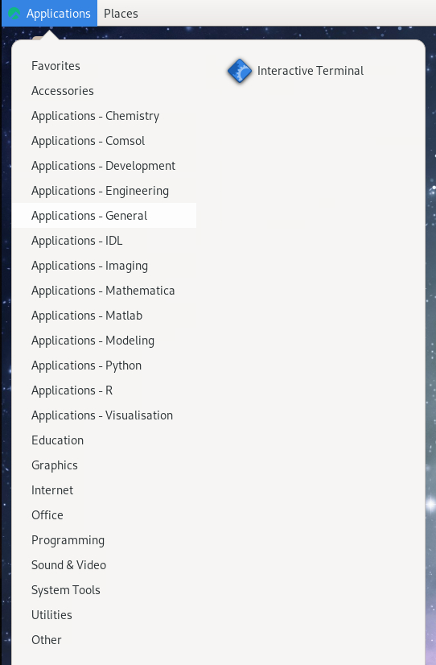
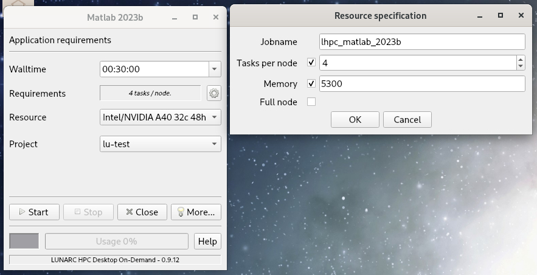
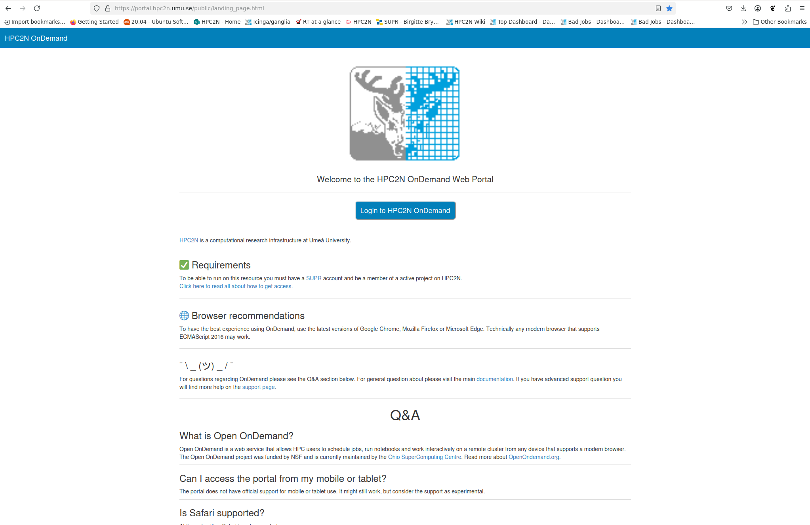

# On Demand Applications

!!! important "Learning Objectives"

   - What are On-Demand applications and when to use it
   - Which interface to use on each resource and how to start them
   - How to set the job parameters for your application

## What is Desktop On Demand? Is it right for my job?

On Cosmos (LUNARC), Kebnekaise (HPC2N), and Dardel (PDC), some applications are available through one of several On Demand services. On Demand applications provide an interactive environment to schedule jobs on compute nodes using a graphic user interface (GUI) instead of the typical batch submission script. How you reach this interface is dependent on the system you use and their choice of On Demand client.

* **Cosmos** and **Dardel** use the On-Demand Desktop developed at LUNARC, which is accessible via Thinlinc.
* **Kebnekaise** uses Open OnDemand[^1] via a dedicated web portal at [https://portal.hpc2n.umu.se](https://portal.hpc2n.umu.se).

!!! important

    On-Demand applications are *not* accessible via SSH; you must use either Thinlinc (Cosmos and Dardel) or the dedicated web portal (Kebnekaise).

[^1]: Open OnDemand is a web service that allows HPC users to schedule jobs, run notebooks and work interactively on a remote cluster from any device that supports a modern browser. The Open OnDemand project was funded by NSF and is currently maintained by the Ohio SuperComputing Centre. Read more about [OpenOndemand.org](https://openondemand.org/).

RStudio and MATLAB are available as On-Demand applications. On Cosmos, there is also an interactive On-Demand command line that may be useful for Julia, especially if you use it with Jupyter Lab. Alternatively, all three facilities covered here provide Jupyter Notebook and/or Jupyter Lab On-Demand if you wish to use IJulia.

!!! important

    Desktop On-Demand is most appropriate for *interactive* work requiring small-to-medium amounts of computing resources. Non-interactive jobs and jobs that take more than a day or so should generally be submitted as batch jobs.

    Batch jobs submitted from within these interactive sessions are *not* bound by the same job parameters as the On-Demand interface. E.g., if you are in the MATLAB GUI and submit a job with the `batch` command, the batch job will not be interrupted if the GUI is closed or times out.

!!! warning "Thinlinc Access Limited on Dardel (PDC)"

      Here we focus on Cosmos and Kebnekaise because access to Dardel via Thinlinc is severely restricted. Only 30 users total may have an active ThinLinc session at a time, and queue times are very long. Other PDC resources not tested in this course may be more flexible, but if you must run a program on Dardel interactively, it is better to use SSH with X-forwarding (that is, log in with `ssh -X <user>@dardel.pdc.kth.se`) and then [follow the workflow described in this link](https://support.pdc.kth.se/doc/run_jobs/run_interactively/).
      
      Keep in mind that if you do not need a full node, you can also select a number of cores on Dardel's `shared` partition, which may help reduce your time in the queue. See [here for information on Dardel partitions](https://support.pdc.kth.se/doc/run_jobs/job_scheduling/#dardel-partitions).

## Cosmos (and Dardel)

For most programs, the start-up process is roughly the same:

1. Log into COSMOS (or Dardel) via your usual Thinlinc client to start an HPC Desktop session.
2. Click `Applications` in the top left corner and hover over the items prefixed with `Applications -` until you find your desired application (on Dardel, On-Demand applications are prefixed with `PDC-`). The menu on Cosmos looks like this: 
 

   
 

3. Upon clicking your chosen application, a pop-up interface called the GfxLauncher will appear and let you set the following options:
      #. **Wall time** - how long your interactive session will remain open. *When it ends, the whole window closes immediately and any unsaved work is lost.* You can select the time from a drop-down menu, or type in the time manually. On Cosmos, CPU-only applications (indicated with "(CPU)" in the name) can run for up to 168 hours (7 days), but the rest are limited to 48 hours. Default is 30 minutes.
      #. **Requirements** - how many tasks per node you need. The default is usually 1 or 4 tasks per node. There is also a **gear icon** to the right of this box that can pull up a second menu where you can set the name of your job, the number of tasks per node, the amount of memory per CPU core, and/or toggle whether or not to use a full node.
      #. **Resource** - which kind of node you want in terms of the architecture (AMD or Intel) and number of cores in the CPU (or GPU). Options and defaults vary by program.
      #. **Project** - choose from a drop-down menu the project with which your work is associated. This is mainly to keep your usage in line with your licenses and permissions, and to send any applicable invoices to the correct PI. Licensed software will only work for projects whose group members are covered by the license.

      

        
        The GfxLauncher GUI (here used to launch MATLAB). The box on the left is the basic menu and the box on the right is what pops up when the gear icon next to `Requirements` is clicked.
      

4. When you're happy with your settings, click "Start". The GfxLauncher menu will stay open in the background so that you can monitor your remaining time and resources with the `Usage` bar.

!!! warning

    Closing the GfxLauncher popup after your application starts will kill the application immediately!

If you want, you can also look at the associated SLURM scripts by clicking the "More" button at the bottom of the GfxLauncher menu and clicking the "Script" tab (example below), or view the logs under the "Logg" tab.

  

If an app fails to start, the first step of troubleshooting will always be to check the "Logg" tab.

!!! warning

    If you start a terminal session or another application from `Favorites`, `System Tools`, or other menu headings not prefixed with `Applications -` or `PDC-`, and launch an interactive program from that, it will run on a login node. Do not run intensive programs this way!

!!! note "Terminals on Compute nodes"

    If you don't see the program you want to run interactively listed under any other `Applications` sub-menus, or if the usual menu item fails to launch the application, you may still be able to launch it via one of the terminals under `Applications - General`, or the **GPU Accelerated Terminal** (GPU support) under `Applications - Visualization`.

    The CPU terminal allows for a wall time of up to 168 hours (7 days), while the two GPU terminals can only run for 48 hours (2 days) at most. For more on the specifications of the different nodes these terminals can run on, see [LUNARC's webpage on COSMOS](https://www.lunarc.lu.se/systems/cosmos/).

## Kebnekaise

To start an Open OnDemand session on Kebnekaise,

1. Open [https://portal.hpc2n.umu.se](https://portal.hpc2n.umu.se) in your browser. The page looks like this:

  

2. Click the blue button labeled "Login to HPC2N OnDemand".
3. A login window should open with boxes for your login credentials. Enter your HPC2N username and password, then click "Sign In".
4. You will now be on the HPC2N Open OnDemand dashboard. The top of it looks like this:

  

5. Find the `Interactive Apps` tab in the menu bar along the top and click it to open a drop-down menu of available apps. The menu currently looks like this:

  

6. TBC

!!! warning

    Unlike on Cosmos and Dardel, On-Demand applications on Kebnekaise are **not** reachable through Thinlinc, regardless of whether you use the desktop client or a browser! If you find similar-looking applications in the Thinlinc interface, be aware that they all run on login nodes!
