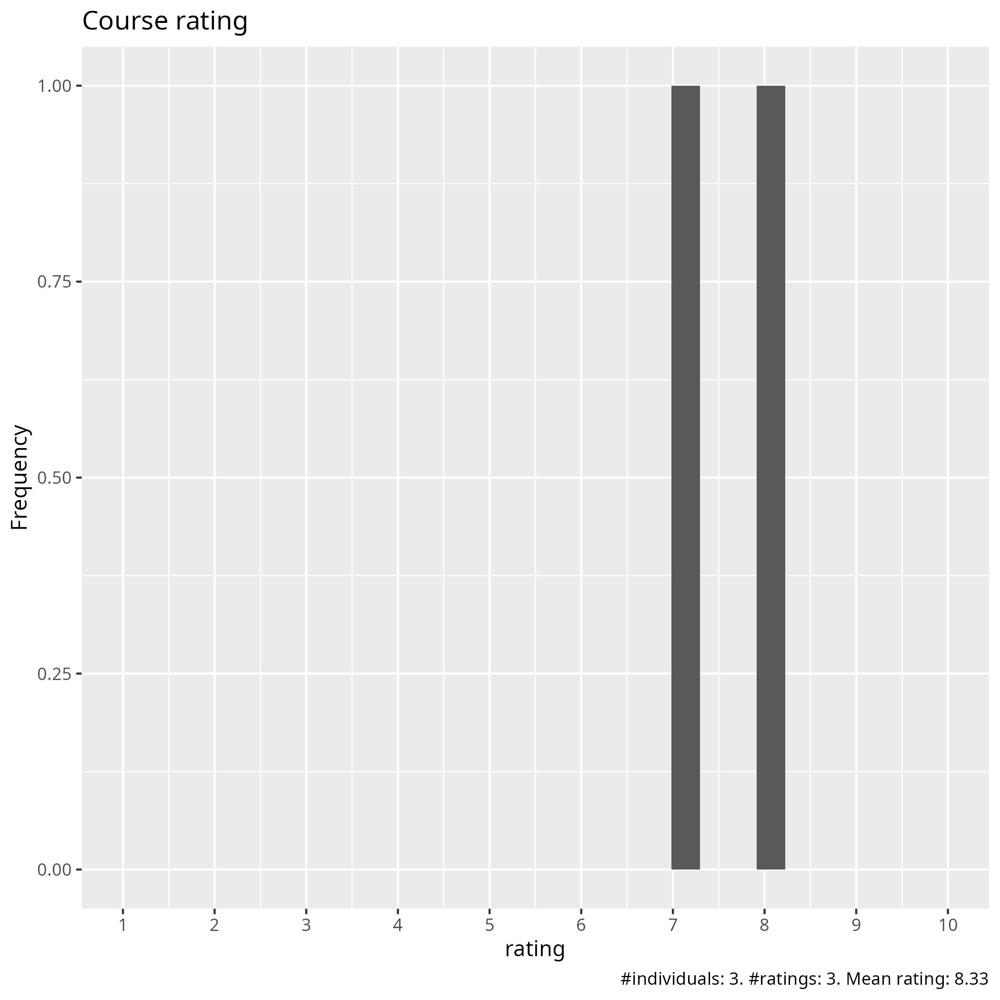
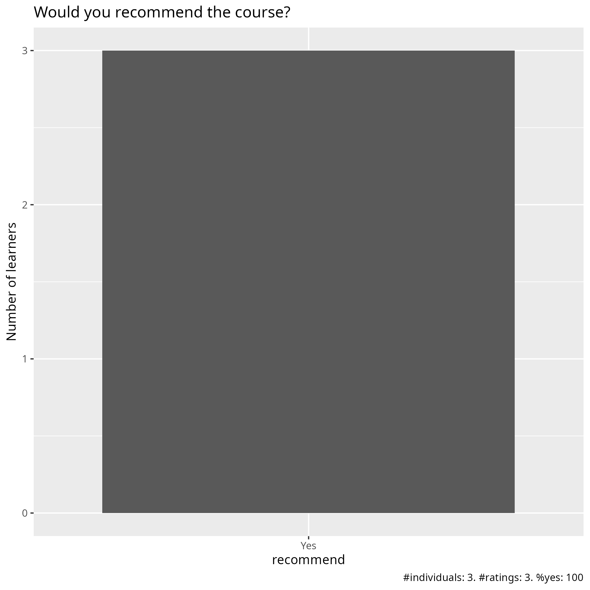
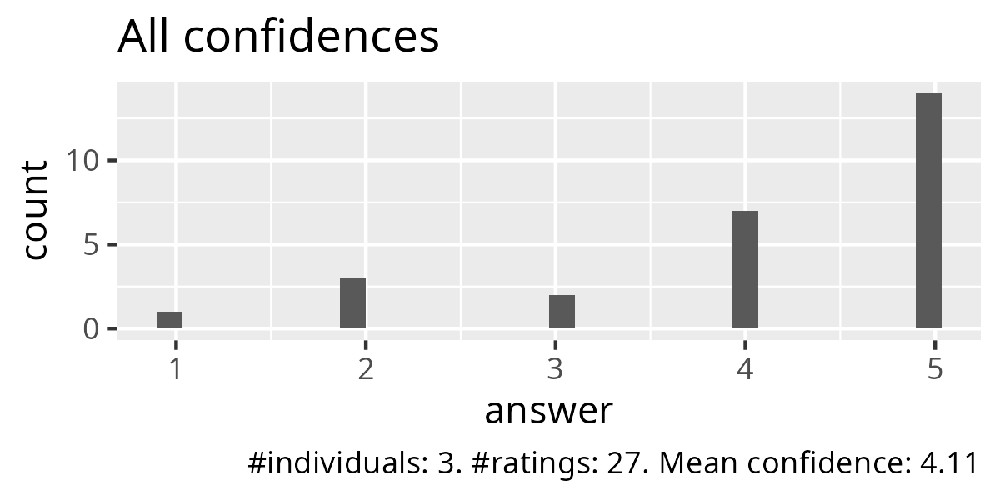
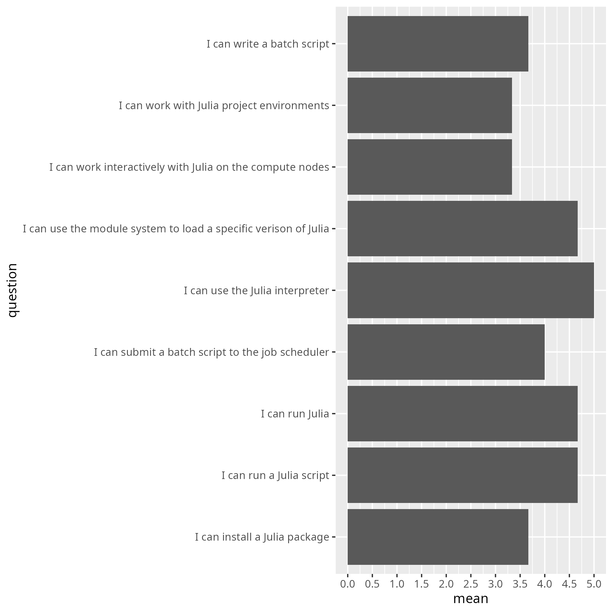
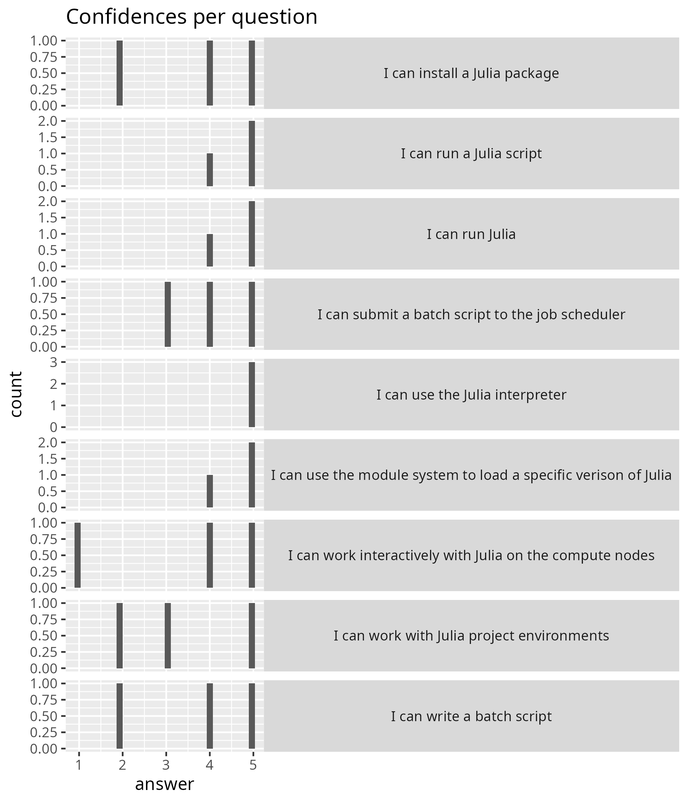

# Evaluation

- Date: 2025-03-26
- language: Julia
- Registrations: ?
- Participants: 4
- Number of evaluations filled in: 3 (75% response rate)
- Average course satisfaction: 8.3/10.0
- [success_score.txt](success_score.txt): 82%
- Analysis script: [analyse.R](analyse.R)
- Average confidence per question as a table: [average_confidences.csv](average_confidences.csv)

## [Question 2: What do you think about the pace of teaching overall?](pace.txt)

- teaching was excellent
- It was good. However, some parts were redundant if you had attended another day.
- ok

## [Question 5: Which future training topics would you like to be provided by the training host(s)?](future_topics.txt)

- machine learning/deep learning/ai-related training
- A more detailed overview of how to setup everything to work with the gpus.

## [Question 6: Do you have any additional comments?](comments.txt)

Suggestions/ideas:

- What did you like best? (materials, exercises, structure)
- Where should we improve? (materials, exercises, structure)
- Training organization (announcement, registration, participant info, ...): what was good and what should we improve?
- Length/depth of the course: too long/short, too superficial/profound, adequate.
- Teaching aids used (presentations, slides, videos, ...): well prepared or not? Specific sessions that were better/worse in this?
- Hands-ons, exercises, demonstrations: were they well prepared or not? Specific sessions that were better/worse in this?
- Hands-ons and demonstrations: too few, too many, adequate amount?
- Comments about specific sessions? Good/bad?

[None]
