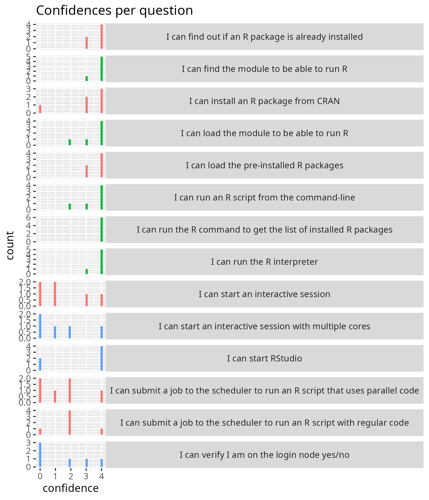

# Evaluation

- Date: 2025-10-06
- Day: R
- Registrations: 14
- Active participants: 6
- Inactive participants: 1
- OS: 3x macOS, 3x Windows

## Analysis

- [Evaluation results file](20251006_r.csv)
- [Analysis script](analyse.R)

## Do you have any additional comments?

- I liked the online material about how to prepare and get everything set up,
  which has been my main issue so far.
  Unfortunately I could not initially run R via the terminal/ssh,
  so I couldn't do the practicals on batch,
  but I am sure I can figure it out myself.
- no
- no
- awesome material and good that you record but could you record during
  the lectures all of you so we get the exact thing that is thought?
  i'm also not fond of having to have the camera on
  which i felt there was pressure to do
  so i watched most after the course instead

