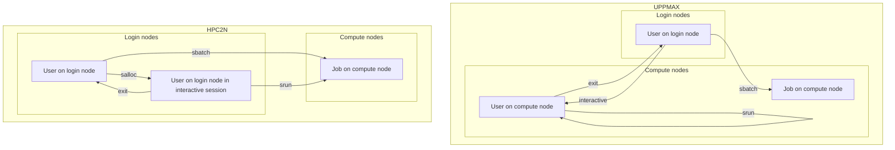
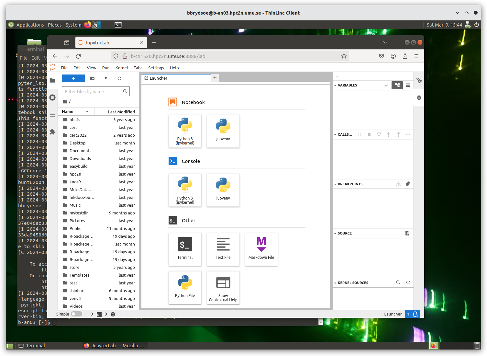
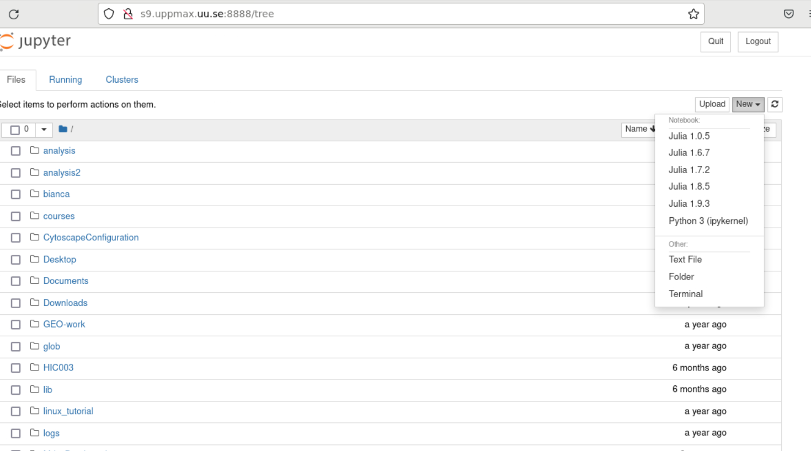
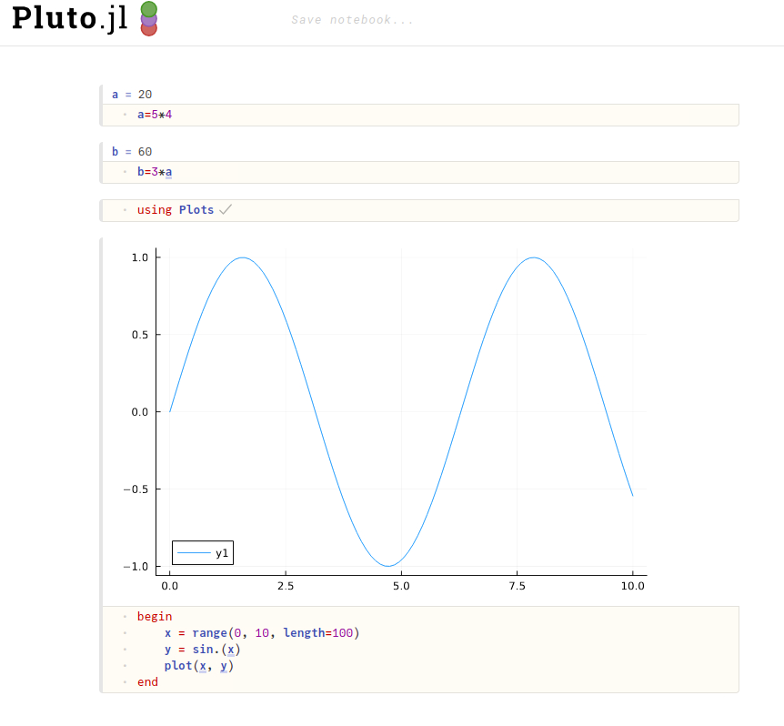

# Julia interactively

!!! info "Learning outcomes for today"

    - Be able to start interactive sessions
    - Use the Julia REPL in the interactive session
    - Be able to run Julia in Jupyter notebook OR Pluto


??? note "Instructor note"

    - Intro 5 min
    - Lecture and 10 min

!!! important "Notes"

    - It is possible to run Julia directly on the login (including ThinLinc) nodes.
    - But this should *only* be done for shorter jobs or jobs that do not use a lot of resources, as the login nodes can otherwise become slow for all users.
    - If you want to work interactively with your code or data, you should start an interactive session.
    - If you rather will run a script which won't use any interactive user input while running, you can instead start a batch job, see next session.

There are several ways to run Julia interactively

## General

In order to run interactively, you need to have compute nodes allocated to run on, and this is done through the Slurm system.

## Interactive sessions at NSC, PDC, HPC2N, UPPMAX and LUNARC

Here we define an interactive session as a session with direct access to a compute node.
Or alternatively: an interactive session is a session, in which there is no queue before a command is run on a compute node.

This differs between HPC2N and UPPMAX :

- HPC2N: the user remains on a login node.
  All commands can be sent directly to the compute node using `srun`
- UPPMAX: the user is actually on a computer node.
  Whatever command is done, it is run on the compute node
- LUNARC: the user is actually on a computer node if the correct menu option is chosen. Whatever command is done, it is run on the compute node
- NSC: the user is actually on a computer node if the correct menu option is chosen. Whatever command is done, it is run on the compute node
- PDC: the user is actually on a computer node if the correct menu option is chosen. Whatever command is done, it is run on the compute node

### Start an interactive session

To start an interactive session,
one needs to allocate resources on the cluster first.

The command to request an interactive node differs per HPC cluster:

| Cluster | `interactive` | `salloc`     | GfxLauncher | Open OnDemand |
|---------|:-------------:|--------------|-------------|---------------|
| HPC2N   | Works         | Recommended  | N/A         |  Recommended  |
| UPPMAX  | Recommended   | Works        | N/A         |  N/A  
| LUNARC  | Works         | N/A          | Recommended |  N/A  
| NSC     | Recommended   | N/A          | N/A         |  N/A  
| PDC     | N/A           | Recommended  | Possible    |  N/A  

Example, HPC2N vs. UPPMAX (also valid for NSC, PDC and LUNARC):



- First, you make a request for resources with ``interactive``/``salloc``, like this:

!!! important "Interactive jobs"

    Short serial example for running on different clusters.

    === "NSC"

        ```bash
        $ interactive -n <tasks> --time=HHH:MM:SS -A naiss2025-22-934
        ```

    === "PDC"

        ```bash
        $ salloc -n <ntasks> --time=HHH:MM:SS -A naiss2025-22-934 -p <partition>
        ```

        Where <partition> is ``shared``, ``main`` or ``gpu``

        - We recommend ``shared``
        - Wait until you get the node
        - ``ssh``  to the node given and then work there
            - Example:

                ```bash
                $ ssh nid001057
                ```

    === "UPPMAX" 

        ```bash
        $ interactive -n <tasks> --time=HHH:MM:SS -A uppmax2025-2-360
        ```

    === "LUNARC"

        ```bash
        $ interactive -n <tasks> --time=HHH:MM:SS -A lu2025-2-94
        ```

    === "HPC2N"

        ```bash
        $ salloc -n <tasks> --time=HHH:MM:SS -A hpc2n2025-151
        ```

where <tasks> is the number of tasks (or cores, for default 1 task per core), time is given in hours, minutes, and seconds 
(maximum T168 hours), and then you give the id for your project.

Then, when you get the allocation, one can run programms in parallel by:

- ``srun -n <ntasks> ./program``

- Your request enters the job queue just like any other job, and interactive/salloc will tell you that it is waiting for the requested resources.
- When salloc tells you that your job has been allocated resources, you can interactively run programs on those resources with ``srun``.
- The commands you run with ``srun`` will then be executed on the resources your job has been allocated.

!!! important "On HPC2N"

   - If you do not preface with ``srun`` the command is run on the login node!
   - You can now run Julia scripts on the allocated resources directly instead of waiting for your batch job to return a result.
   - This is an advantage if you want to test your Julia script or perhaps figure out which parameters are best.

### End an interactive session

When you have finished using the allocation, either wait for it to end, or close it with ``exit``

```bash
$ exit
logout
```

!!! important "Documentation at the centers"

   - [Interactive allocation on PDC](https://support.pdc.kth.se/doc/contact/contact_support/?sub=login/interactive_hpc/){:target="_blank"}
   - [Interactive allocation on NSC](https://www.nsc.liu.se/support/running-applications/#interactive-jobs){:target="_blank"}
   - [Interactive allocation on UPPMAX](https://docs.uppmax.uu.se/cluster_guides/start_interactive_session/){:target="_blank"}
   - [Interactive allocation on HPC2N](https://docs.hpc2n.umu.se/documentation/batchsystem/job_submission/#interactive){:target="_blank"}
   - [Interactive allocation on LUNARC](https://lunarc-documentation.readthedocs.io/en/latest/manual/manual_interactive/#starting-an-interactive-session){:target="_blank"}

## Exercise interactive session

!!! important "Run from ThinLinc (web or client!)"

     - [Log in page](../common/login.md#step-1-log-in)

     - We will need it later for the notebooks!

     - Start a terminal shell from ThinLinc.

!!! important "Interactive jobs"
    
    Requesting 4 cores for 10 minutes, then running Julia
    Short serial example for running on different clusters.

    === "NSC"

        ```bash
        [sm_bcarl@tetralith3 ~]$ interactive -n 4 -t 0:30:0 -A naiss2025-22-934
        salloc: Pending job allocation 43071298
        salloc: job 43071298 queued and waiting for resources
        salloc: job 43071298 has been allocated resources
        salloc: Granted job allocation 43071298
        salloc: Waiting for resource configuration
        salloc: Nodes n760 are ready for job

        [bjornc@r483 ~]$ module load julia/1.10.2-bdist
        ```

        Let us check that we actually run on the compute node:

        ```bash
        [sm_bcarl@n760 ~]$ srun hostname
        n760
        n760
        n760
        n760
        ```

        We are. Notice that we got a response from all four cores we have allocated.

    === "PDC"

        ```bash
        claremar@login1:~> salloc --ntasks=4 -t 0:30:00 -p shared --qos=normal -A naiss2025-22-934
        salloc: Pending job allocation 9102757
        salloc: job 9102757 queued and waiting for resources
        salloc: job 9102757 has been allocated resources
        salloc: Granted job allocation 9102757
        salloc: Waiting for resource configuration
        salloc: Nodes nid001057 are ready for job

        claremar@login1:~> module load PDC/23.12 julia/1.10.2-cpeGNU-23.12
        ```

        Let us check that we actually run on the compute node. This has to be done differently

        ```bash
        claremar@login1:~> srun hostname
        nid001064
        nid001063
        nid001064
        nid001063
        ```

        Now, it seems that Dardel allows for "hyperthreading", that is 2 threads per core.

        ```bash
        claremar@login1:~> srun -n 8 hostname
        nid001064
        nid001064
        nid001063
        nid001063
        nid001064
        nid001064
        nid001063
        nid001063
        ```

        We are. Notice that we got a response from all four cores we have allocated.

    === "UPPMAX (Pelle)"

        ```bash
        [bjornc@pelle ~]$ interactive -A uppmax2025-2-360 -n 4 -t 0:30:00
        You receive the high interactive priority.
        There are free cores, so your job is expected to start at once.

        Please, use no more than 6.4 GB of RAM.

        Waiting for job 29556505 to start...
        Starting job now -- you waited for 1 second.

        [bjornc@p102 ~]$ module load Julia/1.10.9-LTS-linux-x86_64
        ```

        Let us check that we actually run on the compute node:

        ```bash
        [bjornc@p102 ~]$ srun hostname
        p102.uppmax.uu.se
        p102.uppmax.uu.se
        p102.uppmax.uu.se
        p102.uppmax.uu.se
        ```

        We are. Notice that we got a response from all four cores we have allocated.

    === "UPPMAX (Rackham/Bianca)"

        ```bash
        [bjornc@rackham2 ~]$ interactive -A uppmax2025-2-360 -p core -n 4 -t 0:30:00
        You receive the high interactive priority.
        There are free cores, so your job is expected to start at once.

        Please, use no more than 6.4 GB of RAM.

        Waiting for job 29556505 to start...
        Starting job now -- you waited for 1 second.

        [bjornc@r102 ~]$ module load julia/1.8.5
        ```

        Let us check that we actually run on the compute node:

        ```bash
        [bjornc@r102 ~]$ srun hostname
        r102.uppmax.uu.se
        r102.uppmax.uu.se
        r102.uppmax.uu.se
        r102.uppmax.uu.se
        ```

        We are. Notice that we got a response from all four cores we have allocated.

    === "HPC2N"

        ```bash
        [~]$ salloc -n 4 --time=00:30:00 -A hpc2n2025-151
        salloc: Pending job allocation 20174806
        salloc: job 20174806 queued and waiting for resources
        salloc: job 20174806 has been allocated resources
        salloc: Granted job allocation 20174806
        salloc: Waiting for resource configuration
        salloc: Nodes b-cn0241 are ready for job
        [~]$ module load GCC/11.2.0 OpenMPI/4.1.1 julia/1.8.5
        [~]$
        ```

        Let us check that we actually run on the compute node:

        ```bash
        [~]$ srun hostname
        b-cn0241.hpc2n.umu.se
        b-cn0241.hpc2n.umu.se
        b-cn0241.hpc2n.umu.se
        b-cn0241.hpc2n.umu.se
        ```

        We are. Notice that we got a response from all four cores we have allocated.

    === "LUNARC"

        ```bash
        [bjornc@cosmos1 ~]$ interactive -A lu2025-2-94 -n 4 -t 30:00
        Cluster name: COSMOS
        Waiting for JOBID 930844 to start

        [bjornc@cn050 ~]$ module load Julia/1.8.5-linux-x86_64
        ```

        Let us check that we actually run on the compute node:

        ```bash
        [bjornc@cn050 ~]$ echo $SLURM_CPUS_ON_NODE
        4
        ```

        We are, because the *$SLURM* environment variable gves an output. Notice that we got 4, which is not the size of the physcial node bt the allocation size.


    **Test script**: adding two numbers from user input (``serial-sum.jl``)

    ```julia
        # This program will add two numbers that are provided by the user

        # Get the numbers
        x = parse( Int32, ARGS[1] )
        y = parse( Int32, ARGS[2] )
        # Add the two numbers together
        summ = x + y
        println("The sum of the two numbers is ", summ)
    ```

    **Running the script**

    - Note that the commands should be the same for all clusters

    Running a Julia script in the allocation we made further up. Notice that since we asked for 4 cores, the script is run 4 times, since it is a serial script

    ```bash
    [~]$ srun julia serial-sum.jl 3 4
    The sum of the two numbers is: 7
    The sum of the two numbers is: 7
    The sum of the two numbers is: 7
    The sum of the two numbers is: 7
    [~]$
    ```

    Without the ``srun`` command, Julia won't understand that it can use several cores. Therefore the program is run only once.

    ```bash
    [~]$ julia serial-sum.jl 3 4
    The sum of the two numbers is: 7
    ```

    **Running Julia REPL**

    - First start Julia using the 4 cores and check if workers are available

    ```bash
    $ julia -p 4
    ```

    ```julia
    julia> nworkers()
    4
    ```

    Exit Julia

    ```julia
    julia> <CTRL-D>
    4
    ```

    **Do not exit yet!**

!!! info 

    Meanwhile waiting let's talk about notebooks!
    
## Notebooks

### Jupyter

**JuPyteR** was written for serving notebooks for Julia, Python and R




### Pluto 

- Pluto, like Jupyter, is a programming notebook.



- Reproducible (even without Pluto), gittable, extraordinarily interactive programming notebooks
- Offers a similar notebook experience to Jupyter, but understands global references between cells, and reactively re-evaluates cells affected by a code change.

## Exercise: Choose to start Jupyter OR Pluto 

!!! important

    - You should be using ThinLinc.
    - And from the terminal have started a interactive session
    - See [last exercise](#exercise-interactive-session)

- !Start Jupyter](notebook_jupyter.md)
- !Start Pluto](notebook_Pluto.md)

    **Exit**

    When you have finished using the allocation, either wait for it to end, or close it with ``exit``

    === "NSC"

        ```bash
        [sm_bcarl@n134 ~]$ exit
        logout
        srun: error: n134: task 0: Exited with exit code 130
        srun: Terminating StepId=43071803.interactive
        salloc: Relinquishing job allocation 43071803
        salloc: Job allocation 43071803 has been revoked.
        [sm_bcarl@tetralith3 ~]$
        ```

    === "PDC"

        ```bash
        claremar@login1:~> exit
        exit
        salloc: Relinquishing job allocation 9103056
        claremar@login1:~>
        ```

    === "UPPMAX"

        ```bash
        [bjornc@r483 ~]$ exit

        exit
        [screen is terminating]
        Connection to r483 closed.

        [bjornc@rackham2 ~]$
        ```

    === "HPC2N"

        ```bash
        [~]$ exit
        exit
        salloc: Relinquishing job allocation 20174806
        salloc: Job allocation 20174806 has been revoked.
        [~]$
        ```

    === "LUNARC"

        ```bash
        [~]$ exit
        exit
        [screen is terminating]
        Connection to cn050 closed.

        [~]$
        ```


### Exercises run scripts

!!! important "Run scripts from an interactive session"

    - Try out one or two of the scripts from the exercise folder ``batchJulia``.
    - First create an interactive session with the right Slurm commands to the ``interactive``/``salloc`` command.
       - use the commands from the batch job script belonging to the julia script at [examples of batch scripts for julia](https://uppmax.github.io/R-matlab-julia-HPC/julia/batch/#examples-of-batch-scripts){:target="_blank"}

!!! summary

    - Start an interactive session on a calculation node by a SLURM allocation

      - At HPC2N: ``salloc`` ...
      - At UPPMAX/LUNARC: ``interactive`` ...
      
    - Follow the same procedure as usual by loading the Julia module and possible prerequisites.
    - Run Julia in Jupyter lab/notebook

      - Procedure is to use the IJulia package and start a jupyter notebook from the julia command line.
