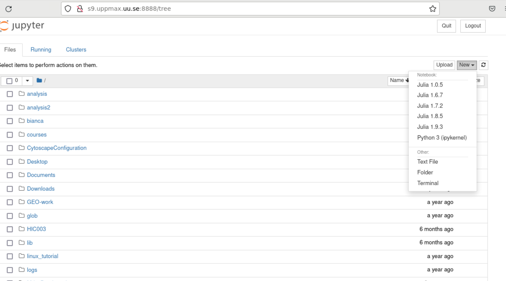

# Running Julia in Jupyter

- Like for Python it is possible to run Julia in Jupyter, i.e. in a web interface with possibility of inline figures and debugging.
- For this you need the ``IJulia package`` that you may have to install yourself.
- An easy way to do this is to load a python or Jupyter  module as well.
- For more interactiveness you can run IJulia which is Julia in Jupyter.
- You benefit a lot if you are using ThinLinc

!!! important "Installation step"

    - This was done in Exercise 2 in the [Managing environments and packages section](environments_packages.md)
    - It may take 5-10 minutes or so.

!!! important "Use ThinLinc and interactive session"

    - Use thinLinc
    - Allocate resources like above with salloc/interactive
    - When these steps are ready continue below!

??? example "Start Jupyter"

    === "NSC"

        ```bash
        $ ml Python/3.11.5-env-hpc1-gcc-2023b-eb
        $ ml julia/1.10.2-bdist
        $ julia -p 4
        ```

        In Julia:

        ```julia
        julia> using Pkg
        julia> Pkg.add("IJulia")
        julia> Pkg.build("IJulia")
        julia> using IJulia
        julia> notebook(dir=".",detached=true)
        ```

    === "PDC"

         Note: not fully tested successfully, but this step works

         ```bash
         $ ml PDC/23.12 julia/1.10.2-cpeGNU-23.12
         $ ml cray-python/3.11.5
         $ julia
         ```

         In Julia:

         ```julia
         julia> using Pkg
         julia> Pkg.add("IJulia")
         julia> Pkg.build("IJulia")
         julia> using IJulia
         julia> notebook(dir=".",detached=true)
         ```

         - The last command may not be able to start notebook, see further down how to do.

    === "UPPMAX"

         ```bash
         $ module load julia/1.8.5
         $ module load python/3.9.5
         $ julia -p 4
         ```

         In Julia:

         ```julia
         julia> using Pkg
         julia> Pkg.add("IJulia")
         julia> Pkg.build("IJulia")
         julia> using IJulia
         julia> notebook(dir=".",detached=true)
         ```

    === "HPC2N & LUNARC"

         - Like for Python it is possible to run a Julia in a Jupyter, i.e. in a web interface with possibility of inline figures and debugging. An easy way to do this is to load the *JupyterLab* and *Julia* modules. In shell:

         ```bash
         $ module load GCCcore/13.2.0  JupyterLab/4.2.0
         $ module load Julia/1.8.5-linux-x86_64
         $ julia
         ```

         In Julia `package` mode:

         ```julia
         (v1.8) pkg>add IJulia
         (v1.8) pkg>build IJulia
         ```

In some centres (UPPMAX and NSC) this will start a Firefox session with the Jupyter notebook interface.



If not, see below.

In any case, IJulia is now installed!

**Starting a Jupyter session with Julia Kernel**


- You can start up Julia in Jupyter quickly, once ``IJulia`` is installed for the combinations of Julia and Python/Jupyter you want to use.
- There are two ways
   - starting from within julia REPL (not for HPC2n or PDC)
   - starting jupyter session from terminal

**From Julia REPL**


- This may not always work

```julia
julia> using IJulia
julia> notebook(dir=".",detached=true)
```

!!! important "Tip"

    With ``notebook(dir="</path/to/work/dir/>", detached=true)`` the notebook will not be killed when you exit your REPL Julia session in the terminal.

**Jupyter session from terminal**

*Principle*

1. Load julia module (and prerequisites)
2. Load Python or Jupyter module (and prerequisites) that is compatible with the python version used when building IJulia in the previous step

!!! important "Running IJulia in Jupyter on compute nodes"

    - Jupyter is rather slow graphically on the compute nodes.
    - This can be fixed by
        - starting the jupyter server on the compute node, copying the URL containing the.
        - then starting a web browser in ThinLinc and open the URL copied in previous step
    - One can even use the home computer, see [here](https://uppmax.github.io/HPC-python/day2/IDEs.html#jupyter)

    === "NSC"

         First start an interactive session

         ```bash
         $ ml Python/3.11.5-env-hpc1-gcc-2023b-eb
         $ ml julia/1.10.2-bdist
         $ jupyter-lab --ip=$HOSTNAME
         ```

         - Start the browser from the ThinLinc menu.
         - Copy-paste the address line containing the node name from the jupyter output
         - You can start the Julia kernel in the upper right corner!


    === "PDC "

         Note: not fully tested successfully.

         - Since Jupyter and a web browser are missing on the compute nodes, we need to find another solution here.
         - Below are the steps that would be nice if we got working!

         First start an interactive session

         ```bash
         $ ml PDC/23.12 julia/1.10.2-cpeGNU-23.12 cray-python/3.11.5
         $ jupyter-lab --ip=$HOSTNAME
         ```

         - Start the browser from the ThinLinc menu.
         - Copy-paste the address line containing the node name from the jupyter output
         - You can start the Julia kernel in the upper right corner!

    === "UPPMAX"

         ```bash
         $ module load julia/1.8.5
         $ module load python/3.9.5
         $ jupyter-lab --ip=$HOSTNAME
         ```

         - Start the browser from the ThinLinc menu.
         - Copy-paste the address line containing the node name from the jupyter output
         - You can start the Julia kernel in the upper right corner!

    === "LUNARC"

         ```bash
         $ module load GCCcore/13.2.0  JupyterLab/4.2.0
         $ module load Julia/1.8.5-linux-x86_64
         $ jupyter-lab --ip=$HOSTNAME
         ```

         - Start the browser from the ThinLinc menu.
         - Copy-paste the address line containing the node name from the jupyter output
         - You can start the Julia kernel in the upper right corner!

    === "HPC2N"

         Write a bash script similar  to this (call it `job_jupyter.sh`, for instance):

         ```bash
         #!/bin/bash
         # Here you should put your own project id
         #SBATCH -A hpc2n2025-062
         # This example asks for 1 core
         #SBATCH -n 1
         # Ask for a suitable amount of time. Remember, this is the time the Jupyter notebook will be available! HHH:MM:SS.
         #SBATCH --time=00:10:00
         # Clear the environment from any previously loaded modules
         module purge > /dev/null 2>&1
         # Load the module environment suitable for the job
         module load GCCcore/13.2.0  JupyterLab/4.2.0
         # Load the Julia module
         ml Julia/1.8.5-linux-x86_64
         # Start JupyterLab
         jupyter lab --no-browser --ip $(hostname)
         ```

         Then, in the output file *slurm-<jobID>.out* file, copy the url that starts with *http://b-cn1403.hpc2n.umu.se:8888/lab* and
         paste it in a Firefox browser on Kebnekaise. When the Jupyter notebook interface starts, you can choose the Julia
         version from the module you loaded (in this case 1.8.5).

         - On Kebnekaise, you can run Jupyter notebooks with Julia kernels by using batch scripts
         - See [HPC2N documentation on using Jupyter Lab with Julia](https://docs.hpc2n.umu.se/software/jupyter/#jupyterlab__with__julia)
