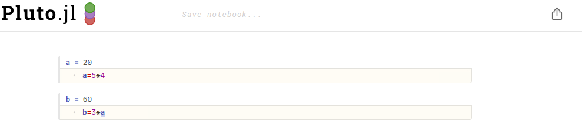

# A Julia notebook: Pluto

## Goals

- Learners 
    - understand the use cases (pros and cons)
    - can start a Pluto session
    - know in what environment to start

## General
Pluto, like Jupyter, is a programming notebook.

### Why is it a good tool?

- Reproducible (even without Pluto), gittable, extraordinarily interactive programming notebooks
- Offers a similar notebook experience to Jupyter, but understands global references between cells, and reactively re-evaluates cells affected by a code change.

### (Possible) use cases when Jupyter might be better.

## How to run

- Graphics
- Interactive session?
- packages and environments

``` { .julia-repl }
(@v1.11) pkg> activate pluto-env
(@v1.11) pkg> add Pluto
julia> using Pluto
julia> Pluto.run()
julia> Pluto.run(; launch_browser=false)

```

- Start Pluto


- Welcome page


- Pluto cells




## Exercises

!!! tip

    Be in a interactive session!

!!! challenge

    - Make a project with name ``pluto-env`` with the packages ``Pluto`` and ``XX`` installed.
    - Start a Pluto session withion the project
    - Check that the packageis available
