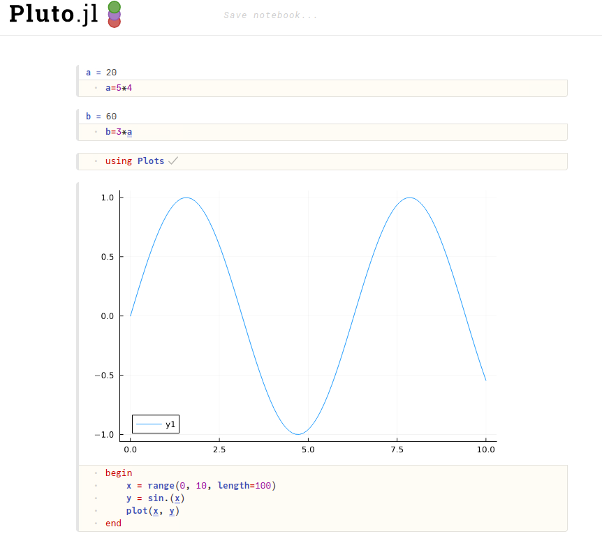

# A Julia notebook: Pluto

## Activate the Pluto environment we installed earlier

``` { .julia-repl }
(@v1.11) pkg> activate pluto-env
julia> using Pluto
```

## Start Pluto

First try:

``` { .julia-repl }
> Pluto.run()
```

- At some places it actually starts a web browser
- Otherwise, do

``` { .julia-repl }
julia> Pluto.run(; launch_browser=false)
```

and note the url given and paste it into a browser opened from the menu of ThinLinc.

## How does it look like?


- Welcome page


- Pluto cells


