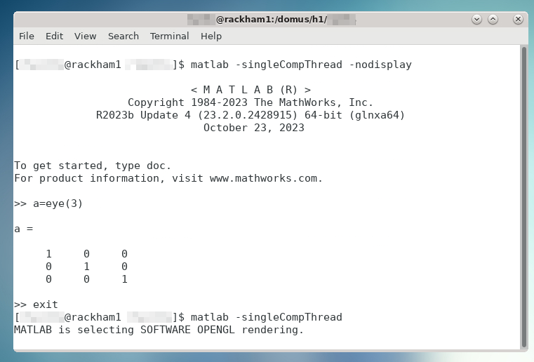

# Load and Run MATLAB

!!! info "Objectives"

    - Load MATLAB
    - Run MATLAB scripts
    - Start the MATLAB graphical user interface (GUI)

!!! important

    Different recommended procedures for each HPC center:
    
    - **UPPMAX, NSC, and HPC2N**: use module system to load at command line
    - **LUNARC**: recommended to use Desktop On-Demand menu, but interactive and non-interactive command lines available
    - **PDC**: recommended to load at command line; can run interactively on a compute node with X-forwarding and `salloc`. ThinLinc access is restricted to 30 users for the whole Dardel cluster.

Most HPC centres in Sweden use the same or a similar module system for their software. The difference lies in which modules are installed and their versions/naming. The general examples below will be similar for all HPC centres in Sweden, with some variation in naming and available versions.

??? faq "Short cheat sheet"

    - See which modules exists: `module spider` or `ml spider`
    - Find module versions for a particular software: `module spider <software>`
    - Modules depending only on what is currently loaded: `module avail` or `ml av`
    - See which modules are currently loaded: `module list` or `ml`
    - Load a module: `module load <module>/<version>` or `ml <module>/<version>`
    - Unload a module: `module unload <module>/<version>` or `ml -<module>/<version>`
    - More information about a module: `module show <module>/<version>` or `ml show <module>/<version>`
    - Unload all modules except the "sticky" modules: `module purge` or `ml purge`
    - Save currently loaded modules: `module save <collection_name>` (especially useful on Dardel)
    - (Re)load modules from saved collection: `module restore <collection_name>`

!!! caution  

    - Note that the module systems at UPPMAX, HPC2N, LUNARC, NSC, and PDC are slightly different.
    - There is no system MATLAB that comes preloaded like Python at any of these HPC resources, but `ml load matlab` with no release date will load the latest release, which is periodically updated. For reproducibility reasons, you should be sure to load the same release throughout a given project.
    - While all modules at UPPMAX and NSC not directly related to bio-informatics are shown by `ml avail`, modules at the other centers may be hidden until one has loaded a prerequisite, like the compiler `GCC`.
    - You need to use `module spider` to see all modules at HPC2N, LUNARC, and PDC, and `ml avail` for those available to load given your currently loaded prerequisites.
    - New sessions on Dardel (PDC) start with 13 modules loaded, but only one of them is sticky (i.e. will remain loaded after a `ml purge` command). We highly recommended that you save the preloaded modules as a collection so that you can quickly restore the default modules if you accidentally use `ml purge` instead of `ml unload <module>`.


## Check for MATLAB versions

### Type-Along

Below we have examples for how to check for MATLAB versions on different clusters. Follow along at your cluster.

=== "UPPMAX (Rackham and Pelle) and NSC (Tetralith)"

    Check all available MATLAB versions with:

    ```bash
    module avail matlab
    ```
    Output on Rackham as of 22 September 2025:
    
    ```bash
    ---------------------------- /sw/mf/rackham/applications ----------------------------
       matlab/R2014a    matlab/R2018a    matlab/R2022b          matlab/7.10
       matlab/R2015a    matlab/R2018b    matlab/R2023a          matlab/7.13
       matlab/R2015b    matlab/R2019a    matlab/R2023b (D)      matlab/8.0
       matlab/R2016a    matlab/R2020b    matlab/7.4             matlab/8.1
       matlab/R2017a    matlab/R2022a    matlab/7.8

      Where:
       D:  Default Module
    ```

    Output on Pelle as of 22 September 2025:

    ```bash
    ---------------------------- /sw/mf/pelle/applications ----------------------------
       MATLAB/2023b-update4
       MATLAB/2024a
    
      Where:
       D:  Default Module
    ```

    Output on Tetralith as of 27 Feb 2025:

    ```bash
    --------------------- /software/sse2/tetralith_el9/modules ---------------------
       MATLAB/recommendation (D)    MATLAB/2023b-bdist
       MATLAB/2023a-bdist           MATLAB/2024a-hpc1-bdist

      Where:
       D:  Default Module
    ```

=== "HPC2N"

    Check all available MATLAB versions with:

    ```bash
    module spider MATLAB
    ```

    As of 26 Sep 2024, the above outputs the following on Kebnekaise:
    
    ```bash
    ----------------------------------------------------------------------------
      MATLAB:
    ----------------------------------------------------------------------------
        Description:
          MATLAB is a high-level language and interactive environment that
          enables you to perform computationally intensive tasks faster than
          with traditional programming languages such as C, C++, and Fortran.

         Versions:
            MATLAB/2019b.Update2
            MATLAB/2021a
            MATLAB/2021b
            MATLAB/2022b.Update3
            MATLAB/2023a.Update4
         Other possible modules matches:
            MATLAB-parallel-support

    ----------------------------------------------------------------------------
    ```

    Note that it is case-sensitive and must be in ALL-CAPS. There will be results if you type ``matlab``, but they won't be the ones you want.
    To see how to load a specific version of MATLAB, including the prerequisites, do

    ```bash
    module spider MATLAB/<version>
    ```

    Example for MATLAB 2023a.Update4

    ```bash
    module spider MATLAB/2023a.Update4
    ```

=== "LUNARC"

    See all available MATLAB versions at the command line with:

    ```bash
    ml spider matlab
    ```

    Or, if on Desktop On-Demand, select `Applications` in the top left corner and hover over ``Applications - Matlab`` (see also GUI section below).

    As of 27 Feb 2025, `ml spider matlab` on COSMOS outputs the following:

    ```bash
    ----------------------------------------------------------------------------
    matlab:
    ----------------------------------------------------------------------------
        Versions:
            matlab/2022a
            matlab/2023a
            matlab/2023b
            matlab/2024b

    ----------------------------------------------------------------------------
    For detailed information about a specific "matlab" package (including how to
    load the modules) use the module's full name. Note that names that have a
    trailing (E) are extensions provided by other modules.
    For example:

    module spider matlab/2023b
    ----------------------------------------------------------------------------
    ```

=== "PDC (Dardel)"

    See all available MATLAB versions at the command line with:

    ```bash
    ml spider matlab
    ```
    
    As of 17 Mar 2025, the above command outputs the following on Dardel:
    
    ```bash
    Versions:
      matlab/r2020b
      matlab/r2021b
      matlab/r2022b
      matlab/r2023a
      matlab/r2024a-ps
      matlab/r2024a
      matlab/r2024b
    ```

    On Dardel, all MATLAB versions have a prerequisite that needs to be loaded (it will called something like PDC/xx.xx or PDCOLD/xx.xx). To view the prerequisites for a specific version of MATLAB, do

    ```bash
    module spider matlab/<version>
    ```

    For example, `module spider matlab/r2024b` outputs the following:

    ```bash
    matlab: matlab/r2024b
      You will need to load all module(s) on any one of the lines below before the "matlab/r2024b" module is available to load.
        PDC/23.12
      Help:
        For more information, visit:
           https://www.mathworks.com
    ```

## Load a MATLAB module

For reproducibility, we recommend ALWAYS loading a specific module instead of using the default version!

For this course, we recommend using MATLAB R2023x at UPPMAX (R2023b), NSC (2023b), and HPC2N (2023b), or R2024b at LUNARC (2024b). At PDC, we recommend r2024b.

### Type-along

Try loading a MATLAB module at the command line. First, go back and check which MATLAB modules were available.

=== "UPPMAX"

     **Rackham.** To load version 2023b, do:

     ```bash
     module load matlab/R2023b
     ```

     Note: all lowercase except the R.
     For short, you can also use `ml` instead of `module load`

     **Pelle.** To load version 2023b-update4, do:

     ```bash
     module load MATLAB/2023b-update4
     ```

     Note: MATLAB is all uppercase.
     For short, you can also use `ml` instead of `module load`

     
=== "HPC2N (Kebnekaise)"

     To load version 2023b, do:
     
     ```bash
     module load MATLAB/2023b
     ```

     Note: all Uppercase except for the letter after the year.
     For short, you can also use:

     ```bash
     ml MATLAB/2023b
     ```
     
=== "LUNARC (COSMOS)"

     To load version 2024b, do:

     ```bash
     module load matlab/2024b
     ```

     Note: all lowercase.
     For short, you can also use:

     ```bash
     ml matlab/2024b
     ```

=== "NSC (Tetralith)"

     To load version 2023b, do:

     ```bash
     module load MATLAB/2023b-bdist
     ```

     Note: all Uppercase except for the letter after the year.
     For short, you can also use:

     ```bash
     ml MATLAB/2023b
     ```

     If you check with ``ml`` which version is loaded, you will see the ``-bdist`` suffix was added automatically. Versions without ``-bdist`` at the end only appear with ``ml spider matlab`` and they do not appear to be loadable.

=== "PDC (Dardel)"

     Go back and check which MATLAB modules were available, and what their prerequisites are. To load version 2024b, do:

     ```bash
     module load PDC/23.12
     module load matlab/r2024b
     ```

     Notes: the module name is all lowercase including the ``r`` before the year.
     For short, you can also use:

     ```bash
     ml PDC/23.12 matlab/r2024b
     ```

## Start MATLAB at the Command Line

Most of the time, you will run either MATLAB live scripts (``.mlx``) or basic script or function files (``.m``).
Live scripts can only be opened and worked on in the GUI, while basic function or script files can also be run from a batch script and/or at the command line.

!!! note

    At the command line, function definition is typically not supported unless the function is short and anonymous.
    User-defined functions must generally be written up and saved to separate `.m` files.

The GUI is often the recommended interface where it is offered. SLURM jobs can be set up through the ``Parallel Computing Toolbox``, which will be discussed later. The resources required to run the GUI and those required to run a job submitted to SLURM are separate, so do not worry if the maximum allocation time for a MATLAB GUI session is much less than the limit for a SLURM job.

!!! important "`-singleCompThread`"

    When starting MATLAB from the command line, the `-singleCompThread` flag is usually required to prevent MATLAB from spawning as many processes as it thinks it needs up to the full capacity of a node. At most HPC centers, terminal instances launch MATLAB (either the GUI or command line) on a login node by default. Hogging a login node can disrupt jobs and access for other users, and violates the NAISS user agreement. HPC center staff reserve the right to kill disruptive tasks without warning. A few HPC centers detect if you have started on a login node and set `maxCompThreads` to 1 automatically, but when in doubt, use `-singleCompThread` to be safe.
    
    Setting `-singleCompThread` does **not** prevent MATLAB from sending parallelised and/or multi-threaded jobs to SLURM or the MATLAB Distributed Computing Server (MDCS).

### Type-along

Try starting MATLAB at the command line. We will use the same versions as in the previous section.

=== "UPPMAX (Rackham and Pelle?) and NSC (Tetralith)"

     Once you've loaded your preferred version of MATLAB, type:

     ```bash
     matlab -nodisplay
     ```

     to start MATLAB in the terminal. The maximum number of computational threads will be set to 1 automatically if you are on a log-in node.

=== "HPC2N (Kebnekaise)"

     The GUI can be started in a ThinLinc session by going to "Application" &rarr; "HPC2N Applications" &rarr; "Applications" &rarr; "Matlab <version>" and clicking the desired version.

     To start MATLAB in the terminal, load matlab/2023b or your preferred version, and then type:

     ```bash
     matlab -singleCompThread -nodisplay
     ```

     to start MATLAB in the terminal. The `-singleCompThread` is important to prevent MATLAB from hogging a whole node, and the `-nodisplay` flag prevents the GUI from launching.

=== "LUNARC (COSMOS)"

     It is recommended that GUI be started in ThinLinc at the LUNARC HPC Desktop On-Demand.

     To start MATLAB in the terminal, you must first choose the correct terminal. There are several in the Applications menu:
     
     - three in `Applications - General`, which can safely launch either the MATLAB GUI or MATLAB command line on a compute node, 
     - one in `Applications - Visualization`, which should be reserved for very graphics-heavy jobs, and 
     - one in `Favorites`, which **MATLAB users should avoid** because it runs on a login node.
     
     Starting any of the ones under menu headings starting with `Applications -` will open a GfxLauncher popup that prompts you for your account and resource choices. Even users who have been awarded GPU time are encouraged to use the CPU-only terminal whenever possible, as they are abundant, less resource intensive, and allow longer wall times.

     Once you've opened a terminal session and loaded your preferred version type:

     ```bash
     matlab -singleCompThread -nodisplay
     ```

=== "PDC (Dardel)"

     Starting a MATLAB session on Dardel looks different depending on whether or not you are affiliated KTH or have been added to the MATLAB user group by PDC support (e.g. as part of this course, if you signed up in time). If you are a KTH affiliate or another PDC-approved academic user, you are covered by KTH's university license. Otherwise, you will need to have a MathWorks account and be logged into it in your browser before getting started, because MATLAB on Dardel will ask you provide the email associated with your MathWorks account and a one-time password (OTP) sent to that account online (which you will have to copy from your browser).

     Either way, you will first need to load the corresponding PDC, PDCOLD, or PDCTEST prerequisite. The current default is PDC/23.12, and that makes available any MATLAB version from 2024. The only version that reliably works for non-KTH users without asking for credentials is r2024-ps.

     If you, for example, wanted to start matlab/r2024a-ps in the terminal, the sequence would look as follows:

     ```bash
     ml PDC/23.12  matlab/r2024a-ps
     matlab -singleCompThread -nosplash -nodesktop -nodisplay
     ```

     If you are an academic user who has been vetted by PDC staff, the above should be enough to eventually take you to the MATLAB command prompt. Otherwise, you will see the following:

     ```bash
     Please enter your MathWorks Account email address and press Enter: <your.email@your.institute.se>
        You need a one-time password to sign in. To get a one-time password, follow these steps:
          1. Go to https://www.mathworks.com/mwa/otp
          2. Enter your MathWorks Account email address.
          3. Copy the generated one-time password.
          4. Return here and enter the password.
        Enter the one-time password:
     ```

     If you are a student or staff member at KTH and you see these credential requests, that means PDC support did not receive your request for MATLAB access.

     !!! note
     
         PDC users may also go through ThinLinc and open MATLAB from the On-Demand Applications menu, but this is not recommended. Only 30 users are allowed to interface with Dardel via ThinLinc at any one time, and queue times are very long.

## Start the MATLAB GUI

Running the MATLAB GUI requires that users be logged into a ThinLinc session. Refer to [the login section](../common/login.md##step-1-log-in) for help.

=== "HPC2N (Kebnekaise)"
  
    For HPC2N, once logged into the remote desktop, the procedure for starting the MATLAB GUI is the same as what was shown above to start it at the command line, except that the ``-nodisplay`` flag is omitted (as are ``-nodesktop -nosplash`` if applicable). You should still include ``-singleCompThread``!
  
    It is possible to start the MATLAB GUI on a compute node on Kebnekaise (HPC2N). The procedure uses ``salloc`` and ``srun`` to achieve what other facilities often do with the ``interactive`` command (edit time, resources, project ID, and MATLAB version as needed):
  
    ```bash
    salloc -N 1 -t 00:30:00 -A hpc2n20YY-XXX
    module load MATLAB/2023b
    srun matlab
    ```

    Finally, HPC2N also has MATLAB available through the Open OnDemand portal. We will cover this briefly [in a later lecture](https://uppmax.github.io/R-matlab-julia-HPC/common/on-demand/), and there is more specific documentation in the [HPC2N connection guides](https://docs.hpc2n.umu.se/tutorials/connections/#interactive__apps__-__matlab__proxy).
     

=== "UPPMAX (Pelle)"

     For UPPMAX users, once logged into the remote desktop, the procedure for starting the MATLAB GUI is the same as what was shown above to start it at the command line, except that the ``-nodisplay`` flag is omitted (as are ``-nodesktop -nosplash`` if applicable). You should still include ``-singleCompThread``!

     

     It is also possible to start the MATLAB GUI on the login node. A MATLAB GUI session on a compute node can be run with the following commands (again, edit time, resources, project ID, and MATLAB version as needed):

     ```bash
     interactive  -n 4 -t 00:30:00 -A uppmax2025-2-360
     module load MATLAB/2023b-update4
     matlab
     ```

     In the above example, ``-n 4`` means the job will run on 4 cores. Pelle nodes have 96 cores. Please refer to [this link](https://docs.uppmax.uu.se/cluster_guides/snowy/#using-the-batch-system) for allowed combinations of ``interactive`` parameters.


=== "NSC (Tetralith)"

    The best way to start the MATLAB GUI on Tetralith depends on how intensively you plan to use the GUI. Most of the time, it is recommended to use the ``interactive`` command first to get an allocation on a compute node. The commands you will need to enter look like the following (change the MATLAB version and interactive job specifications as needed):

     ```bash
     interactive -N 1 --exclusive -t 4:00:00
     module load MATLAB/2024a-hpc1-bdist
     matlab -softwareopengl
     ```

    For short (<<1 hour) tasks requiring few resources, once you've loaded your preferred version of MATLAB, you can use the following command to start MATLAB on a login node:
  
     ```bash
     vglrun matlab -nosoftwareopengl
     ```
  
    You do not need to include `-singleCompThread` because `maxNumCompThreads` will be set to 1 automatically to account for starting on a login node.

=== "LUNARC (COSMOS)"

    The recommended way to open the MATLAB GUI on COSMOS is by using [Desktop On-Demand](https://uppmax.github.io/R-matlab-julia-HPC/common/on-demand/). We will go over this in the first session after lunch.

    There are 3 versions per MATLAB release in the Apps menu---regular, (CPU), and (HEP,CPU)---and your resource choices partly depend on which of those you select.

    

    The (HEP,CPU) nodes are private. The regular versions may run on either AMD/NVIDIA A40 48-core nodes or Intel/NVIDIA A40 32-core nodes, and the maximum allowed wall times for each are 24 and 48 hours, respectively. If you do not plan to do any intensive graphical work inside the GUI, you can choose the (CPU) version of your preferred release to access an AMD A100 48-core node, which also allows you to run for up to 7 days (168:00:00).

=== "PDC (Dardel)"

    There are 2 ways to run MATLAB interactively on Dardel: via SSH with X-forwarding (recommended), or via Desktop On-Demand in a ThinLinc window. ThinLinc access to Dardel is limited to 30 users total, and even if you do get through, interactive jobs are likely to be stuck in queues for a long time.

    **SSH with X-forwarding.** When you first ssh into Dardel, you will need to have added the `-X` flag between `ssh` and your username. Once you are logged in, you need to book a compute node with `salloc`, and then SSH (again with the `-X` flag) into whichever node you are assigned to by `salloc`. The `salloc` step and its output will look something like this:

    ```bash
    salloc -N 1 -t 00:30:00 -A naiss2025-22-262 -p main
    ```

    if you request a full node, or
    
    ```bash
    salloc -c 16 -t 00:30:00 -A naiss2025-22-262 -p shared
    ```

    if you request, for example, 16 cores on a shared node. Adjust the time, resources, and account number as needed. `salloc` will then print a handful of lines about the progress of allocating and queuing your job. The last line of output, something like `salloc: Nodes nid00xxxx are ready for job`, will contain the ID of the node you booked. Copy that, and then run the following lines (after the `:~>` prompt; adjust the node ID as needed):

    ```bash
    <user>@login1:~> ssh -X nid001756
    <user>@nid001756:~> ml PDC/23.12
    <user>@nid001756:~> ml matlab/r2024a-ps
    <user>@nid001756:~> matlab
    ```

    The GUI will take a few minutes to load.

    If you are lucky enough to get into Dardel via ThinLinc, the process looks very similar to LUNARC because Dardel uses the same Desktop On-Demand interface, except that the MATLAB versions in the app menu are under `PDC - Matlab` and are not separated by the types of nodes to run on.


### Exercises

Try them yourself! Note that `$` indicates a bash prompt and `>>` indicates the MATLAB prompt; those characters should not be included at the front of your input.

!!! example "**Challenge 1.** Load MATLAB in the terminal or GUI."

    Then do a few simple commands at the command line. For example,
    ```bash
    $ ml matlab/2023b
    $ matlab -singleCompThread -nodisplay
                                < M A T L A B (R) >
                   Copyright 1984-2023 The MathWorks, Inc.
               R2023b Update 7 (23.2.0.2515942) 64-bit (glnxa64)
                               January 30, 2024
    To get started, type doc.
    For product information, visit www.mathworks.com.
    >> a = 5;
    >> b = eye(2);
    >> c = a+b
    c =
        6     5
        5     6
    ```

!!! example "**Challenge 2.** Run a function."

    Copy the example function below to a file called ``add2.m`` in your working directory or the MATLAB directory that the configuration step created for you in your Documents folder. Then run it at the MATLAB command line.

    ```matlab
    function result = add2(x,y)
    result = x+y
    disp("The sum of "+x+" and "+y+" is "+result)
    end
    ```

??? check "Solution"

    ```matlab
    >> add2(5,8)
    result =
        13
    The sum of 5 and 8 is 13
    >>
    ```

!!! example "**Challenge 3.** Exit the MATLAB command line."

    Use `quit` or `exit` (this can take a few seconds).

??? check "Solution"

    ```matlab
    >> exit
    ```

!!! summary

    - You can start MATLAB either in a GUI or, with the `-nodisplay` flag, run it in the terminal.
    - If you start either interface from the terminal, you must first load the correct module(s).
    - For interactive work, you will usually have to reserve time on a compute node, but some facilities have a Desktop On-Demand interface that makes that easier.
    - If you take the risk of starting on a login node, use the `-singleCompThread` flag in the starting command to avoid hogging the node, unless you are sure that your cluster sets that constraint on the login node automatically.
