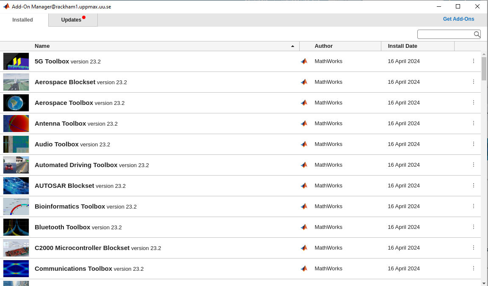
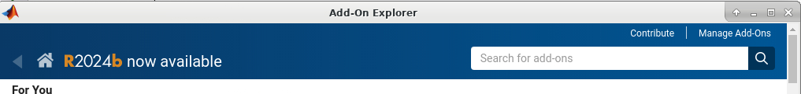

# Add-Ons

Add-ons extend the capabilities of MATLAB® by providing additional functionality for specific tasks and applications, such as:

- connecting to hardware devices
- additional algorithms
- interactive apps
      
Encompass a wide variety of resources

- products
- apps
- toolboxes
- support packages

Available from:

- MathWorks®
- the global MATLAB user community

For more information, [click here](https://se.mathworks.com/help/matlab/add-ons.html?s_tid=CRUX_lftnavZ).

!!! info "Objectives"

    - Navigate to toolboxes and Add-Ons
    - View Add-Ons and toolboxes
    - Install and use Add-Ons

Before going into installing Add-Ons, let's have a background to the MATLAB environments and ecosystem!

!!! tip "Want a video?"

    See [Matlab add-ons (Oct 2024)](https://www.youtube.com/watch?v=TLXdzEF06xU&list=PL6jMHLEmPVLwzXjygOpG__54j6oG4IRFN&index=42)

## MATLAB Add-Ons manager


<div align="center">
  
</div>

In the GUI, the Add-Ons manager can be selected from the menu at the top. The drop-down menu options allow users to:

- **Browse a library of Add-Ons to download.** Note that some Add-Ons require a separate license.

???- tip "What does that look like?"

    <div align="center">
        
    </div>

- **Manage Add-Ons already downloaded.**

???- tip "What does that look like?"
   
    <div align="center">
        
    </div>

- Package user-generated code as a Toolbox or App

- Get hardware-related support packages

Here we will only focus on the first two options.

!!! important

    Note that very many packages are already included in the Academic installation and license. You can go to the Add-On explorer and select "View My Products" to see what is available.

    <div align="center">
      
    </div>

!!! seealso 

    Some typical toolboxes include:
    - Parallel Computing
    - Simulink
    - Symbolic Math
    - Signal Processing
    - Machine Learning
    
    Some toolboxes provide a **GUI** for their tools/Apps
    - :ref:`Read more <matlab-extra-addons>`

    We won't cover the usage of most toolboxes here!

### Install Add-Ons

- Search in Add-Ons explorer and install.

<div align="center">
  
</div>

- Installation goes in local folder, `~/MATLAB Add-Ons`, and should be accessible wherever you are in the file tree.
- It's in the path so it should be possible to run directly if you don't need to run an installation file.
- For more information about a specific support package install location, see the documentation for the package.

!!! warning

    To be able to install you need to use the email for a **personal mathworks account**.

You can install some Add-Ons manually using an installation file. This is useful in several situations:

- The add-on is not available for installation through the Add-On Explorer, for example, if you create a custom add-on yourself or receive one from someone else.
- You downloaded the add-on from the Add-On Explorer without installing it.
- You downloaded the add-on from the File Exchange at MATLAB Central™.

!!! seealso

    [MathWorks page on getting Add-Ons](https://se.mathworks.com/help/matlab/matlab_env/get-add-ons.html)

!!! example "Demo"

    - Search for ``kalmanf``
    - Click "Learning the Kalman Filter"
    - Look at the documentation
    - Test if the command works today:

    ```matlab
    >> kalmanf
    Unrecognized function or variable 'kalmanf'.
    ```
    
    - OK, it is not there
    - Click "Add", and "Download and Add to path"
    - Type email address connected to your MathWorks account (not needed for some versions at Dardel)
    - Installation starts
    - It will end up in the ``~/MATLAB\ Add-Ons/`` folder
    - This is how the file tree looked for me (``tree`` command is available at some centres)

    ```console
    $ tree MATLAB\ Add-Ons/
    MATLAB\ Add-Ons/
    └── Collections
    |   └── Efficient\ GRIB1\ data\ reader
    |       ├── core.28328
    |       ├── license.txt
    |       ├── readGRIB1.c
    |       ├── readGRIB1.mexa64
    |       └── resources
    |           ├── addons_core.xml
    |           ├── matlab_path_entries.xml
    |           ├── metadata.xml
    |           ├── previewImage.png
    |           ├── readGRIB1.zip
    |           └── screenshot.png
    └── Functions
        └── Learning\ the\ Kalman\ Filter
            ├── kalmanf.m
            └── resources
                ├── addons_core.xml
                ├── kalmanf.zip
                ├── matlab_path_entries.xml
                ├── metadata.xml
                ├── previewImage.png
                └── screenshot.png
    ```
    
    - Evidently it is a ``function``. Note that I already have something classified as ``collections``
    - Now test:

    ```matlab
    >> kalmanf()
    'kalmanf' requires Learning the Kalman Filter version 1.0.0.0 to be enabled.
    ```

    - OK. It is installed but may need some other things. Just an example!

## Exercises

!!! note " Exercise"


    Find the **kalmanf** add-on, install it, and run a test command. Use the Demo as instruction.

!!! note " Exercise"

    Browse the add-ons and get inspired for your own work. Use the Demo as inspiration.

!!! summary

    - Many Add-Ons, like toolboxes and packages are available at the Clusters
    - You can view Add-Ons and toolboxes with the Add-on manager
    - It is all more or less graphical
    - Use Add-Ons explorer to find and install add-ons/toolboxes.
    - Add-ons installed by you can be found in ``~/MATLAB\ Add-Ons/``, and folder is automatically added to the MATLAB PATH, so it should be found no matter which working directory you are working in..
