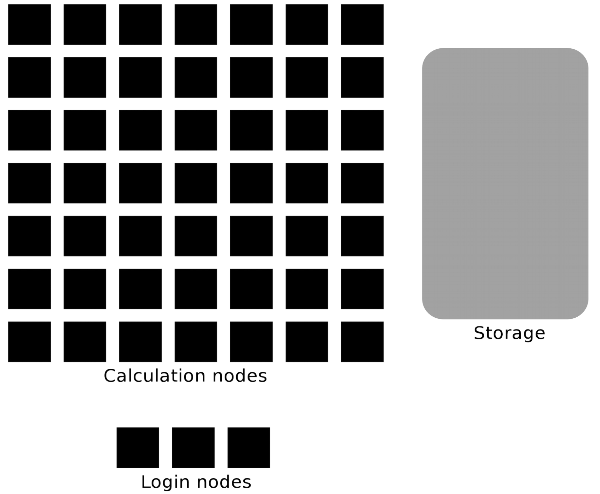

Pre-requirements
================

.. admonition:: Goal

    The goal of this page to make sure you can follow the course.

These are the things you need to follow the course:

- You are not a complete beginner of the Linux environment
- The technical prepartaions are covered in the next page.

These are discussed in detail below

Get familiar with the Linux/Bash command line
---------------------------------------------

- We recommend the NAISS workshop below but you could test the centre specific material as well.
    - You can use your own computer  for this.
- Some material is better followed from a session on the mentioned cluster.

NAISS workshop
..............

- `Introduction to Linux <https://hpc2n.github.io/intro-linux/>`_

Centre material
.................

- UPPMAX
    
  - `Linux <http://docs.uppmax.uu.se/getting_started/linux/>`_
  - `Basic commands <http://docs.uppmax.uu.se/getting_started/linux_basics/>`_
  - `Whole intro course material <https://docs.uppmax.uu.se/courses_workshops/uppmax_intro_course/>`_
      
- HPC2N
    
  - `HPC2N's intro course material (including link to recordings) <https://github.com/hpc2n/intro-course>`_
  - `HPC2N's YouTube channel video on Linux <https://www.youtube.com/watch?v=gq4Dvt2LeDg>`_
  - `Linux "cheat sheet" <https://www.hpc2n.umu.se/documentation/guides/linux-cheat-sheet>`_

- LUNARC
    - Any of the above links would be helpful for you

- NSC
    - Any of the above links would be helpful for you

- PDC
    - `PDC intro course material <https://pdc-support.github.io/pdc-intro/>`_ 

Material for improving your programming skills
----------------------------------------------

First level
:::::::::::

`The Carpentries <https://carpentries.org/>`_ teaches basic lab skills for research computing.

- `Software carpentry courses/material <https://software-carpentry.org/lessons/>`_ 

Second level
::::::::::::

`Code Refinery <https://coderefinery.org/>`_ develops and maintains training material on software best practices for researchers that already write code. 

- Their material addresses all academic disciplines and tries to be as programming language-independent as possible. 
- `Code refinery lessons <https://coderefinery.org/lessons/>`_     

Third level
:::::::::::

`ENCCS (EuroCC National Competence Centre Sweden) <https://enccs.se/>`_ is a national centre that supports industry, public administration and academia accessing and using European supercomputers. They give higher-level training of programming and specific software.

- `ENCCS training material <https://enccs.se/lessons/>`_ 

Understanding clusters
----------------------

The HPC centers UPPMAX, HPC2N, LUNARC, and NSC 
##############################################

.. admonition:: Four HPC centers

   - There are many similarities:
   
     - Login vs. calculation/compute nodes
     - Environmental module system with software hidden until loaded with ``module load``
     - Slurm batch job and scheduling system
     
   - ... and small differences:
   
     - commands to load R, Matlab and Julia and packages/libraries
     - sometimes different versions of R, Matlab and Julia, etc.   
     - slightly different flags to Slurm
     
   - ... and some bigger differences:
   
     - UPPMAX has three different clusters 

       - Rackham for general purpose computing on CPUs only
       - Snowy available for local projects and suits long jobs (< 1 month) and has GPUs
       - Bianca for sensitive data and has GPUs

   - HPC2N has Kebnekaise with GPUs  
   - LUNARC has Cosmos with GPUs (and Cosmos-SENS) 
   - NSC has several clusters
       - BerzeLiUs (AI/ML, NAISS)
       - Tetralith (NAISS)
       - Sigma (LiU local)
       - Freja (R&D, located at SMHI)
       - Nebula (MET Norway R&D)
       - Stratus (weather forecasts, located at NSC)
       - Cirrus (weather forecasts, located at SMHI)
       - We will be using Tetralith, which also has GPUs 

    - PSC has Dardel with AMD GPUs 

    - Conda is recommended only for UPPMAX/LUNARC/NSC users
    
.. warning:: 

   - At HPC2N, UPPMAX, LUNARC, and NSC we call the applications available via the *module system* **modules**. 
   - https://docs.uppmax.uu.se/cluster_guides/modules/ 
   - https://docs.hpc2n.umu.se/documentation/modules/
   - https://lunarc-documentation.readthedocs.io/en/latest/manual/manual_modules/  
   - https://www.nsc.liu.se/software/modules/
   - https://support.pdc.kth.se/doc/support/?sub=software/module/

 
Briefly about the cluster hardware and system at UPPMAX, HPC2N, LUNARC, NSC and PDC
:::::::::::::::::::::::::::::::::::::::::::::::::::::::::::::::::::::::::::::::::::

**What is a cluster?**

- Login nodes and calculations/computation nodes

- A network of computers, each computer working as a **node**.
     
- Each node contains several processor cores and RAM and a local disk called scratch.

.. figure:: ./img/node.png
   :align: center

- The user logs in to **login nodes**  via Internet through ssh or Thinlinc.

  - Here the file management and lighter data analysis can be performed.

- The **calculation nodes** have to be used for intense computing. 

Common features
###############

- Intel (and for HPC2N/LUNARC, also AMD) CPUs
- Linux kernel
- Bash shell

.. list-table:: Hardware
   :widths: 25 25 25 25 25 25 25
   :header-rows: 1

   * - Technology
     - Kebnekaise
     - Rackham
     - Snowy
     - Bianca
     - Cosmos  
     - Tetralith   
   * - Cores/compute node
     - 28 (72 for largemem, 128/256 for AMD Zen3/Zen4)
     - 20
     - 16
     - 16
     - 48  
     - 32  
   * - Memory/compute node
     - 128-3072 GB 
     - 128-1024 GB
     - 128-4096 GB
     - 128-512 GB
     - 256-512 GB  
     - 96-384 GB   
   * - GPU
     - NVidia V100, A100, A6000, L40s, H100, A40, AMD MI100 
     - None
     - NVidia T4 
     - NVidia A100
     - NVidia A100 
     - NVidia T4   

Overview of the UPPMAX systems
##############################

.. mermaid:: mermaid/uppmax2.mmd

Overview of the HPC2N system
############################

.. mermaid:: mermaid/kebnekaise.mmd

Overview of the LUNARC system 
############################# 

.. figure:: ./img/cosmos-resources.png 
   :align: center

Overview of the NSC systems
########################### 

