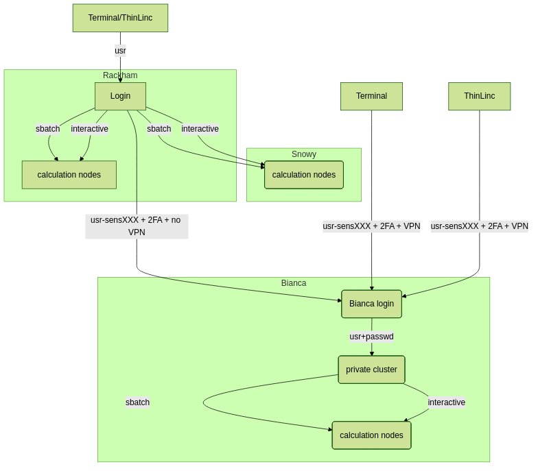
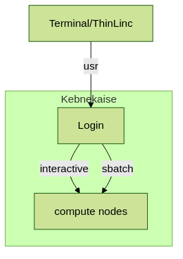

# Interactive work on the compute nodes

!!! note

    - It is possible to run R directly on the login (including ThinLinc) nodes.
       - should *only* be done for short and small jobs 
       - otherwise the login node becomes slow for all users. 
    - If you want to work interactively with your code or data, you should 
       - start an **interactive session**.
       - this includes Open OnDemand at those centres that have it 
    - If you rather will run a script which **won't use any interactive user input while running**, you should
       - start a **batch job**, see previous session.
   
!!! note "Questions"

    - How do I proceed to work interactively on a compute node
   
!!! note "Objectives"

    - Show how to reach the calculation nodes on UPPMAX and HPC2N
    - Test some commands on the calculation nodes

!!! note "Compute allocations in this workshop" 

   - Rackham/Pelle: ``uppmax2025-2-360``
   - Kebnekaise: ``hpc2n2025-151``
   - Cosmos: ``lu2025-2-94``
   - Tetralith: ``naiss2025-22-934``
   - Dardel: ``naiss2025-22-934``
   - Alvis: ``naiss2025-22-934``

## Overview of the UPPMAX systems



## Overview of the HPC2N system



## Overview of the LUNARC system


## Overview of the NSC system


## General

In order to run interactively, you need to have compute nodes allocated to run
on, and this is done through the batch system.  

!!! warning

    - (HPC2N) Do note that it (salloc) is not *real* interactivity as you probably mean it, as you will have to run it as a R script instead of by starting R and giving commands inside it. The reason for this is that you are not actually logged into the compute node and only sees the output of the commands you run. You also need to preface with ``srun`` or it will run on the login node. 

    - The way to get real interactivity at HPC2N is to use the Open OnDemand desktop (https://portal.hpc2n.umu.se) 

## R "interactively" on the compute nodes 

To run interactively, you need to allocate resources on the cluster first. You can use the command ``salloc``/``interactive`` to allow interactive use of resources allocated to your job. When the resources are allocated, if you are using HPC2N and ``salloc`` you need to preface commands with ``srun`` in order to run on the allocated nodes instead of the login node. 
      
- First, you make a request for resources with ``interactive``/``salloc``, like this:

=== "UPPMAX (interactive)"

    ```bash
    $ interactive -n <tasks> --time=HHH:MM:SS -A uppmax2025-2-360 
    ``` 
  
=== "HPC2N (salloc)" 

    ```bash
    $ salloc -n <tasks> --time=HHH:MM:SS -A hpc2n2024-025 
    ```          

=== "LUNARC (interactive)"

    ```bash
    interactive -A lu2025-2-94 -t HHH:MM:SS
    ```

=== "NSC (interactive)" 

    ```bash
    interactive -A naiss2025-22-934
    ```

=== "PDC (salloc + ssh)" 

    ```bash
    salloc --time=HHH:MM:SS -A naiss2025-22-934 -p [partition]
    ```

    Where ``[partition]`` is main or gpu. After your resources have been allocated, you can login to the compute node with ``ssh <node>`` and have real interactivity. 

=== "C3SE" 

    ```bash
    srun -A NAISS2025-22-934 -p alvis --gpus-per-node=T4:1 --pty bash
    ```

Your request enters the job queue just like any other job, and interactive/salloc will tell you that it is waiting for the requested resources. When salloc tells you that your job has been allocated resources, you can interactively run programs on those resources with ``srun`` (or login to the compute node with ssh on PDC). The commands you run with ``srun`` will then be executed on the resources your job has been allocated. If you do not preface with ``srun`` the command is run on the login node! 
      
You can now run R scripts on the allocated resources directly instead of waiting for your batch job to return a result. This is an advantage if you want to test your R script or perhaps figure out which parameters are best.
                  
!!! warning

    **Let us use ThinLinc or Open OnDemand (where available)**

    === "UPPMAX"

        - ThinLinc app: ``<user>@rackham-gui.uppmax.uu.se``
        - ThinLinc in web browser: ``https://rackham-gui.uppmax.uu.se``   This requires 2FA!
        - ThinLinc (Pelle): ``<user>@pelle-gui.uppmax.uu.se``
        - ThinLinc (Pelle) in web browser: ``https://pelle-gui.uppmax.uu.se``   This requires 2FA!

    === "HPC2N"

        - ThinLinc: kebnekaise-tl.hpc2n.umu.se
        - From web browser: https://kebnekaise-tl.hpc2n.umu.se:300/
        - OpenOnDemand: https://portal.hpc2n.umu.se (click [https://docs.hpc2n.umu.se/tutorials/connections/#interactive__apps__-__rstudio__server](here for documentation on RStudio with Open OnDemand))

    === "LUNARC"

        - ThinLinc: ``cosmos-dt.lunarc.lu.se``
            - Note that you need to setup <a href="https://lunarc-documentation.readthedocs.io/en/latest/getting_started/login_howto/" target="_blank">TFA (PocketPass)</a> to use LUNARC!
        - You can start Gfx (Open OnDemand) from inside ThinLinc! 

    === "NSC (Tetralith)"

        - ThinLinc: tetralith.pdc.kth.se
            - 2FA required! https://www.nsc.liu.se/support/2fa/

    === "PDC"

        - ThinLinc: dardel-vnc.nsc.kth.se
            - SSH keys or kerberos needed! https://support.pdc.kth.se/doc/support/?section=/doc/support-docs/basics/quickstart

    === "C3SE (Alvis)"

        - OpenOnDemand: https://alvis.c3se.chalmers.se
            - https://www.c3se.chalmers.se/documentation/connecting/remote_graphics/
            - Note that Alvis is accessible via SUNET networks (i.e. most Swedish university networks). If you are not on one of those networks you need to use a VPN - preferrably your own Swedish university VPN. If this is not possible, contact ``support@chalmers.se`` and ask to be added to the Chalmers's eduVPN.

    **Using terminal**

    === "NSC"

        - SSH: ``ssh <user>@tetralith.nsc.liu.se``
        - Note that you need to setup <a href="https://www.nsc.liu.se/support/2fa/" target="_blank">TFA</a> to use NSC!

    === "HPC2N"

        - SSH: ``ssh <user>@kebnekaise.hpc2n.umu.se``

    === "UPPMAX"

        **Rackham**

        - SSH: ``ssh <user>@rackham.uppmax.uu.se``
        - Note that you may have to setup <a href="https://docs.uppmax.uu.se/getting_started/get_uppmax_2fa/"

        **Pelle*

        - SSH: ``ssh <user>@pelle.uppmax.uu.se``
        - Note that you may have to setup <a href="https://docs.uppmax.uu.se/getting_started/get_uppmax_2fa/" target="_blank">TFA for Uppmax</a> when using either of the ThinLinc connections.

    === "LUNARC"

        - SSH: ``ssh <user>@cosmos.lunarc.lu.se``
        - Note that you need to setup <a href="https://lunarc-documentation.readthedocs.io/en/latest/getting_started/login_howto/" target="_blank">TFA (PocketPass)</a> to use LUNARC!

    === "PDC"

        - SSH: ``ssh <user>@dardel.pdc.kth.se``
        - Note that you need to setup <a href="https://support.pdc.kth.se/doc/login/ssh_login/" target="_blank">SSH keys</a> or kerberos in order to login to PDC!

    === "C3SE"

        - SSH: ``ssh <user>@alvis1.c3se.chalmers.se``
               or
               ``ssh <user>@alvis2.c3se.chalmers.se``
        - Note that Alvis is accessible via SUNET networks (i.e. most Swedish university networks). If you are not on one of those networks you need to use a VPN - preferrably your own Swedish university VPN. If this is not possible, contact ``support@chalmers.se`` and ask to be added to the Chalmers's eduVPN.

    **In any case:**  

    - Remember to have X11 installed!
    - On Mac
       - install XQuartz
    - On Windows
       - Use MobaXterm or
       - install XMING and use with Putty or PowerShell


### Example 

**Requesting 4 cores for 10 minutes, then running R**

=== "UPPMAX"

    ```bash
    [bjornc@pelle2 ~]$ interactive -A uppmax2025-2-360 -n 4 -t 10:00
    This is a temporary version of interactive-script for Pelle
    Most interactive-script functionality is removed
    salloc: Pending job allocation 82050
    salloc: job 82050 queued and waiting for resources
    salloc: job 82050 has been allocated resources
    salloc: Granted job allocation 82050
    salloc: Waiting for resource configuration
    salloc: Nodes p102 are ready for job
    [bjornc@p102 ~]$
    ```      

    Let us check that we actually run on the compute node: 

    ```bash
    [bjornc@p102 ~]$ srun hostname
    p102.uppmax.uu.se
    p102.uppmax.uu.se
    p102.uppmax.uu.se
    p102.uppmax.uu.se
    ```
        
    We are! Notice that we got a response from all four cores we have allocated.   

    === "HPC2N"
         
        ```bash
        [~]$ salloc -n 4 --time=00:30:00 -A hpc2n2024-025
        salloc: Pending job allocation 20174806
        salloc: job 20174806 queued and waiting for resources
        salloc: job 20174806 has been allocated resources
        salloc: Granted job allocation 20174806
        salloc: Waiting for resource configuration
        salloc: Nodes b-cn0241 are ready for job
        [~]$ module load GCC/12.2.0  OpenMPI/4.1.4 R/4.2.2
        [~]$ 
        ```            
      
        Let us check that we actually run on the compute node: 
      
        ```bash   
        [~]$ srun hostname
        b-cn0241.hpc2n.umu.se
        b-cn0241.hpc2n.umu.se
        b-cn0241.hpc2n.umu.se
        b-cn0241.hpc2n.umu.se
        ``` 
      
        We are. Notice that we got a response from all four cores we have allocated.   
      
**Running a script**
   
!!! warning

    - You need to reload all modules you used on the login node!!!


**The script** 

Adding two numbers from user input (``serial_sum.R``)
   
- You will find it in the exercise directory ``exercises/r/`` so go there with ``cd``.
- Otherwise, use your favourite editor and add the text below and save as ``serial_sum.R``.
   
         
```R
# This program will add two numbers that are provided by the user
args = commandArgs(trailingOnly = TRUE)
res = as.numeric(args[1]) + as.numeric(args[2])
print(paste("The sum of the two numbers is", res))
```
  
**Running the script**

- Note that the commands are the same for both HPC2N and UPPMAX!
      
Running a R script in the allocation we made further up. Notice that since we asked for 4 cores, the script is run 4 times, since it is a serial script
         
```bash
$ srun Rscript serial_sum.R 3 4
[1] "The sum of the two numbers is 7"
[1] "The sum of the two numbers is 7"
[1] "The sum of the two numbers is 7"
[1] "The sum of the two numbers is 7"
```
 
Without the ``srun`` command, R won't understand that it can use several cores. Therefore the program is run only once.
                  
```bash
$ Rscript serial_sum.R 3 4
[1] "The sum of the two numbers is 7"
```

**Running R with workers**

- First start R and check available workers with ``future``. 
- Create a R script called `script-workers.R`` with the following content:

```R 
library(future)
availableWorkers()
availableCores()
```

- Execute the code with ``srun -n 1 -c 4 Rscript script-workers.R``

## Exit

When you have finished using the allocation, either wait for it to end, or close it with ``exit``

**Don't do it now!** 

- We shall test RStudio first in the next session!

=== "UPPMAX"
   
    ```bash        
    [bjornc@p102 ~]$ exit
    
    exit
    [screen is terminating]
    Connection to p102 closed.
      
    [bjornc@pelle2 ~]$
    ```
    
=== "HPC2N"
   
    ```bash
    [~]$ exit
    exit
    salloc: Relinquishing job allocation 20174806
    salloc: Job allocation 20174806 has been revoked.
    [~]$
    ``` 

!!! note "Keypoints"

    - Start an interactive session on a calculation node by a SLURM allocation
       - At HPC2N: ``salloc`` ...
       - At UPPMAX: ``interactive`` ...
    - Follow the same procedure as usual by loading the R module and possible prerequisites.
    
