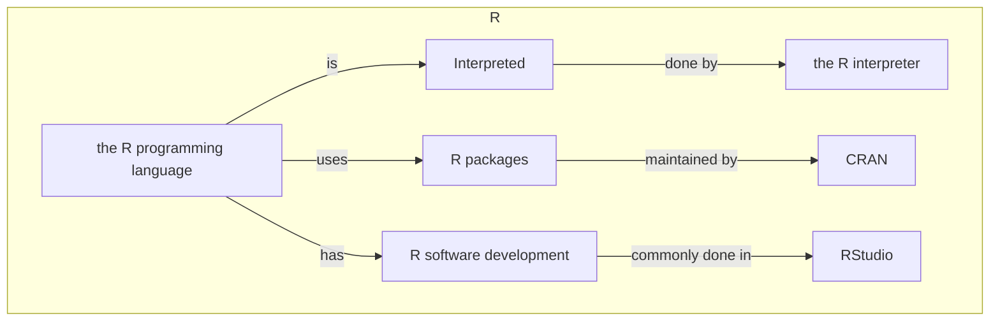
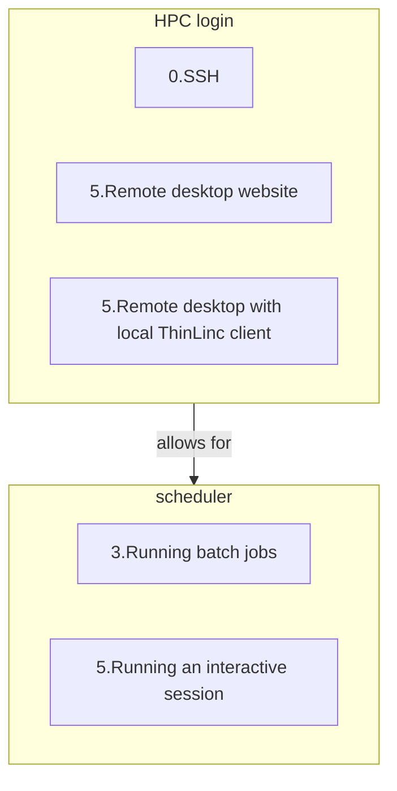
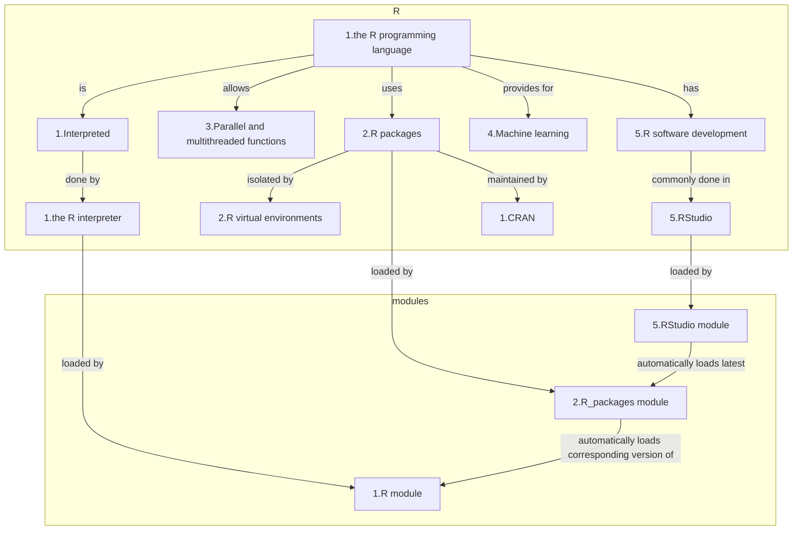

# Introduction R

???- note "Prefer this session as video?"
    See [this YouTube video](https://youtu.be/N-TRzv9LdF4)
    to see this session as a video.

!!! note "Learning outcomes"

    - see a first overview of the R programming language
    - see the overview of the course
    - hear about 'the tarball with exercises'

???- note "For teachers"

    Learning outomes are:

    - Learners have seen an overview of the course
    - Learners have seen an first overview of the R programming language

    Priors:

    - What is R?
    - What are features of R?
    - What are R packages?
    - What is the R interpreter?
    - What is RStudio?

!!! note "Course learning outcomes"

    - use the module system to load R
    - use the module system to load site-installed R packages
    - find out which versions of R and packages are installed
    - run R scripts
    - write a batch script for running R
    - install R packages from CRAN
    - see how to install other R packages yourself
    - start batch jobs
    - run RStudio

    on the NAISS clusters COSMOS, Dardel, Kebnekaise, Rackham and Tetralith.

!!! note "Course non-goals"

    - improve R coding skills
    - use R on other HPC clusters
    - transfer files (tip: see [the NAISS 'File transfer' course](https://uppmax.github.io/naiss_file_transfer_course/))

## First overview of R

R is a programming language for statistical computing and data visualization
([Wikipedia](https://en.wikipedia.org/wiki/R_(programming_language))).

The main general R resources are:

- [The R homepage](https://www.r-project.org/)
- [The official R documentation](https://cran.r-project.org/manuals.html)
- [The CRAN homepage](https://cran.r-project.org/)

R is used in many NAISS centres:

- [An overview of NAISS centres and their R documentation](http://docs.uppmax.uu.se/software/r/#overview-of-naiss-centers-and-their-documentation-about-r)
- [An (incomplete) overview of R courses being taught at NAISS](http://docs.uppmax.uu.se/software/r/#learning-r)

## Schedule

## Exercises used in the course

The course uses a so-called tarball files with exercises as
used in this course.

See [How to use the course tarball](../common/use_tarball.md)
how to get and decompress it.

In the 'Load and run R' session, there is the time to do so.
