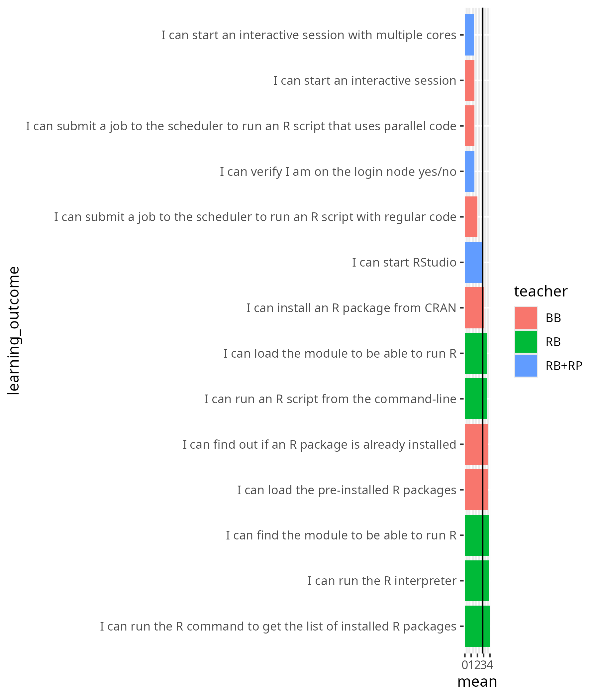
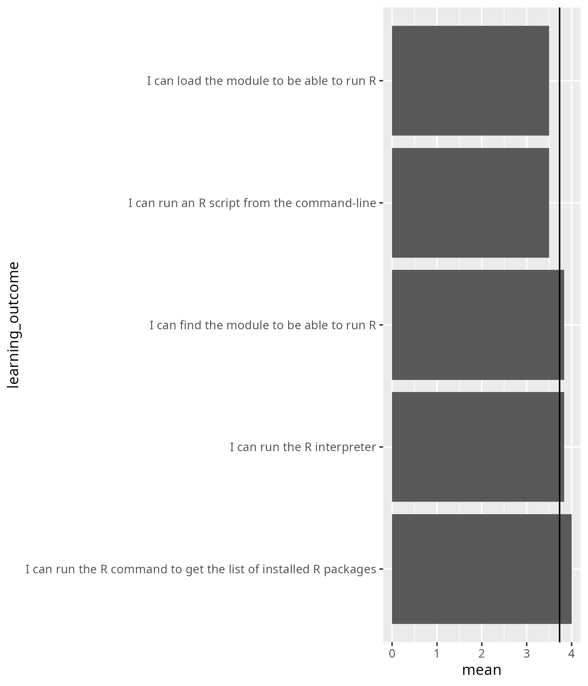

# Reflection

- Author: Richel
- Date: 2025-10-06
- Day: R

I was ill in the morning. I was ill already for a week and hence
was more absent from all team discussions.

## Teaching 9:00 First login

There were 5 visitors. Me and the team were able to help all of them.
I've helped 1 learner and it was a good experience: she was a complete
beginner and at the end of my, around 15 minutes, help, she
was super ready.

## Teaching 10:00 Load modules and run

There were 6 learners. Most time was spent with the 1 learner
that did not attend the login session.

When ill, my talking is slower. A good thing. However, due to the constant
pain, I do not enjoy my teaching sessions as usual.

I did meet all students properly. At 10:47 2 (out of 6) were done: I sent them
on an earlier break. 

## Teaching 14:00 RStudio

Me and a colleague split up the learners:
the colleague offered to help, as it was unsure
how well I was (as I was less response in chat,
due to -indeed- illness). I think it is nice
to get unexpected help and I think it is
a good idea that she had a 1-on-1 with 'her'
COSMOS users. So, we split up, after announcing
this in the main room.

I was very happy to see my learners again. We
were with 3, 1 that used Sigma, and 2 that used
Dardel. I started with the Sigma user,
as (1) she has no documentation, 
and (2) Dardel has Open OnDemand, which is easier.
I did so after discussing this with the whole group.

When the Sigma user was in the system (for the
first time), I told her to try a bit for herself,
so I could talk to the Dardel users. We agreed.

I disturbed the Dardel users. They were already done.
I told them that in 5 minutes I will give a bit
more in-depth demo about RStudio, after helping
the Sigma user (which I estimated to cost that
long). The Dardel users agreed.

The Sigma user was in quickly, so we started talking
as a class again. I did my demo on RStudio,
until it was time again to back to the main room.

I remember from earlier reflections that
I should not be too informal, and I think
I succeeded reasonably (but not perfectly)
well: it felt too nice to have them back :-)

## 15:00 Summary and Evaluation

I went through the summary. What was missing
was a list of other course.

- [x] Add link to SCoRe list of courses

The evaluation was clean: I told them why I
put them in breakout rooms. One out of six
learners came back to ask his questions, which
I discussed in a breakout room.

## Predictions

My sessions went very well:

- In the 'Load modules and run' session,
  I have seen all run the R interpreter
- In the RStudio session,
  I have seen all run RStudio

## Evaluation results

- [My success score](../../evaluations/20251006_r/succes_score_richel.txt): 75%

The only useful item is 'Do you have any additional comments?':

- I liked the online material about how to prepare and get everything set up,
  which has been my main issue so far.
  Unfortunately I could not initially run R via the terminal/ssh,
  so I couldn't do the practicals on batch,
  but I am sure I can figure it out myself.

Too bad. Nothing to be done about that I guess ...?

- no

Sure :-)

- no

Sure :-)

- awesome material and good that you record but could you record during
  the lectures all of you so we get the exact thing that is taught?
  i'm also not fond of having to have the camera on
  which i felt there was pressure to do
  so i watched most after the course instead

This is an interesting comment: on the one hand this person
mentions to not like the camera. On the other hand,
the learning outcomes for my early sessions for that person are
highest:

Learning outcome                                                              |Camera|Confidence
------------------------------------------------------------------------------|------|------------------------------------
I can find the module to be able to run R                                     |Yes   |I can absolutely do this!
I can load the module to be able to run R                                     |Yes   |I can absolutely do this!
I can run the R interpreter                                                   |Yes   |I can absolutely do this!
I can run the R command to get the list of installed R packages               |Yes   |I can absolutely do this!
I can run an R script from the command-line                                   |Yes   |I have good confidence I can do this
I can find out if an R package is already installed                           |No    |I have good confidence I can do this
I can load the pre-installed R packages                                       |No    |I have good confidence I can do this
I can install an R package from CRAN                                          |No    |I have good confidence I can do this
I can submit a job to the scheduler to run an R script with regular code      |No    |I have some confidence I can do this
I can submit a job to the scheduler to run an R script that uses parallel code|No    |I have some confidence I can do this
I can start an interactive session                                            |No    |I have low confidence I can do this

So in this case, higher learning outcomes were achieved in the sessions
with a camera, including by the person that did not like using a camera.

## The RStudio sessions

I've compared the simultaneous sessions of this course's
iteration with the previous course iteration where I was the only teacher:

learning_outcome                                       |teacher| average_confidence
-------------------------------------------------------|-------|-------------------
I can start an interactive session with multiple cores |RB+RP  |           1.4
I can verify I am on the login node yes/no             |RB+RP  |           1.5
I can start RStudio                                    |RB+RP  |           2.7
I can verify I am on the login node yes/no             |RB     |           3.1
I can start an interactive session with multiple cores |RB     |           3.1
I can start RStudio                                    |RB     |           3.4

It seems same enough. The biggest differences are from things that one does not
need when using Open OnDemand.

- [ ] Remove learning outcome 
  'I can start an interactive session with multiple cores'
- [ ] Remove learning outcome 
  'I can verify I am on the login node yes/no'

Taking a look at the confidences per question for RStudio:

Could it be that I scored 2x a 'I can absolutely do this!'
and Rebecca scored 2x a 'I can absolutely do this!'?

Starting time   |Confidence for 'I can start RStudio'
----------------|------------------------------------
10/6/2025 14:45 |I can absolutely do this!
10/6/2025 14:54 |I have no confidence I can do this
10/6/2025 14:53 |I can absolutely do this!
10/6/2025 14:53 |I can absolutely do this!
10/6/2025 14:53 |I can absolutely do this!
10/17/2025 13:09|I have no confidence I can do this

The last person may not have followed this session at all? It would make
sense: I've had 2 and Rebecca had -according to my notes- 2.
I think it is likely enough that the 4x 'I can absolutely do this!'
comes from the 4x people attending our session. If my notes are
incorrect (they do seem incomplete) I can imagine that the
COSMOS SENS person had problems here. I conclude that me and Rebecca
did a perfect job!

This brings us to another problem: the learner that was absent
filled in a 'I have no confidence I can do this'
over skipping the question. As far as I remember, it was impossible
to skip questions.

- [ ] Suggest to make confidences optional (i.e. one can get away
  to not fill in a confidence) to remove this skew

