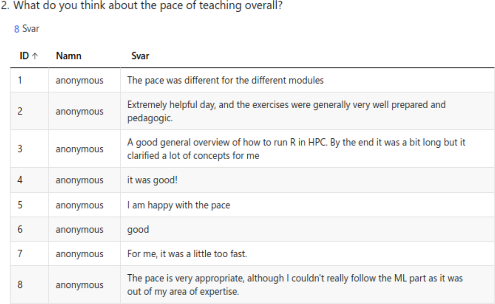
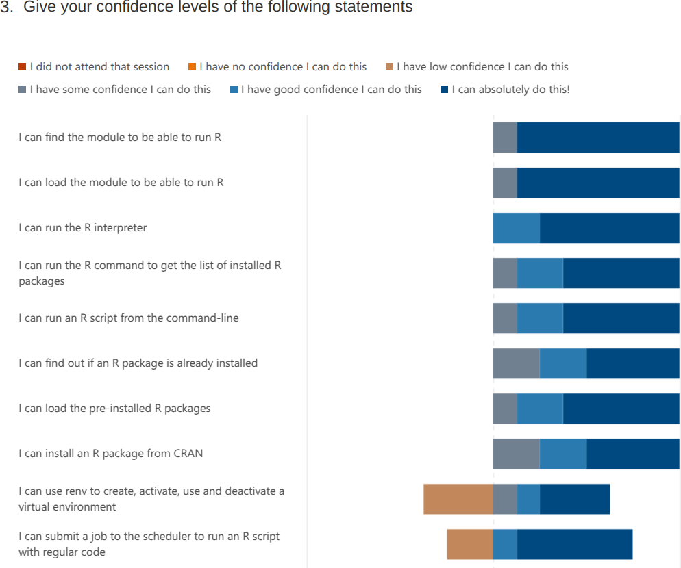
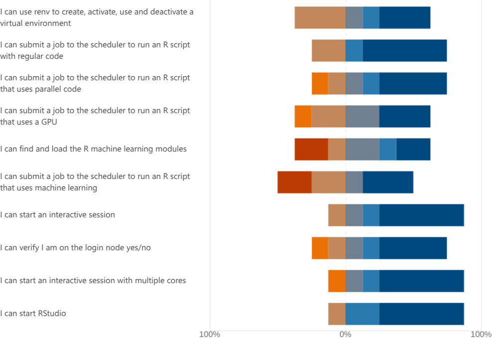

# Evaluation

- Date: 2025-03-24
- language: R

Column text|Description
-----------|----------------------------
`NA`       |I did not attend that session
`0`        |I have no confidence I can do this
`1`        |I have low confidence I can do this
`2`        |I have some confidence I can do this
`3`        |I have good confidence I can do this
`4`        |I can absolutely do this!

