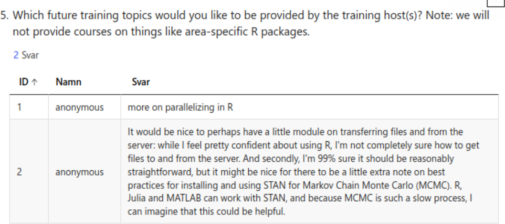

# Evaluation

- Date: 2025-03-24
- language: R
- Registrations: 33
- Participants: 12 (36% of registrations shows up)
- Number of evaluations filled in: 8 (67% response rate)
- Average course satisfaction: 8.25/10.0
- Success score: 77%

## Question 1

- 8.25

## Question 2

- The pace was different for the different for the different modules
- Extremely helpful day, and the exercises were generally
  very well prepared and pedagogic
- A good general overview of how to run R in HPC.
  By the end it was a bit long but it clarified a lot
  of concepts for me
- It was good!
- I am happy with the pace
- Good
- For me, it was a little too fast
- The pace is very appropriate, although I couldn't really
  follow the ML part as it was out of my area of expertise

## Question 3

Column text|Description
-----------|----------------------------
`NA`       |I did not attend that session
`0`        |I have no confidence I can do this
`1`        |I have low confidence I can do this
`2`        |I have some confidence I can do this
`3`        |I have good confidence I can do this
`4`        |I can absolutely do this!

## Question 4

Answer  |Amount
--------|--------
Yes     |8
No      |0
Not sure|0

## Question 5

- More on parallelizing in R
- It would be nice to perhaps have a little module on transferring
  files to and from the server: while I feel pretty confident about
  using R, I'm not completelt sure how to get files to and from
  he server. And secondly, I'm 99% sure it should be reasonably
  straightforward, but it might be nice for there to be a little
  extra note on best practices for installing and using STAN
  for Markov Chain Monte Carlo (MCMC). R, Julia and MATLAB can work
  with STAN, and because MCMC is such a slow process, I can
  imagine that this could be helpful.

## Question 6

- For some portions of this course it was a bit unclear when/what to do
  hands-on. The course documentation is very good
  and will help me the most in the future.
- I really liked the materials and the web page.
  It was extremely helpful, and I have bookmarked the course page
  because it is easier to use than all the official documentation.
  The exercises were well-prepared, although the parallel processing
  section was less good on both the web page,
  and the exercise code needed a bit of editing to get it to work.
  The organization was great - however the initial email maybe didn’t make
  it quite clear enough that setting up a login account could take many days.
  I happened to already have one, but sitting the day before to try to set up,
  I could easily have missed that.
  I really appreciate the amount of hands-on demonstrations:
  they were great. Only a very, very small comment is that it was not always
  clear which .sh file was appropriate for the relevant exercises,
  for instance serial and parallel at the start.
  The exercises might be named with the same names,
  which would make it easier to find them.
  But this is such a small complaint.
  The whole material for the day was excellent,
  and I’m feeling extremely confident about moving forward with getting started.
- I had some issues with my account not being set up correctly,
  which set me behind for the whole course and meant there were some things
  I couldn’t test myself as they were being explained.
  This was not the fault of the course facilitators,
  but did make the course less useful for me.
- I liked the exercises best,
  makes it easy to understand how you can directly apply.
  I would have appreciated more time for them though.
  The length of the course is good,
  the machine learning part was difficult for me to follow.
