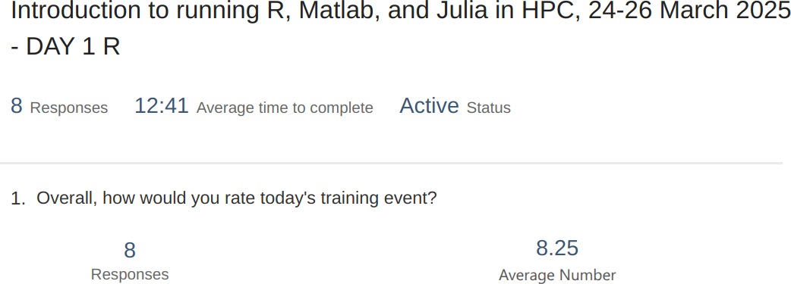
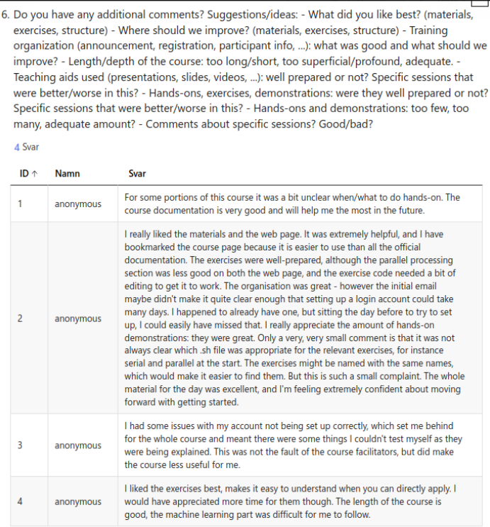

# Evaluation

- Date: 2025-03-24
- language: R

Column text|Description
-----------|----------------------------
`NA`       | I did not attend that session
`0`        |I have no confidence I can do this
`1`        |I have low confidence I can do this
`2`        | I have some confidence I can do this
`3`        |I have good confidence I can do this
`4`        | I can absolutely do this!

- Success score: sum / `max_score`
- `max_score` = `n_learners` * 4 = 32

Learning outcome                                                                 |0  |1  |2  |3  |4  |NA |Sum|SS
---------------------------------------------------------------------------------|---|---|---|---|---|---|---|---
I can find the module to be able to run R                                        |0  |0  |1  |0  |7  |.  |30 |75
I can load the module to be able to run R                                        |.  |0  |1  |.  |7  |.  |30 |75
I can run the R interpreter                                                      |.  |0  |.  |2  |6  |.  |30 |75
I can run the R command to get the list of installed R packages                  |.  |0  |1  |2  |5  |.  |28 |70
I can run an R script from the command-line                                      |.  |0  |1  |2  |5  |.  |28 |70
I can find out if an R package is already installed                              |.  |0  |2  |2  |4  |.  |26 |65
I can load the pre-installed R packages                                          |.  |0  |1  |2  |5  |.  |28 |70
I can install an R package from CRAN                                             |.  |0  |2  |2  |4  |.  |26 |65
I can use renv to create, activate, use and deactivate a virtual environment     |.  |3  |1  |1  |3  |.  |20 |50
I can submit a job to the scheduler to run an R script with regular code         |.  |2  |0  |1  |5  |.  |25 |63
I can submit a job to the scheduler to run an R script that uses parallel code   |1  |1  |1  |1  |4  |.  |22 |55
I can submit a job to the scheduler to run an R script that uses a GPU           |1  |2  |2  |0  |3  |.  |18 |45
I can find and load the R machine learning modules                               |.  |2  |1  |0  |3  |2  |16 |40
I can submit a job to the scheduler to run an R script that uses machine learning|.  |2  |1  |0  |2  |2  |12 |30
I can start an interactive session                                               |.  |1  |1  |1  |5  |.  |26 |65
I can verify I am on the login node yes/no                                       |1  |1  |1  |1  |5  |.  |26 |65
I can start an interactive session with multiple cores                           |1  |0  |1  |1  |5  |.  |25 |63
I can start RStudio                                                              |.  |1  |0  |2  |5  |.  |27 |68
