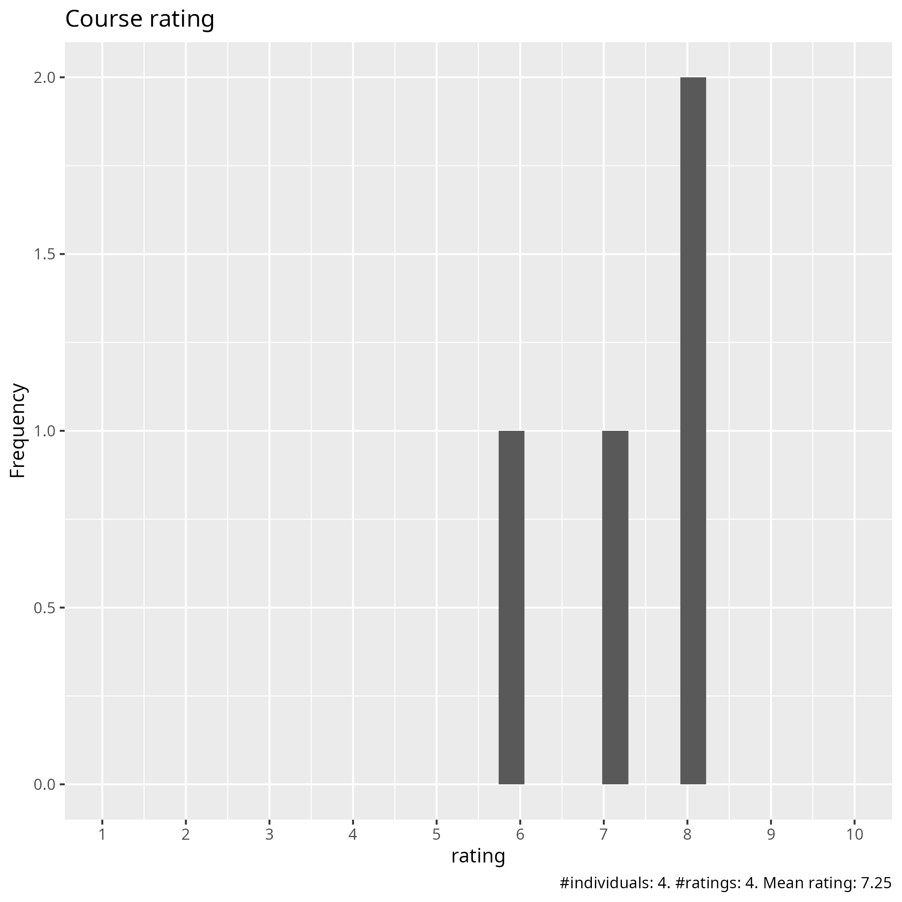
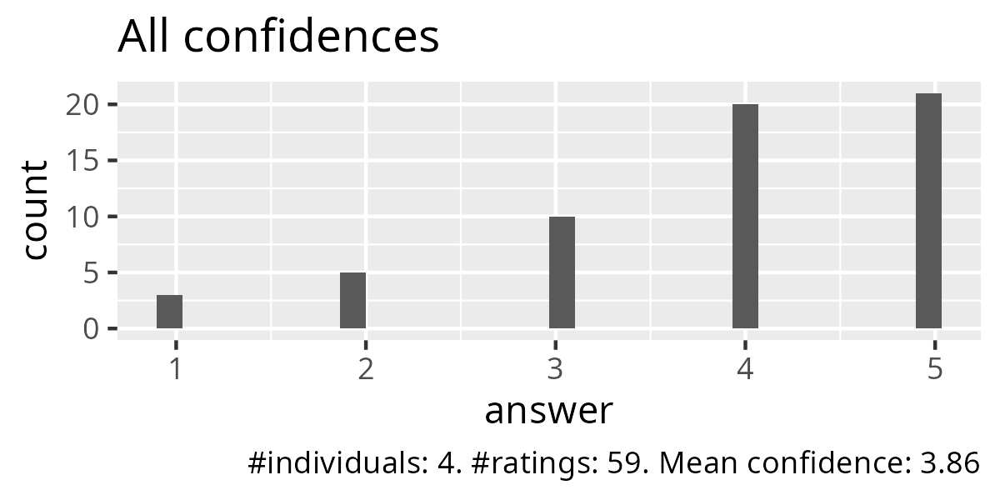
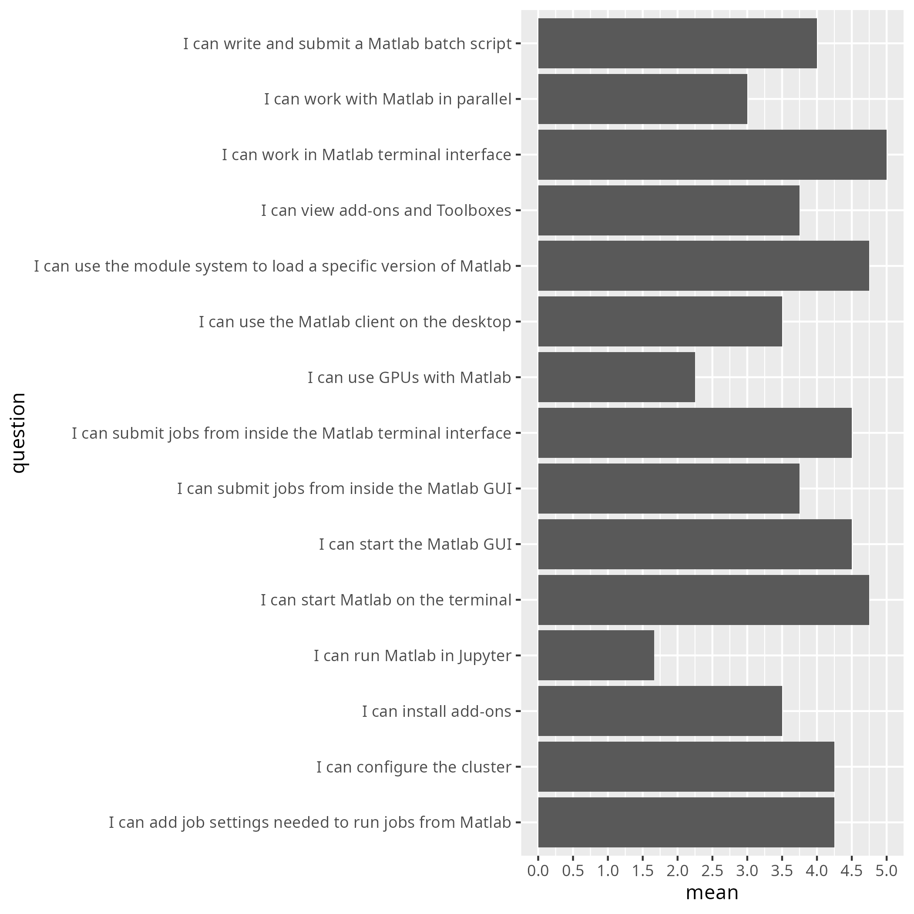
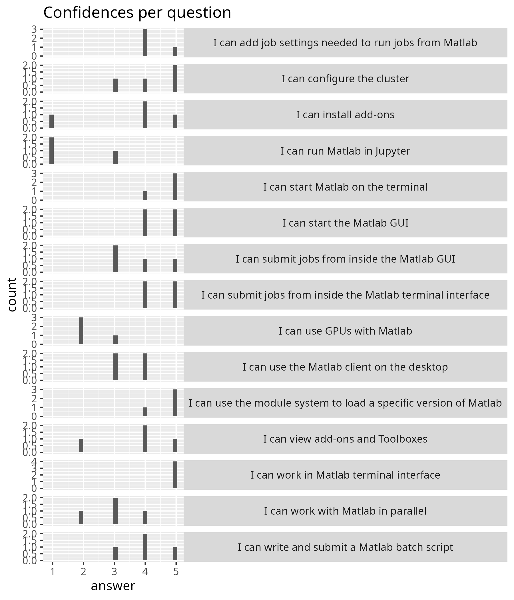

# Evaluation

- Date: 2025-03-25
- language: MATLAB
- Registrations: ?
- Participants: 4
- Number of evaluations filled in: 3 (75% response rate)
- Average course satisfaction: 7.25/10.0
- [success_score.txt](success_score.txt): 77%
- Analysis script: [analyse.R](analyse.R)
- Average confidence per question as a table: [average_confidences.csv](average_confidences.csv)

## [comments.txt](comments.txt)

- The course material is excellent. However, it is not necessary that someone reads it in real time in a zoom meeting, and the level of interaction in the zoom meeting has been low. I could just as well have gone through the course material in my own pace at a time that suited me and learned almost as much (my background is that I know some Linux, Matlab, and cluster batch job submission from before).

## [future_topics.txt](future_topics.txt)

- using matlab with thirdparty tools
