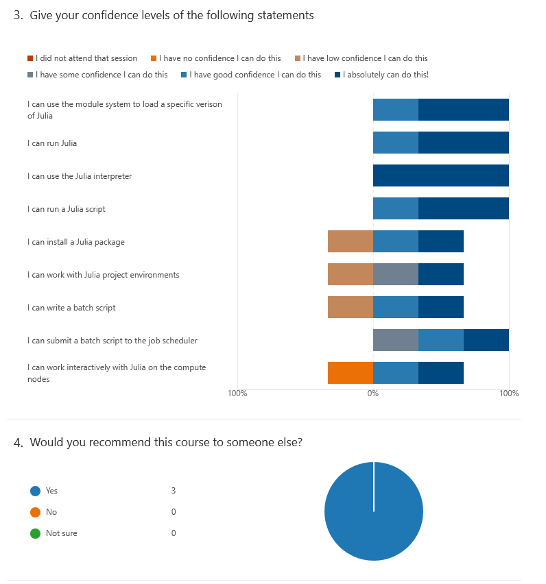

# Evaluation

- Date: 2025-03-26
- language: Julia
- Registrations: ?
- Participants: 4
- Number of evaluations filled in: 3 (75% response rate)
- Average course satisfaction: 8.3/10.0

## Question 2: What do you think about the pace of teaching overall?

- teaching was excellent
- It was good. However, some parts were redundant if you hade attended another day.
- ok

## Question 5: Which future training topics would you like to be provided by the training host(s)?

- machine learning/deep learning/ai-releated training
- A more detailed overview of how to setup everything to work with the gpus. 
