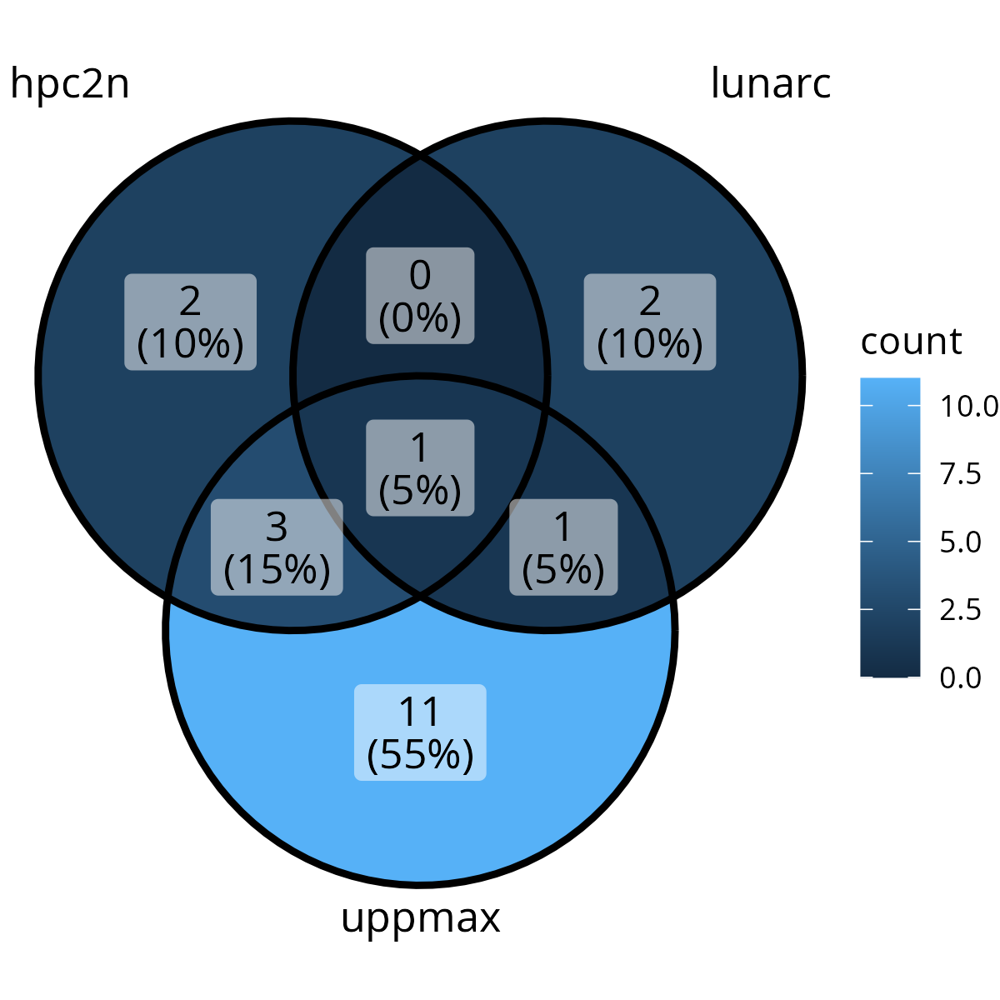
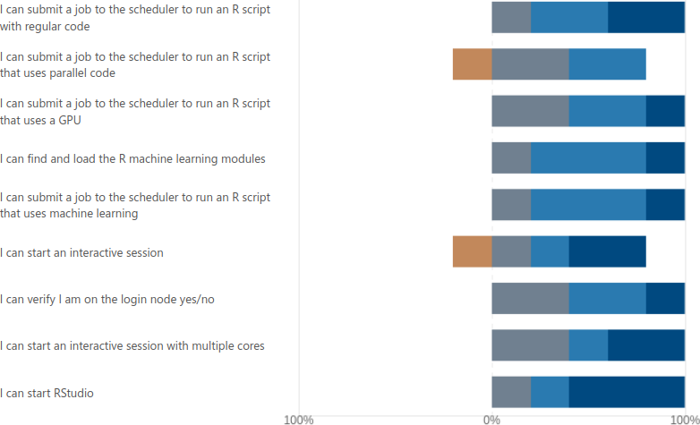

# Reflection

 * Teaching day: 2024-10-24
 * Topic: R
 * Written on 2024-10-24

## Schedule

This is the schedule of that day:

 Time  | Topic                  | Teacher(s)
-------|------------------------|------------------
 9:00  | (optional) First login | BB + PO + RB
 9:45  | Break                  | .
 10:00 | Introduction           | RB
 10:10 | Syllabus               | RB
 10:20 | Load modules and run   | RB
 10:45 | Break                  | .
 11:00 | Packages               | BB
 11:30 | Isolated environments  | BB
 12:00 | Lunch                  | .
 13:00 | Batch                  | BB
 13:30 | Parallel               | PO
 14:15 | Break                  | .
 14:30 | Simultaneous session   | PO \* RB \* RP
 15:15 | Break                  | .
 15:30 | Machine learning       | BB or PO
 16:00 | Summary and evaluation | RB
 16:15 | Done                   | .

## Login session

4 learners showed up for this optional session:

- 3x could already login
- 1x a LUNARC user that needed help, I put him in a Zoom room with the LUNARC
  teacher

## Session: 10:00-10:45: intro and syllabus and load and run R

There were 5 learners. I did the regular teaching cycles, with a Prior
at the start. There were 3 that -per my request- turned on their camera,
with 2 left after the announcement that the session will be recorded.
At 10:21 I started the exercise and at 10:40 I discussed it.
At 10:40, upon asking for a yes/no reaction, 5 out of 5 learners signalled
they had been able to do the exercise. I rounded of the session
by going over the key points again.

As already was in the lesson plan, I don't like this session.
I do think many people think this stock-standard way of teaching
is fine, but I'd enjoy better to have the learners learn from
each center's documentation, as this will be more helpful.
Instead, now, the session is more a copy-paste exercise, except
for the Prior and Repeat. I can imagine learners like it (we know
learners like passive teaching), but they could actually have learned
more.

- [ ] In the next course iteration: use more active learning methods in this
  session

## Session 14:30-15:15: interactive and RStudio

It was delayed 15 minutes, which was no problem.
Prior took 15 minutes, in which I recapped earlier sessions too.
I gave the learners 15 minutes for the exercise.
All 4 learners were able to complete the procedure.

During the 15 minutes, there was 1 learner that shared her
screen with a question beyond the content of this session.
1 learner needed to install a local ThinLinc client and this
did not work. That learner did see how it looked like
and stated she is confident she could do it via the website.

As the learning objectives were achieved, I ended the session earlier
(there were no more questions).
I do think the session's length is correct, in the case there would
be some slower learners.

I told the 4 learners when the next session would start,
which was 15 minutes later on the schedule, as
I expected other sessions to do take the scheduled amount of time.
However, it turned out that the next session would like to start
earlier. I took the blame and hoped for the best.
What I did not know is that it would be only the UPPMAX learners left,
so we could have easily started 15 minutes earlier.

## Session 16:00-16:15: summary and evaluation

I've not shown the summary, although it follows the
evaluation questions, as I feel it increases the evaluation
results, as the confidences will be higher, due to the refresher.
The full procedure took 3 minutes. It took 5 minutes
for the 5 learners to fill in the evaluation forms.
All learners said bye, except for 1.
That 1 learner had a question, which was answered.

I discussed this story with a colleague afterwards.
He will try out a combination of showing
summary yes/no, answers in summary yes/no
and report to me.

## Analysis

[20241024_counts.csv](20241024_counts.csv)



> Centers of R learners


> Languages of R learners


> Number of learners per language


> Learners in time

## Evaluation results

5 responses

```
1. Overall, how would you rate today's training event?
- 7.4. Average Number
```

Useless info to me.

```
2. Today's content and feedback to the lecturers (e.g. materials, exercises, structure): – What did you like best?

- "I liked being able to run through the examples myself. "
- "Pedro's sessions"
```

Useless to me, nice for Pedro!

```
3. Today's content and feedback to the lecturers (e.g. materials, exercises, structure): – Where should we improve?
- "I think sometimes there could have been slightly less kinds of examples, and one main example per module with extra focus and more time to complete. "
```

I think I focussed well on one example and did have enough time for exercises.


```
4. Training event organisation (e.g. announcement, registration, ...): – What did you like best? – Where should we improve?
- "I liked the general organization, felt like any questions one might have where answered in the introductory email."
```

Nice for Birgitte!


```
5. Length of teaching today was
Adequate	4	
Too short	0	
Too long	1	
```

Useless to me: which sessions?

```
6. Depth of content was
Adequate	4	
Too superficial	1	
Too profound	0	
```

Useless to me: which sessions?

```
7. The pace of teaching was
Adequate	3	
Too slow	0	
Too fast	2	
```

Useless to me: which sessions?

```
8. Teaching aids used (e.g. slides) were well prepared
Agree completely	2	
Agree	3	
No strong feelings	0	
Disagree	0	
Disagree completely	0	
```

Useless to me: which sessions?

```
9. Hands-on exercises and demonstrations were
Adequate	3	
Too few	2	
Too many	0	
```

Useless to me: which sessions?

```
10. Hands-on exercises and demonstrations were well prepared
Agree completely	2	
Agree	3	
No strong feelings	0	
Disagree	0	
Disagree completely	0	
```

Useless to me: which sessions?

```
11. How would you rate the separate sessions?
```


Only my sessions:

- Introduction: 2x very good, 2x excellent
- Load and run: 4x excellent
- Interactive work on the compute node: 1x very good, 4x excellent
- Using RStudio: 2x very good, 2x excellent

So, although I dislike my 'Load and run' session, it has been
appreciated by the learners.

```
12. Give your confidence levels of the following statements
```




My learning objectives:

- I can find the module to be able to run R: 1x some, 1x good, 3x absolutely
- I can load the module to be able to run R: 1 some, 1 good, 3 absolutely
- I can run the R interpreter: 1 some, 1 good, 3 absolutely
- I can run the R command to get the list of installed R packages: 1 some, 1 good, 3 absolutely
- I can run an R script from the command-line: 1 some, 2 good, 2 absolutely
- I can find out if an R package is already installed: 1 some, 1 good, 3 absolutely
- I can start an interactive session: 1 low, 1 some, 1 good, 2 absolutely
- I can verify I am on the login node yes/no: 2 some, 2 good, 1 absolutely
- I can start an interactive session with multiple cores: 2 some, 1 good, 2 absolutely
- I can start RStudio: 1 some, 1 good, 3 absolutely

It seems my simultaneous session was weakest: they did feel confident to
start RStudio, but starting an interactive node and verify on which node(s)
was indeed done a bit too informal in hindsight. It is weird that a learner
has a low confidence in starting any interactive session, but some confidence
when it is multiple cores...?

To do next time:

- [ ] In the simultaneous session, stay formal

```
13.Did today's course meet your expectation?
Yes	3	
No	0	
Not sure	2	
```

Useless info.

```
14. Which future training topics would you like to be provided by the training host(s)?
- 2 responses
```

No idea what those are

```
15. Do you have any additional comments?
- 1 response
```

No idea what those are
