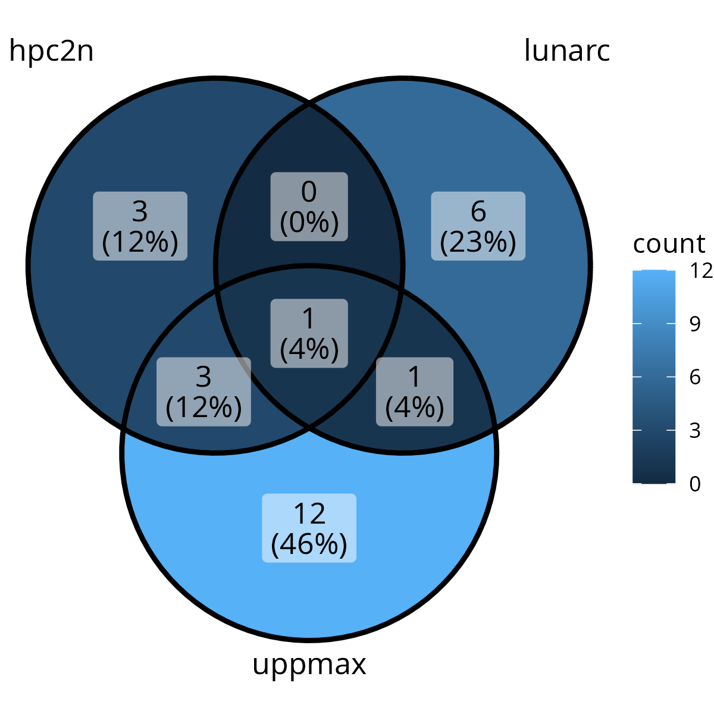
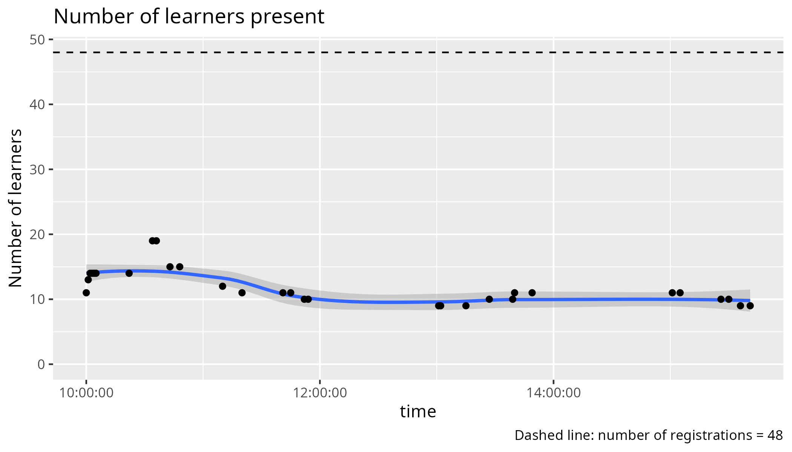

# Reflection

* Teaching day: -
* Topic: entire course
* Written on 2024-10-25



> Registrations over the centers


> Registrations per language


> Number of registrations per language



> Learners in time for the Python day


> Learners in time for the R day

## Email

Below is the email sent to participants, with some info removed.
I think it is too long

TODO:

* [ ] Make shorter, suggest at meeting
* [ ] Decide upon first hour with the team, put the optional hour -if needed- in there.

```
> Hello!
>
> This email contains information for the UPPMAX/HPC2N/LUNARC four days online course “Introduction to running R, Python, Julia, and Matlab in HPC”, which will be given Tuesday-Friday, 22-25 October, 2024, 9:00-16:00 each day.
>
> NOTE that the course starts at 9:00 not 9:15!
>
> We will use Zoom for this online course. See below (#11) for links.
>
> NOTE please go through everything, as there is important information about pre-requirements, how to login, etc. Also be aware that you may need to set up MFA for UPPMAX, and Pocket Pass for LUNARC, which can take a day to get setup, so do this immediately.
>
> NOTE onboarding for those that need help with login, Monday 21 October 13-14. Zoom (only for onboarding): https://umu.zoom.us/j/62612416748?pwd=FX3dgIDLfyAkYa9drDQiLO6bTxNfAy.1
>
> 1) Schedule:
>
>     Python (Tuesday): https://uppmax.github.io/R-matlab-julia-HPC/python/intro.html#schedule
>     Julia (Wednesday): https://uppmax.github.io/R-matlab-julia-HPC/julia/introJulia.html#preliminary-schedule
>     R (Thursday): https://uppmax.github.io/R-matlab-julia-HPC/r/introR.html#schedule
>     Matlab (Friday): https://uppmax.github.io/R-matlab-julia-HPC/matlab/introMatlab.html#preliminary-schedule
>
> 2) Materials: https://github.com/UPPMAX/R-matlab-julia-HPC

I don't think learners care about the raw course material.
I suggest to remove point 2.

> 3) Rendered presentations for the course: https://uppmax.github.io/R-matlab-julia-HPC/
>
> 4) Important information about the course is gathered here: https://umeauniversity.sharepoint.com/:w:/s/HPC2N630/EQNh3Uht3ExCnyqVUm1t_bEB1e7FOp_pqxtFix3x2UPXtQ

Suggest to use the course website instead and remove point 4.

> 5) Questions and answers page for the course: https://umeauniversity.sharepoint.com/:w:/s/HPC2N630/Ebo1tbwHnz5GhBq7p04ex6sB9or9WlqWHHWIlcUTW230mA

Suggest to use the course website instead and remove point 5.

> 6) Please make sure you have an account at SUPR (https://supr.naiss.se/) and at UPPMAX (or HPC2N if you are affiliated with UMU, SLU, IRF, LTU, or MIUN, or LUNARC if you are affiliated with LU). The site account for UPPMAX/HPC2N/LUNARC can be applied for through SUPR after you have your SUPR account and have been added to the course project. The account at SUPR and the accounts at HPC2N/UPPMAX/LUNARC are all SEPARATE. You should have already been contacted about getting such accounts if you did not already have them.
>
> 7) Please make sure you have installed either ThinLinc or an SSH client. ThinLinc is strongly RECOMMENDED for this course and can be installed from https://www.cendio.com/thinlinc/download
>
>     Login info
>         UPPMAX – Rackham (the course project is at UPPMAX)
>             SSH: rackham.uppmax.uu.se
>             ThinLinc: rackham-gui.uppmax.uu.se
>             From web browser: https://rackham-gui.uppmax.uu.se/
>         HPC2N - Kebnekaise
>             SSH: kebnekaise.hpc2n.umu.se
>             ThinLinc: kebnekaise-tl.hpc2n.umu.se
>             From web browser: https://kebnekaise-tl.hpc2n.umu.se:300/
>        LUNARC – Cosmos
>             SSH: cosmos.lunarc.lu.se
>             ThinLinc: cosmos-dt.lunarc.lu.se

Suggest to use the course website instead and remove point 7.
Only recommenend to be able to log in in at least 1 way.


> Note that if you are using ThinLinc, you will connect to a graphical interface and do not need a separate X11 server to enable opening graphics and GUIs.

Suggest to use the course website instead and remove this point.

> Note that if you are using Windows and do not already have an SSH client you use, we strongly recommend using ThinLinc.

Suggest to use the course website instead and remove this point.

> 8) Pre-requirements: This page contains some info on getting ready to login (including the above info), but also a short summary/list of links for things like Linux, editors, and coding: https://uppmax.github.io/R-matlab-julia-HPC/prereqs.html

> 9) Onboarding: If you need help with logging in, ThinLinc, etc. then we have an optional onboarding session Monday, 21 October 2024, 13:00-14:00. Zoom for onboarding: https://umu.zoom.us/j/62612416748?pwd=FX3dgIDLfyAkYa9drDQiLO6bTxNfAy.1

> 10) Course project and policy: As part of the hands-on, you will be given temporary access to a course project, which will be used for running the hands-on examples. There are some policies regarding this, that we ask that you follow:
>
>     You may be given access to the project before the course; please do not use the allocation for running your own codes. Usage of the project before the course means the priority of jobs submitted to it goes down, diminishing the opportunity for you and your fellow participants to run the examples during the course.
>     The course project will be open 1-2 weeks after the course, giving the participants the opportunity to test run examples and shorter codes related to the course. During this time, we ask that you only use it for running course related jobs. Use your own discretion, but it could be: (modified) examples from the hands-on, short personal codes that have been modified to test things learned at the course, etc.
>     Anyone found to be misusing the course project, using up large amounts of the allocation for their own production runs, will be removed from the course project.
>     When the course is no longer active, all files in the attached storage directory will be deleted. Please copy out anything you want to save before that.
>         Project ID, UPPMAX: [project_id]
>         Project ID, HPC2N: [project_id]
>         Project ID, LUNARC: [project_id]
>         Directory name on rackham: /proj/r-py-jl-m-rackham
>             Please create a suitably named subdirectory below /proj/r-py-jl-m-rackham, for your own exercises.
>         Directory name on Kebnekaise: /proj/nobackup/r-py-jl-m
>             Please create a suitably named subdirectory below /proj/nobackup/[project_id], for your own exercises.
>         Cosmos: Since the Cosmos home directories are quite a lot larger than on Rackham or Kebnekaise, you will be using your home directory there for the exercises. Please create a suitably named subdirectory there.

Suggest to use the course website instead. The course website should show how to make sure you have gotten SUPR access

> 11) Zoom info for the course:
>
> a) There will be a zoom for the lectures. It is the same zoom link for each day.
>
> b) When you join the Zoom meeting, use your REAL NAME.
>
> c) Please MUTE your microphone when you are not speaking and use the “Raise hand” functionality under the “Participants” window during the lecture. Please do not clutter the Zoom chat. Behave politely!

Suggest to remove this point. Teachers can talk too.
>
> d) If you have questions during the lectures, you can write them on this page: https://umeauniversity.sharepoint.com/:w:/s/HPC2N630/Ebo1tbwHnz5GhBq7p04ex6sB9or9WlqWHHWIlcUTW230mA

Suggest to remove this point. Teachers can state how they want to have questions asked. Some want to be interrupted.

> e) There may be breakout rooms used in the Zoom for the hands-ons and for discussions. Most likely there will be a “silent” room for those who just wish to work on their own, a discussion room (or rooms) for cooperation, and the rest will be in the main room. If you are in the silent room and need help, go to the main room and contact a helper. There will be breakout rooms that can be used if you want individual help.

Suggest to remove this point, as I see no need to write down our Zoom room policies here.

> f) The lectures and demos will be recorded, but not the hands-ons sessions. If you ask questions during the lectures, you may thus be recorded. If you do not wish to be recorded, then please keep your microphone muted and your camera off and write your questions in the Q/A document.

> ZOOM (same each day):
>
>
>    Zoom: [URL]
>    Meeting ID: [ID]
>    Passcode: [passcode]
>
>See you Tuesday!
```
