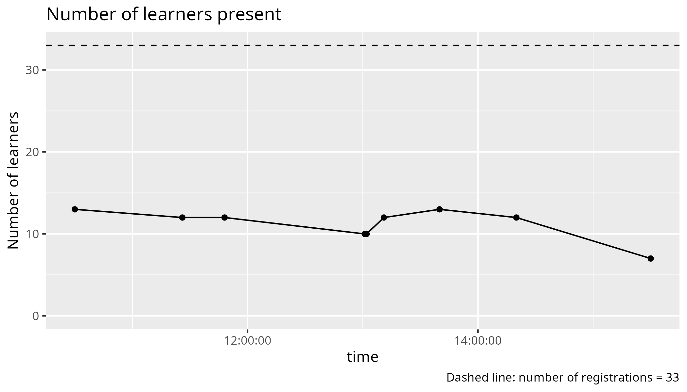
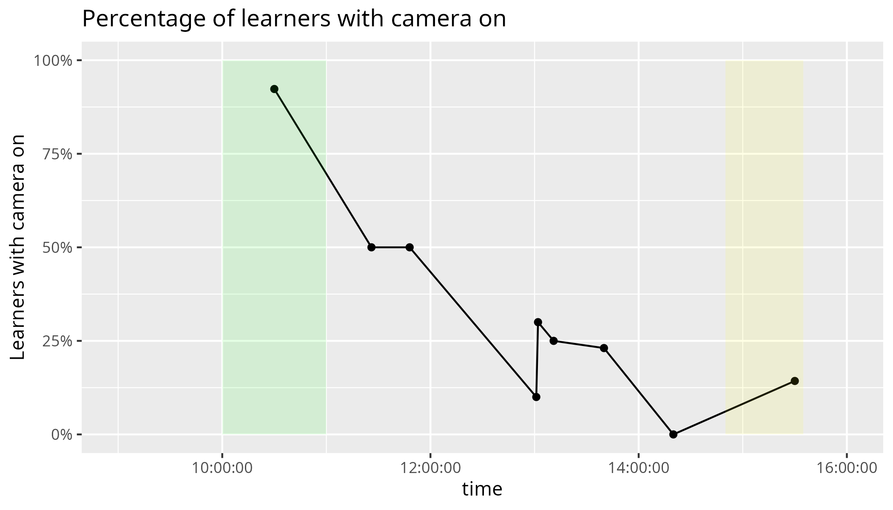
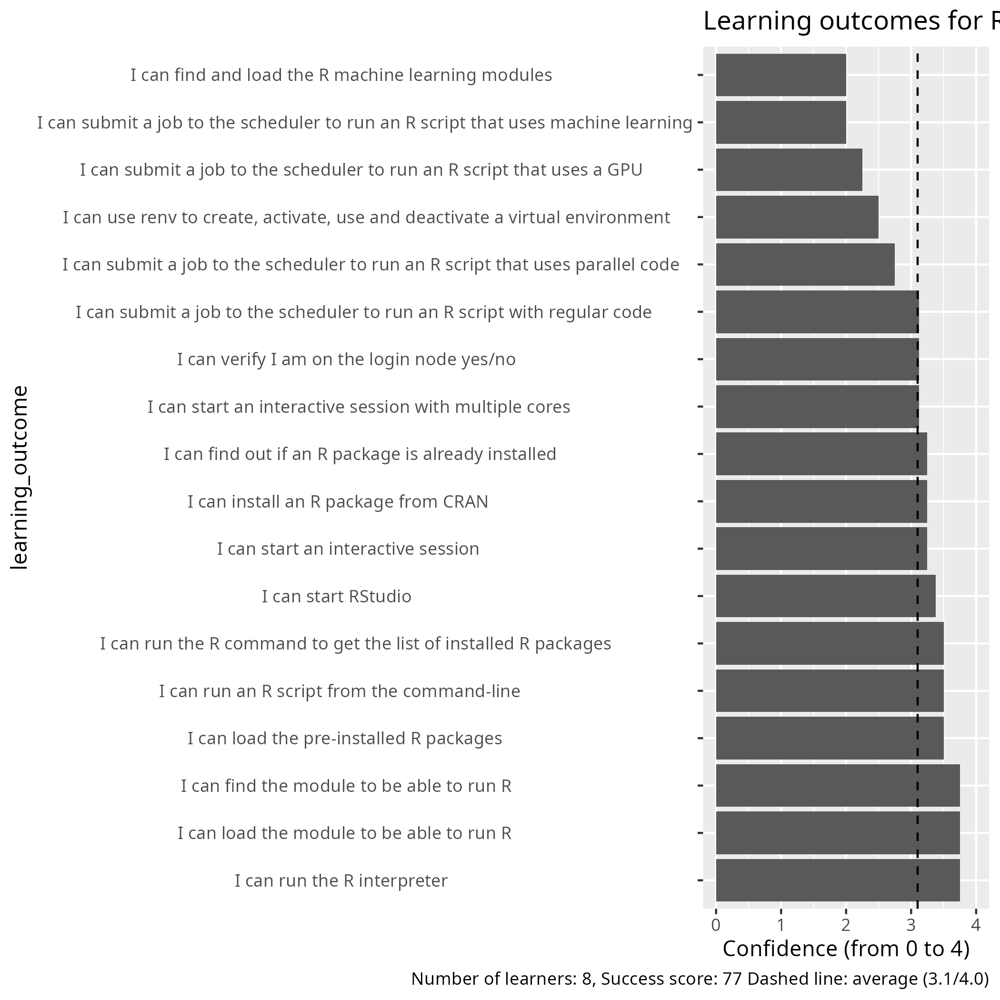
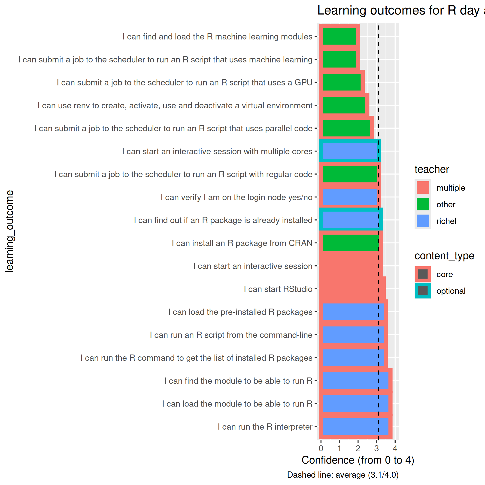

# Reflection

- Author: Richel
- Date: 2025-03-24
- Language: R
- [Lesson plans](../../lesson_plans/20250324_richel/README.md)
- [Evaluation](../../evaluations/20250324_r/README.md)
- Registrations: 33
- Participants: 12 (36% of registrations shows up)

With the 1 hour optional login session, we
give 1 hour of teaching to the unprepared,
while sacrificing 1 hour of teaching for the
prepared. I think we should reward the prepared,
by not having this drop-in.

However, at the drop-in, 9 showed up, of which 5
were put in a breakout room with me. There, I
discovered how useful it is. There were 2 out
of 5 that could not have logged in without this
session. Also, it is a great first impression
of our students.

```bash
+-------+------------------------------+--------------+
| Time  | Topic                        | Teacher(s)   |
+=======+==============================+==============+
| 9:00  | (optional) First login       | BB + PO + RB |
+-------+------------------------------+--------------+
| 9:45  | Break                        | .            |
+-------+------------------------------+--------------+
| 10:00 | Introduction                 | RB           |
+-------+------------------------------+--------------+
| 10:10 | Syllabus                     | RB           |
+-------+------------------------------+--------------+
| 10:20 | Load modules and run         | RB           |
+-------+------------------------------+--------------+
| 10:45 | Break                        | .            |
+-------+------------------------------+--------------+
| 11:00 | Packages                     | BB           |
+-------+------------------------------+--------------+
| 11:30 | Isolated environments        | BB           |
+-------+------------------------------+--------------+
| 12:00 | Lunch                        | .            |
+-------+------------------------------+--------------+
| 13:00 | Batch                        | BB           |
+-------+------------------------------+--------------+
| 13:30 | Parallel                     | PO           |
+-------+------------------------------+--------------+
| 14:15 | Break                        | .            |
+-------+------------------------------+--------------+
| 14:30 | Simultaneous session         | .            |
+-------+------------------------------+--------------+
| .     | HPC2N: ThinLinc, RStudio     | PO           |
+-------+------------------------------+--------------+
| .     | LUNARC: On-Demand, RStudio   | RP           |
+-------+------------------------------+--------------+
| .     | UPPMAX: Interactive, RStudio | RB           |
+-------+------------------------------+--------------+
| 15:15 | Break                        | .            |
+-------+------------------------------+--------------+
| 15:30 | Machine learning             |  PO          |
+-------+------------------------------+--------------+
| 16:00 | Summary and evaluation       | RB           |
+-------+------------------------------+--------------+
| 16:15 | Done                         | .            |
+-------+------------------------------+--------------+
```



I overestimated the number or learners leaving:
from [my data](https://richelbilderbeek.github.io/teaching/data/counts/)
is estimated 25% of all learners to leave. Instead, before and after the
break there were around 12 learners.



Recording has a clear effect on the number of learners with camera on/off.

Online instruction in higher education: Promising, research-based, and evidence-based practices

From:

> Boettcher, Judith V., and Rita-Marie Conrad. The Online Teaching Survival Guide : Simple and Practical Pedagogical Tips, John Wiley & Sons,

Table 3.1:

- Be present at the course site
- Create a supportive online course community
- Develop a set of explicit expectations for your learners
  and yourself as to how you will communicate
  and how much time students should be working on the course each week
- Use a variety of large group, small group, and individual work experiences
- Use synchronous and asynchronous activities
- Ask for informal feedback early in the term
- Prepare discussion posts that invite responses,
  questions, discussions, and reflections
- Think digital and mobile for all course content
- Combine core concept learning with customized and personalized learning
- Plan a good closing and wrap activity for the course
- Assess as you go by gathering evidences of learning
- Rigorously connect content to core concepts and learning outcomes
- Develop and use a content frame for your course
- Design experiences to help learners make progress on their novice-to-expert journey.


From:

> Nilson, Linda B., and Ludwika A. Goodson. Online teaching at its best: Merging instructional design with teaching and learning research. John Wiley & Sons, 2021.

I quote:

- Students learn new material better and can remember it longer when they learn
  it by engaging in an activity than when they passively watch or listen
  to an instructor talk [8 references]
- [...] long lectures and presentations will fail because students stop
  viewing and listening after about six minutes.
  This phenomenon parallels McKeachie's earlier classroom findings about
  inattention after five to ten minutes [reference].
  In online classes, such student inattention becomes explicitly visible
  through electronic monitoring of activities and questions
  from students about what has already been covered in a long presentation.

Reasons why learners do not turn on their camera, is

> Tobi, Bernadette, et al. "A case study on students’ reasons for not switching on their cameras during online class sessions." Learning 6.41 (2021): 216-224

with results (number of learners = 50):

Reason                                              |Percentage
----------------------------------------------------|----------
Fear of insufficient internet data                  |54%
Poor internet connection                            |50%
Physical condition of students’ background/location |46%
Physical appearance on camera (not looking good)    |46%
Uncomfortable to be looked at all the time          |42%

Or, from

> Alim, Syahrul, Sirirat Petsangsri, and John Morris. "Does an activated video camera and class involvement affect academic achievement? An investigation of distance learning students." Education and Information Technologies 28.5 (2023): 5875-5892.

the following reasons for not turning on the camera:

Reason                                        |Percentage
----------------------------------------------|--------------------
Unready to learn                              |44%
Unstable internet connection and limited quota|37%
psychological reasons                         |11%
devices overheating                           |4%
following others                              |4%

'Unready to learn' means, I quote:
'the environment did not support camera activation, they had not taken a bath,
were sick, wanted to sleep, were still doing something else,
were fatigued or needed to go to the toilet.'.

The course is an introduction course. I feel the start-up parts
are given too little time, for the things that I do not consider
being beginner topics. I feel beginner things need their time,
over sacrificing it for more sexy topics.

Remove, in order of my preference:

- Machine learning
- Parallel
- Isolated

I will suggest this in a meeting:

- [x] Suggest to remove 'Machine learning'
- [x] Suggest to remove 'Parallel'
- [x] Suggest to remove 'Isolated environments'

My favorite schedule

```bash
+-------+------------------------------+--------------+
| Time  | Topic                        | Teacher(s)   |
+=======+==============================+==============+
| 9:00  | (optional) First login       | BB + PO + RB |
+-------+------------------------------+--------------+
| 9:45  | Break                        | .            |
+-------+------------------------------+--------------+
| 10:00 | Introduction                 | RB           |
+-------+------------------------------+--------------+
| 10:10 | Syllabus                     | RB           |
+-------+------------------------------+--------------+
| 10:20 | Load modules and run         | RB           |
+-------+------------------------------+--------------+
| 11:00 | Break                        | .            |
+-------+------------------------------+--------------+
| 11:15 | Packages                     | BB           |
+-------+------------------------------+--------------+
| 12:00 | Lunch                        | .            |
+-------+------------------------------+--------------+
| 13:00 | Batch                        | BB           |
+-------+------------------------------+--------------+
| 14:00 | Break                        | .            |
+-------+------------------------------+--------------+
| 14:15 | Simultaneous session         | .            |
+-------+------------------------------+--------------+
| .     | HPC2N: ThinLinc, RStudio     | PO           |
+-------+------------------------------+--------------+
| .     | LUNARC: On-Demand, RStudio   | RP           |
+-------+------------------------------+--------------+
| .     | UPPMAX: Interactive, RStudio | RB           |
+-------+------------------------------+--------------+
| 15:00 | Break                        | .            |
+-------+------------------------------+--------------+
| 15:15 | To be decided by vote        | ?            |
+-------+------------------------------+--------------+
| 15:45 | Summary and evaluation       | RB           |
+-------+------------------------------+--------------+
| 16:00 | Done                         | .            |
+-------+------------------------------+--------------+
```

I felt rushed during my session, with only 45 minutes.
The learners did reach the learning outcomes in time,
but I had no time to discuss this with them. Sure,
one could argue that the LOs have been achieved,
yet, on the other hand, there was no proper
Feedback phase.

I was a helper during the other sessions. I was not a very good helper:
I find it hard to stay focused during monologues.


## Evaluations

### Q1: Course satisfaction: 8.25

Useless information to me.

### Q2: Pace of teaching

Useless information to me.

### Q3



My grades (average is 77):

learning_outcome                                                                 |success_score|Comment
---------------------------------------------------------------------------------|-------------|-------
I can find the module to be able to run R                                        |94           |Mine, great
I can load the module to be able to run R                                        |94           |Mine, great
I can run the R interpreter                                                      |94           |Mine, great
I can run the R command to get the list of installed R packages                  |88           |Mine, great
I can run an R script from the command-line                                      |88           |Mine, great
I can find out if an R package is already installed                              |81           |Mine, was extra
I can load the pre-installed R packages                                          |88           |Mine, great
I can install an R package from CRAN                                             |81           |Not mine
I can use renv to create, activate, use and deactivate a virtual environment     |62           |Not mine
I can submit a job to the scheduler to run an R script with regular code         |78           |Not mine
I can submit a job to the scheduler to run an R script that uses parallel code   |69           |Not mine
I can submit a job to the scheduler to run an R script that uses a GPU           |56           |Not mine
I can find and load the R machine learning modules                               |50           |Not mine
I can submit a job to the scheduler to run an R script that uses machine learning|50           |Not mine
I can start an interactive session                                               |81           |Simultaneous session
I can verify I am on the login node yes/no                                       |78           |Mine, not taught explicitly
I can start an interactive session with multiple cores                           |78           |Mine, not taught explicitly
I can start RStudio                                                              |84           |Simultaneous session



My worst sessions were those that were optional and/or in the
simultaneous sessions. I find it hard to convince myself to take a
second look at my material, as the learning outcomes are achieved too
well.

### Q4: would recommend

Useless to me.

## Q5: suggestions for future topics

> - More on parallelizing in R

Even more?

> - It would be nice to perhaps have a little module on transferring
>   files to and from the server: while I feel pretty confident about
>   using R, I'm not completelt sure how to get files to and from
>   he server.

Maybe link to the NAISS file transfer course

- [x] Link to the NAISS file transfer course in the course material

> - And secondly, I'm 99% sure it should be reasonably
>   straightforward, but it might be nice for there to be a little
>   extra note on best practices for installing and using STAN
>   for Markov Chain Monte Carlo (MCMC). R, Julia and MATLAB can work
>   with STAN, and because MCMC is such a slow process, I can
>   imagine that this could be helpful.

This feels quite niche to me.

### Q6: other feedback

> - For some portions of this course it was a bit unclear when/what to do
>   hands-on.

Agree: it was unclear to me too sometimes.
I am unsure if this applies to my session.

> - The course documentation is very good
>   and will help me the most in the future.

Nice.

> - I really liked the materials and the web page.
>   It was extremely helpful, and I have bookmarked the course page
>   because it is easier to use than all the official documentation.

Nice.

> - The exercises were well-prepared,

Nice

> - ... although the parallel processing
>   section was less good on both the web page,
>   and the exercise code needed a bit of editing to get it to work.

Not my session

> The organization was great

Well done course coordinator!

> - however the initial email maybe didn’t make
>   it quite clear enough that setting up a login account could take many days.
>   I happened to already have one, but sitting the day before to try to set up,
>   I could easily have missed that.

Consider:

- [x] Suggest to make even clearer that getting an account takes days

> - I really appreciate the amount of hands-on demonstrations:
>    they were great.

Unsure if this applies to me.

> - Only a very, very small comment is that it was not always
>   clear which .sh file was appropriate for the relevant exercises,
>   for instance serial and parallel at the start.
>   The exercises might be named with the same names,
>   which would make it easier to find them.
>   But this is such a small complaint.

Does not apply to me.
This seems like an easy fix.

> - The whole material for the day was excellent,
>   and I’m feeling extremely confident about moving forward with getting started.

Nice.

> - I had some issues with my account not being set up correctly,
>   which set me behind for the whole course and meant there were some things
>   I couldn’t test myself as they were being explained.
>   This was not the fault of the course facilitators,
>   but did make the course less useful for me.

Agree.

> - I liked the exercises best,
>   makes it easy to understand how you can directly apply.
>   I would have appreciated more time for them though.

I agree. The same feedback as always :-)

> - The length of the course is good,

Nice.

> - the machine learning part was difficult for me to follow.

I agree. Not my session.

## To do

- [x] Suggest to remove 'Machine learning'
- [x] Suggest to remove 'Parallel'
- [x] Suggest to remove 'Isolated environments'
- [x] Suggest my favorite schedule

```bash
+-------+------------------------------+--------------+
| Time  | Topic                        | Teacher(s)   |
+=======+==============================+==============+
| 9:00  | (optional) First login       | BB + PO + RB |
+-------+------------------------------+--------------+
| 9:45  | Break                        | .            |
+-------+------------------------------+--------------+
| 10:00 | Introduction                 | RB           |
+-------+------------------------------+--------------+
| 10:10 | Syllabus                     | RB           |
+-------+------------------------------+--------------+
| 10:20 | Load modules and run         | RB           |
+-------+------------------------------+--------------+
| 11:00 | Break                        | .            |
+-------+------------------------------+--------------+
| 11:15 | Packages                     | BB           |
+-------+------------------------------+--------------+
| 12:00 | Lunch                        | .            |
+-------+------------------------------+--------------+
| 13:00 | Batch                        | BB           |
+-------+------------------------------+--------------+
| 14:00 | Break                        | .            |
+-------+------------------------------+--------------+
| 14:15 | Simultaneous session         | .            |
+-------+------------------------------+--------------+
| .     | HPC2N: ThinLinc, RStudio     | PO           |
+-------+------------------------------+--------------+
| .     | LUNARC: On-Demand, RStudio   | RP           |
+-------+------------------------------+--------------+
| .     | UPPMAX: Interactive, RStudio | RB           |
+-------+------------------------------+--------------+
| 15:00 | Break                        | .            |
+-------+------------------------------+--------------+
| 15:15 | To be decided by vote        | ?            |
+-------+------------------------------+--------------+
| 15:45 | Summary and evaluation       | RB           |
+-------+------------------------------+--------------+
| 16:00 | Done                         | .            |
+-------+------------------------------+--------------+
```

- [x] Link to the NAISS file transfer course in the course material
- [x] Suggest to make even clearer that getting an account takes days

